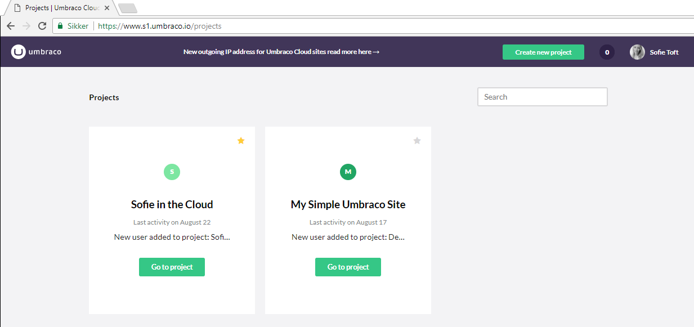

# Welcome to Umbraco Cloud
We're excited you have decided to use Umbraco Cloud!

In this article you can read all about how to manage your Umbraco Cloud projects, and learn what a project on Umbraco Cloud constists of.

## Overview
Umbraco Cloud is a new way to work with your favorite CMS! It includes 10-ears of experience and best-practices in an intuitive, simple, but robust approach. No matter if you’re working in a team or of you’re single handedly building a website, Umbraco Cloud removed the barriers that slow down projects and get in the way of beautiful, functional sites.

Umbraco Cloud is Umbraco - plus a whole lot more! Built on the Microsoft Azure Cloud and encompassing web standard approaches, Umbraco Cloud is familiar to Umbraco users new and old. We’ve made it painfully simple to get started with Umbraco Cloud and there are no limits to what you can accomplish - literally anything you can do with Umbraco and web technology you can do with Umbraco Cloud.

Umbraco Cloud takes care of installation, infrastructure and security. We also provide you the tools to work with your project in the Cloud or or locally by cloning the project down to your PC, Mac or even your tablet.

When you’re ready to show your work to the world, Umbraco Cloud provides a safe deployment mechanism that makes it easy for you to publish to the web. When you have changes or updates to your site, Umbraco Cloud has got you covered: An easy to follow process for moving, testing and deploying your changes to your public site. 

With all the success you’ll have building your site with Umbraco Cloud you’ll want to add more, which is easily done using the same account and team members - all this is done from one single place: The Umbraco Cloud Portal. That’s simplicity!

[Learn more and sign up for Umbraco Cloud](https://umbraco.com/cloud)

## Projects and Environments
In Umbraco Cloud we organize your work into projects which are made of environments, teams, settings, and other related resources like databases and file storage. A project is comprised of different numbers of environments depending on which plan you are on. If you choose the _Starter_ plan then the project comes with a single _live_ environment and you have the option to add a _development_ environment and a _staging_ environment. If you choose the _Professional_ plan the project will have a _Development_ AND a _Live_ environment. As with the _Starter_ Plan you can add/remove environments as needed.

When your project is running in trial mode your _live_ environment is protected with the basic authentication. The basic authentication  will be removed when you pay for the project. _Development_ and _Staging_ environments are always protected with basic authentication

You can avoid basic authentication by whitelisting IP addresses for the appropriate environments. See [IP Whitelist](https://our.umbraco.org/documentation/Umbraco-Cloud/Set-Up/#ip-whitelist) for more information.

#### Set up and Code
For developers, you will use the Development environment to set up the site. To create and test code, clone _Development_ to your local machine and then, once things are just how you like, push the changes back to Umbraco Cloud. Your changes will be added to the _Development_ environment automatically and added to the deployment queue. To deploy to the _Live_ environment, simply push the deploy button and everything will be deployed to the _Live_ environment. See more about this in the [deployment section](../Deployment/index.md).

#### Content
For content editors, you will use the _Live_ environment to create and edit your content. Developers can always restore to the latest content on the Development or local environments.

If the project contains a _Staging_ environment and you create your content here, be aware that content doesn't get added to the deployment queue automatically. Once you're ready to deploy the content to the _Live_ environment, add it to the deployment queue using the __Queue for transfer__ feature in the backoffice.

## Finding your Umbraco Project
To navigate to your project, simply log in to the Umbraco Cloud portal and then click on the project you want to use.

We create your project’s URL using the name you used when you created the project, and then we add _s1.umbraco.io_. If you named your project __Snoopy__, your project URL will be _snoopy.s1.umbraco.io_ and your project’s Umbraco backoffice URL will be _snoopy.s1.umbraco.io/umbraco_. For the Development environment we prefix with _dev-_ so the URLs will be _dev-snoopy.s1.umbraco.io_ and _dev-snoopy.s1.umbraco.io/umbraco_. You'll find all environments for a project listed on the Project page.

## Logging in to Umbraco
When working with a trial project on Umbraco Cloud you need to log in to work with the Umbraco backoffice and also to view your site. The user name and password for both locations are the same as the username and password you use for the portal. Once you upgrade to any of the non-Trial versions you’ll no longer need to login to view your live site but, of course, will still need to log in to the backoffice.

From your Project page select the *Go To Backoffice* link to login to the backoffice and the *View Page* link to view your site.

## Making changes to your site
This is where you get to make your Umbraco project your own. Umbraco is built using web standards - things like HTML, CSS, and JavaScript. You’ll find the HTML that makes up the Templates for your site in the Umbraco backoffice _Settings_ section, under the Templates tree. This is plain-old-HTML, so feel free to change or replace what’s there. The same goes for your project’s CSS (it’s in the Stylesheets tree) and the JavaScript (yup, in the Scripts tree). See the [Umbraco documentation](https://our.umbraco.org/documentation/Getting-Started/) for more information.

## Starting with a Baseline
Beyond the basics of creating a new project, you may wish to start with a Baseline project. Read more about Baselines and how to work with [Baseline Projects](Baselines/).
