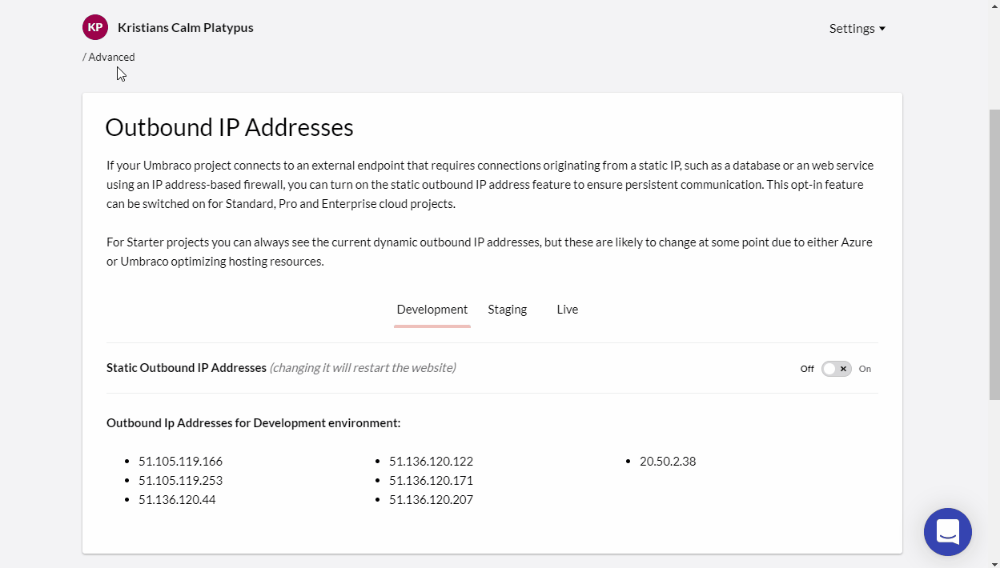

# Release Notes, March 15, 2022

_Static outbound IP + Managing Transport Security + Content Comparison_

### Key Takeaways
- **Static Outbound IP Address** - Enable the static outbound IP address feature to ease communication with external firewall-protected services. Find the dynamic or static outbound IP addresses on the _Advanced_ page.
- **Managing Transport Security** - Configure transport security options for your specific hostnames for your Umbraco Cloud Project.
- **Content Comparison** - Explore the new feature in Umbraco Deploy feature that enables you to preview content changes prior to transferring them to another environment.

### Static Outbound IP Address
When your Umbraco project connects to an external endpoint that requires connections originating from a static IP, such as a database or a web service using an IP address-based firewall, you will need **static outbound IP addresses** for your cloud project. 

On the _Advanced_ page of your project, you are now able to turn on the static outbound IP address feature to ensure persistent communication. This opt-in feature can be switched on for Standard, Pro, and Enterprise cloud projects.

For Starter projects, there is likewise a new addition. On the Advanced page, you can see the current outbound IP addresses of your project. These are however dynamic and are likely to change at some point due to either Azure or Umbraco optimizing hosting resources.

### [Managing Transport Security](https://our.umbraco.com/documentation/Umbraco-Cloud/Set-Up/Manage-Security/)
Once you have added your own hostnames to your Umbraco Cloud project it's possible to configure certain **transport security options** for all or for specific hostnames within your project. These security options all relate to the traffic that goes through your hostname from the origin (Umbraco Cloud) to the end-user - meaning the protocols and encryption used to transport your website and assets from the webserver to the browser.

This can be done on the new _Security_ page.

:::note
The Manage Transport Security feature will be rolling out on individual projects this week. It is expected that all relevant projects is able to access the new _Security_ page on March 18th 2022.
:::

The options currently available are:
- HTTP/2 (default: on)
- TLS 1.3 (default: off)
- Minimum TLS Version (default: 1.2)

When a new hostname is added to a Project it will have the default settings applied for all environments. You can change the default settings for your Project, so new hostnames will get the default settings you have chosen.

You can also add hostname-specific settings if needed and thereby overriding the default settings.

### [Content Comparison](https://umbraco.com/blog/umbraco-forms-81193-and-deploy-4593-release/#content)
The Umbraco Commercial Packages team has made some great improvements for  Umbraco Forms and Umbraco Deploy [lately](https://umbraco.com/blog/umbraco-forms-81193-and-deploy-4593-release/) which immediately adds value to your projects on Umbraco Cloud.
One of the new Umbraco Deploy features, Content Comparison, enables you to preview content changes directly in the backoffice prior to transferring them to another environment. This will often be helpful in order to ensure the correct updates are transferred and improve predictability when working with content in multiple environments. 

You are able to see what has changed when. And understand what will change if you proceed with a transfer upstream or a restore into the local environment.

Content comparison is now available in all Umbraco Cloud projects running Umbraco Deploy 9.3+ for Umbraco 9, and 4.5 + for Umbraco 8.
