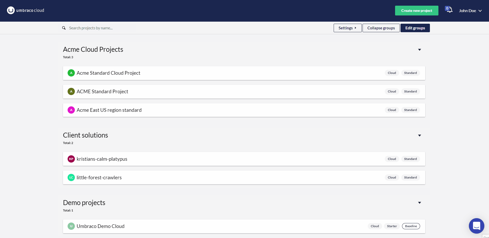

# Release Notes, November 8, 2022

_Dedicated for Starter and Standard - Projects Dashboard Quicklinks- Other Umbraco Cloud Updates_

## Key Takeaways

- **Dedicated for Starter and Standard plan** - You can now add a dedicated option for every Umbraco Cloud project plan to run on dedicated resources.
- **Projects Dashboard Quick links** - When hovering an environment in the Projects Dashboard two quick links are shown for easy access to the backoffice and page, respectively.
- **Other Umbraco Cloud Portal updates** - The Portal has been updated with a few other features and updates worth mentioning. These includes a quick invite for organization members, improved deployment messaging, region and dedicated info on the project information page, and a few fixes.

## [Dedicated for Starter and Standard plan](https://our.umbraco.com/documentation/Umbraco-Cloud/Set-Up/2-factor-authentication-on-cloud/)

When "Dedicated resources" was launched in Umbraco Cloud, it was initially only for Professional plans. But since October, it has also been possible to add a dedicated option to a Starter or Standard plan, so that all projects now have the option of being executed on dedicated resources with the benefits included therein.

2FA code can be sent either to your email or as an SMS to your phone, or you can use an authentication app such as Google Authenticator, Authy, or similar.

As your Umbraco profile is used to log in to the backoffice for your projects, these are all now protected with 2FA.

See the [2-factor authentication on Umbraco Cloud documentation](https://our.umbraco.com/documentation/Umbraco-Cloud/Set-Up/2-factor-authentication-on-cloud/) for details. 

## Projects Dashboard Quick links

Until now, Umbraco Cloud has been exclusively hosted in the West Europe region on Azure. Including **East US** as an option and offering regional hosting to agencies, partners, and end clients located or working in the US is a big milestone and enabler for Umbraco Cloud.

You can select which region you would like to host your Umbraco Cloud project while creating a new Cloud project.

As excited as we are about making Umbraco Cloud available in the US, it is exciting to have the ability to expand to **new regions in the future**. If you have specific requests regarding the next region you want Umbraco Cloud to expand to, you’re welcome to let us know at product@umbraco.com.

See the blog article [Umbraco Cloud expands with US regional hosting](https://umbraco.com/blog/umbraco-cloud-expands-with-us-regional-hosting/) for more information.

## Other Umbraco Cloud Portal updates

Have you tried the new Projects Dashboard yet? The first official version of the dashboard has been released. Currently, you can find a link in the project's overview, but soon the Projects Dashboard will be the default landing page after logging into Umbraco Cloud Portal.

By clicking on “Edit groups”, you can sort projects into groups with the drag-drop functionality to organize your Cloud and Heartcore projects.

After saving your projects, you can choose between a detailed view with relevant information for your projects such as environments, product versions, and bandwidth/media storage usage, or a more compact view with less information. You can decide by using the “Settings” option.

You can try out the Projects Dashboard on https://www.s1.umbraco.io/projectsdashboard and start grouping the Cloud projects as per your preference.
We will add new features and functionality to the dashboard in future releases starting with a filtering system as one of the next new additions.
