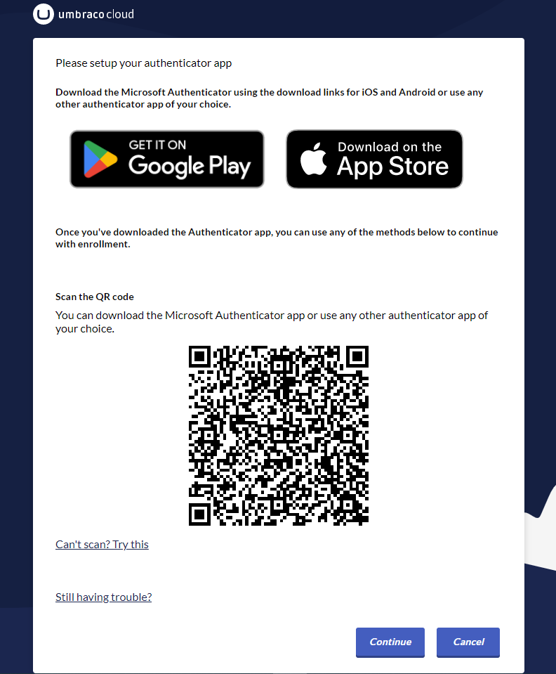

# 2-factor authentication on Umbraco Cloud

On Umbraco Cloud, you can add 2-factor authentication for your Umbraco Cloud account using either email, phone, or an authenticator app when logging in to the Umbraco Cloud Portal.

## Enabling 2-factor authentication

2-factor authentication can be enabled when editing your Umbraco Cloud profile

To enable 2-factor-authentication follow these steps:

1. Go to your profile on Umbraco Cloud
2. In the profile settings section go to Edit profile
3. Choose the desired 2-factor authentication
4. Follow the steps shown to enable 2-factor authentication.

### Email authentication

With email authentication, you will get an email with a code that you need to enter when you log in to the Umbraco Cloud portal.

### Authenticator App

With the authenticator app, you need to use an authenticator app when you log in to the Umbraco Cloud Portal.

You can use the Microsoft Authenticator app for both iOS and android or any other authenticator app of your choice.

### Phone Authentication

With the phone authenticator, when you log in to the Umbraco Cloud portal, you can choose to either receive an SMS with a code to enter when login in or a call to log you in.

