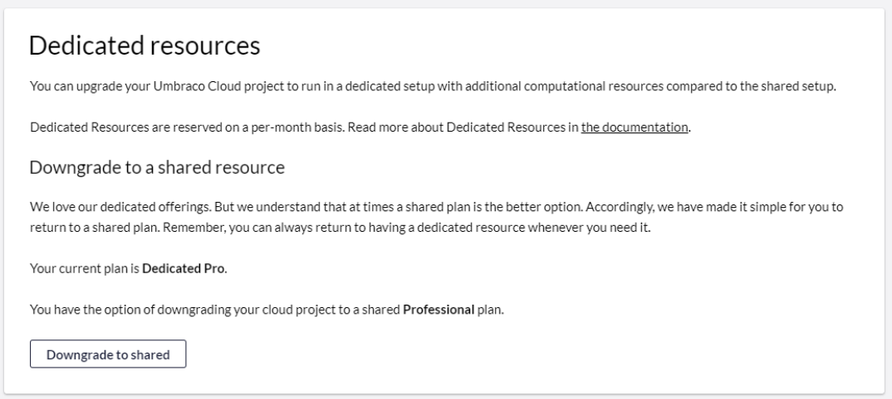

# Move your Umbraco Cloud project to dedicated resources

In this article, you can read about how you can move your Umbraco Cloud project to dedicated resources and what you need to be aware of before you do so.

## Before you move your project to dedicated resources

Before you decide to move your Umbraco Cloud project, you need to consider a few things:

- Currently, Umbraco Cloud offers dedicated resources for Professional plans only. We expect to include dedicated resources for Starter and Standard plans in the self-service feature in Umbraco Cloud portal later in 2022.

- In case you want to move a project on a Starter or Standard project plan to a dedicated server in Umbraco Cloud, please reach out to our support who will assist you in doing this.

- Moving from a shared plan to a dedicated plan will change the outgoing IP of the project. If your solution has an external service that requires whitelisting the outgoing IP of the project, we advise you to enable the static outbound IP feature for your cloud project and share that static outbound IP address with the third party. The static outbound IP address will not change when moving from a shared plan to a dedicated resource. For more info on static lease visit the documentation for [external services](https://our.umbraco.com/documentation/Umbraco-Cloud/Set-Up/External-Services/).

## How to upgrade your plan

The first step moving to a dedicated resource is to access your project in the project overview at [Umbraco.io](https://www.s1.umbraco.io/projects).

- In the project overview you can find all the projects that you have been invited to or have created.

- From here you need to find the project that you want to move to dedicated.

Under the project on the right side you have a dropdown menu called settings:

- Clicking on the tab will direct you to the _Dedicated resource_ page that guides you on how to upgrade to a dedicated plan.

- For a Umbraco Cloud project with a Shared Professional plan there are three dedicated plans for you to choose among. For each of the dedicated plans, you will find its name, the memory and CPU cores, and the price per month.

- By hitting the "Upgrade" button on your dedicated plan of choice and confirming your choice, you will be redirected to the project page where you will be notified when the move to a dedicated resource has been completed.

:::note Dedicated Resources are reserved on a per-month basis.
The price of the dedicated resource will take effect from the next period of your subscription.
If you move your cloud project to a dedicated resource in the middle of the month, the time from that date until the start of the next subscription period, will be added to the next invoice. :::

## Move from dedicated to shared

If you’d like to move from dedicated to shared resources, you can easily do this on the _Dedicated resource_ page.

- By hitting "Downgrade to shared" and confirming your choice, you will be redirected to the project page where you will be notified when the move back to a shared resource has been completed.

- That's it! You cloud project is now back on a shared resource.

If you have any questions regarding dedicated resource, feel free to reach out to [Umbraco Support](mailto:contact@umbraco.com).
