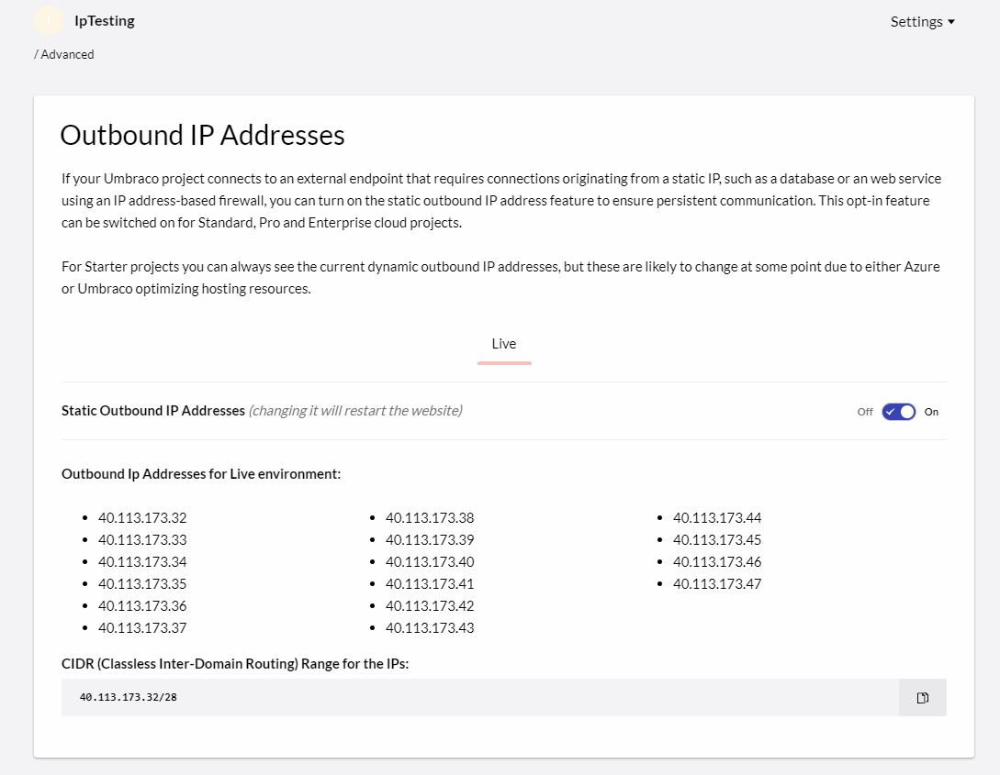

# Using external services with Umbraco Cloud

In some cases Umbraco Cloud might not be the only service you are working with. You might need to work with other services as well - this could be either internal or third party services. In either case, it will be services external to Umbraco Cloud.

When you are working with an external service that is behind a firewall and that service needs to communicate with your Umbraco Cloud project, you need to make sure the Umbraco Cloud Server IPs are allowed to bypass the firewall.

An example could be, that you're fetching some information from an external service which is behind a firewall. In order to give your Umbraco Cloud project access to the external service you need to add the IPs used by the Umbraco Cloud servers to an allow list (other services may refer to it as a "whitelist").

## Static Outbound IP's

If you are on a **Standard** or **Professional** plan, you can turn on the on the static outbound IP address feature under the `Advanced` Settings page:

:::note
If you are on a **Starter Plan** you can see the current outbound IP addresses of your project, however they are dynamic and likely to change at some point due to either Azure or Umbraco optimizing hosting resources.
:::