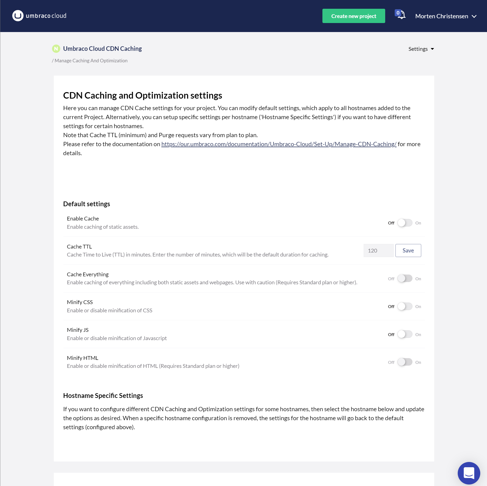
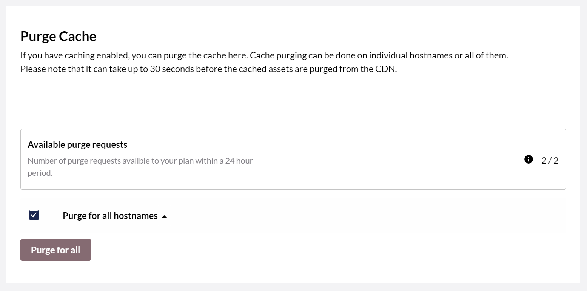

# Managing CDN Caching and Optimizations

Once you have added your own hostnames to your Umbraco Cloud project it's possible to configure certain CDN Caching and minification options for all or for specific hostnames within your project.
These caching options all relate to the traffic that goes through your hostname from the origin (Umbraco Cloud) to the end-user - meaning the traffic of your website and assets from the webserver to the browser.

The options that are currently available are
- Enable Cache (default: off)
- Cache TTL (default: 120 minutes)
- Cache Everything (default: off)
- Minify CSS (default: off)
- Minify JS (default: off)
- Minify HTML (default: off)

When a new hostname is added to a Project it will have the default settings applied. However you can change the default settings for your project, so new hostnames will get the settings you have chosen. This also means that if you enable caching in the default settings and add a new hostname, that caching will be enabled for that new hostname.

## Caching Explained

When Caching is enabled on your project it means that static assets like , CSS, and images are going to be cached in the Content Delivery Network (CDN) used by Umbraco Cloud. How assets are cached is very much up to you, as you can control it through 'cache-control headers'. By default, Umbraco Cloud will enforce a minimum Time to Live (TTL) based on the Plan of your Umbraco Cloud Project, which means that assets cannot be cached for a shorter period of time than what your Plan allows. You can always choose a longer duration - especially if you don't expect your assets to change.

These are the types of files that are cached as static assets through the CDN: '7z', 'csv', 'gif', 'midi', 'png', 'tif', 'zip', 'avi', 'doc', 'gz', 'mkv', 'ppt', 'tiff', 'zst', 'avif', 'docx', 'ico', 'mp3', 'pptx', 'ttf', 'apk', 'dmg', 'iso', 'mp4', 'ps', 'webm', 'bin', 'ejs', 'jar', 'ogg', 'rar', 'webp', 'bmp', 'eot', 'jpg', 'otf', 'svg', 'woff', 'bz2', 'eps', 'jpeg', 'pdf', 'svgz', 'woff2', 'class', 'exe', 'js', 'pict', 'swf', 'xls', 'css', 'flac', 'mid', 'pls', 'tar', 'xlsx'.

If you want to disable caching on certain types of static assets, you can use a 'no-cache' cache-control header, which will be respected by the caching strategy in the CDN. You can utilize an outbound rewrite rule in order to add such a cache-control header to the request. 

The following example adds a cache-control header with 'no-cache' as the value when the requested Url contains a PDF file:

```XML
<rewrite>
    <outboundRules>
        <rule name="Set Cache-Control - No-Cache PDF">
            <match serverVariable="RESPONSE_Cache_Control" pattern=".*" />
            <conditions>
                <add input="{REQUEST_URI}" pattern="\.(pdf)$" />
            </conditions>
            <action type="Rewrite" value="no-cache"/>
        </rule>
    </outboundRules>
</rewrite>
```

Please note that the webpage itself is not cached when CDN Caching is enabled.

## Cache Everything

When Cache Everything is enabled it means that everything including the webpage is cached in the CDN. So in addition to static assets, the webpage will also be cached and served from the CDN instead of loaded from the origin. When a webpage is cached it will be stripped of any cookies that are otherwise part of the request, so if you are utilizing cookies as part of the website please be aware of the implications of using Cache Everything.

When using Cache Everything you should use a Cache TTL, which matches the Editor's expectations of when the webpage is refreshed with a new version loaded from the origin. As an example, choosing a Cache TTL of 2 hours means that the webpage will be served from the cache for 2 hours and then it will be refreshed with a copy from the origin. If Editors make changes every 30 minutes then they will have to wait at least two hours until they can see the changes on the website.

We recommend that Cache Everything is used with caution.

## Cache Purging

When assets are cached for a long time and you need to refresh them, you can choose to purge the CDN cache to evict everything from the cache and force a refresh. This can be useful to do after having deployed changes to JS and CSS files, which are cached in the CDN.

Cache purging is done per hostname and it can take up to 30 seconds before assets are completely gone from the CDN, as it's refreshed globally.

By default, all hostnames are selected, but you can choose to purge specific hostnames from the environments in your Umbraco Cloud project.

Purging the cache is a fairly heavy operation, so there is a constraint on how many purge requests can be done within a 24-hour period. The 24 hours starts from the moment you Purge, so if you have 2 Purge requests available and Purge twice with an hour in between then you can Purge again in 23 hours (for the first Purge request) and then again in 24 hours (for the second Purge request).
In the Purge section of the subpage, you can always see how many Purge requests you have available and when.

Please note that the number of Purge requests you have available varies depending on your Cloud Plan. The Plan specific features are listed below.

## Minification

Minification can be enabled for CSS, JS, and HTML, and is done through the CDN as part of serving the request. Minification strips whitespace from the CSS, JS, and HTML files, so the request is smaller and thus faster to download for the end-user.

Please note that using minification through the CDN can affect Content Security Policies, as the files are being changed after they leave the origin. If you are using Content Security Policies we recommend doing minification within the Umbraco site.

## Plan specific features

Access to the different options varies depending on the Umbraco Cloud Plan your project is on.
Currently, the features are available as follows:

- Starter: 
  - Enable Cache
  - Cache TTL (see below for minimum TTL)
  - Minify CSS
  - Minify JS
- Standard: 
  - Enable Cache
  - Cache TTL (see below for minimum TTL)
  - Cache Everything
  - Minify CSS
  - Minify JS
  - Minify HTML
- Pro: 
  - Enable Cache
  - Cache TTL (see below for minimum TTL)
  - Cache Everything
  - Minify CSS
  - Minify JS
  - Minify HTML

The minimum Cache TTL varies as follows:

- Starter: 2 hours / 120 minutes
- Standard: 30 minutes
- Pro: 2 minutes

The number of Cache Purge requests within 24 hours: 

- Starter: 2
- Standard: 10
- Pro: 20

## CDN Caching and Optimizations subpage

From your Umbraco Cloud Project, click 'CDN Caching & Optimization' from the Settings dropdown to get to the subpage where you can configure the various caching options.
All settings are scoped per environment, so if you have multiple environments and add your own hostnames to different environments you can select the environment at the top of the page.
Aside from environments, the 'CDN Caching & Optimization' subpage is divided into two parts: 'Default Settings' and 'Hostname Specific Settings'.
Use the default settings to configure what should be applied by default to new and existing hostnames.



If you want to have different caching options for different hostnames, then select the hostname under Hostname specific settings and adjust the options for that specific hostname.
This might be useful if you want to test the different options on another hostname than your primary hostname.

### Cache Purging

If you have caching enabled, you can purge the cache in the Purge Cache section in the bottom of the subpage. Cache purging can be done on individual hostnames or all of them.
Please note that it can take up to 30 seconds before the cached assets are purged from the CDN.
Here you can always see how many Purge requests you have available and when used requests will be available again.


