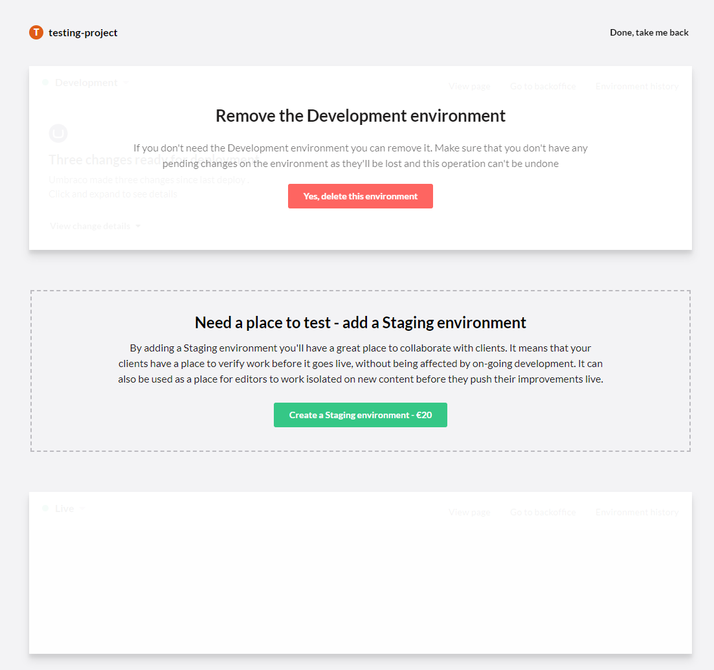

# Manage environments

When working with an Umbraco Cloud project you can add and remove extra environments. 

For the Starter plan you can add a Development environment for an additional price per month.

For the Standard plan you get the Development environment for free and can add a Staging environment for an additional price per month.

 [Learn more about the additional prices on Umbraco Cloud](https://umbraco.com/cloud-pricing/)

If you are on a Professional plan you can add and remove environments whenever you like without any additional cost.

<iframe width="800" height="450" src="https://www.youtube.com/embed/9AwZNyaHbVk?rel=0" frameborder="0" allow="autoplay; encrypted-media" allowfullscreen></iframe>

## Adding or removing environments

__Important:__ *Before* adding an environment you should consider if you have any changes locally that are not on Live yet. If you do you should make sure to push it as adding another environment will also push it into the deployment chain.

__Important:__ *After* adding a Development environment you need to do a fresh clone of the site. The local version you have already will be set up to push directly to Live, a fresh clone will push to Development.

You can find the interface for adding and removing environments from your project page, it is located here:

On that page you will be able to add or remove an environment, if you wish to remove one you will be prompted to type in the environment alias, so either 'Development' or 'Staging'.

Be aware that there is a specific order that the environments are being added in. You will need to have a Development environment before you can have a Staging environment.

If you have both a Development and a Staging environment and need to remove the Development environment, then you will need to remove the Staging environment first before you can remove the Development environment. 

Once you have added or removed the environment it will take a couple of minutes for the Cloud to set it all up, and then you will be ready to use it.
