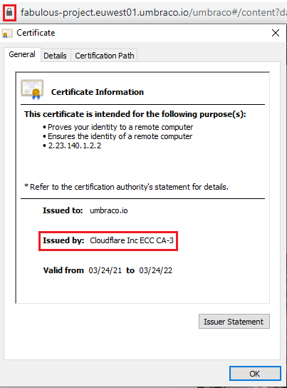

# How to move away from using Umbraco Latch

:::warning
You can no longer use Latch on Umbraco Cloud. This means that unless the settings are changed, the site will not be accessible for users. Therefore make sure to update your hostname to Automatic TLS with Cloudflare.
:::

As of December 8th, 2020, the Umbraco Latch service used for issuing security certificates to hostnames added to Umbraco Cloud environments, has been replaced with another Umbraco Cloud service. Any hostnames added to your environments will automatically be issued a TLS (HTTPS) certificate provided by Cloudflare.

All current certificates issued by the Umbraco Latch service, using Let's Encrypt, will continue to be renewed every three months.

In this article, you will find a guide on how to move away from Umbraco Latch (Let's Encrypt) and instead ensure that all your hostnames are protected by TLS (HTTPS) certificates provided by our Umbraco Cloud service and Cloudflare.

## Checking the certificate

To check which provider has issued the certificate which is currently protecting your hostname(s):

1. Open your website URL.
2. Select the **lock** icon to the left of the URL in the address bar in your browser.
3. Click on **Connection is secure** -> **Certificate is valid**.
4. Identify the provider next to **Issued by:**.

    

If the certificate is already issued by Cloudflare, there are no further steps to be taken.

If the certificate is issued by Let's Encrypt, follow the steps below to issue a new TLS (HTTPS) certificate for your hostname(s).

## Removing the Umbraco Latch certificate

To follow the steps below, ensure that you have access to the DNS configuration for your hostname as well as admin access to the Umbraco Cloud Portal.

1. Access the DNS configuration for your hostname.
2. Update the DNS entry to a **CNAME** record pointing to `dns.umbraco.io`.
3. Save the new configuration settings.
4. Access the Umbraco Cloud Portal.
5. Open the **Hostnames** page for your project.
6. Remove the hostname for which you've updated the DNS configuration.
7. Add the hostname again.

## How to move your custom certificates away from Umbraco Latch

If you are using a custom certificate, that is set up through Umbraco Latch the certificate will need to be re-uploaded to ensure your hostname will work on the new and improved Umbraco Cloud infrastructure. This is a fairly straightforward process if you follow the steps mentioned here.

:::note
If you are unsure whether your custom certificate is uploaded through Umbraco Latch, you can reach out to our friendly support - they can share the current state of your certificates with you.
:::

To follow the steps below, ensure that you have access to the DNS configuration for your hostname, a custom certificate that [meets the requirements](../Security-Certificates) as well as admin access to the Umbraco Cloud Portal.

1. Access the DNS configuration for your hostname.
2. Update the DNS entry to a **CNAME** record pointing to `dns.umbraco.io`.
3. Save the new configuration settings.
4. Access the Umbraco Cloud Portal.
5. Open the **Hostnames** page for your project.
6. Remove the hostname for which you've updated the DNS configuration.
7. Add the hostname again.
8. Upload and bind the certificate [following the documentation](../Security-Certificates)

:::note
If you for some reason cannot use a CNAME record, you can use an A-record which points to one of these IPs: `104.19.191.28` or `104.19.208.28`.

As these static IPs are volatile towards change, this is something you should only do when using a CNAME record is not possible.
:::

Depending on your DNS provider, it might take some time before the changes kick in.

:::tip
In some cases, you might not be able to update the DNS entry but will need to create a new entry instead.

In these cases, you will need to **remove the old DNS entry** for Umbraco Cloud and the Cloudflare service to generate a new TLS certificate for your hostname.
:::

Eventually, you should see that your hostname is now protected by a new TLS (HTTPS) certificate issued by Cloudflare.

This certificate will continue to be renewed on an annual basis.

:::links

## Related articles

* [Manage Hostnames](../)
* [Custom security certificates](../Security-Certificates)

:::
