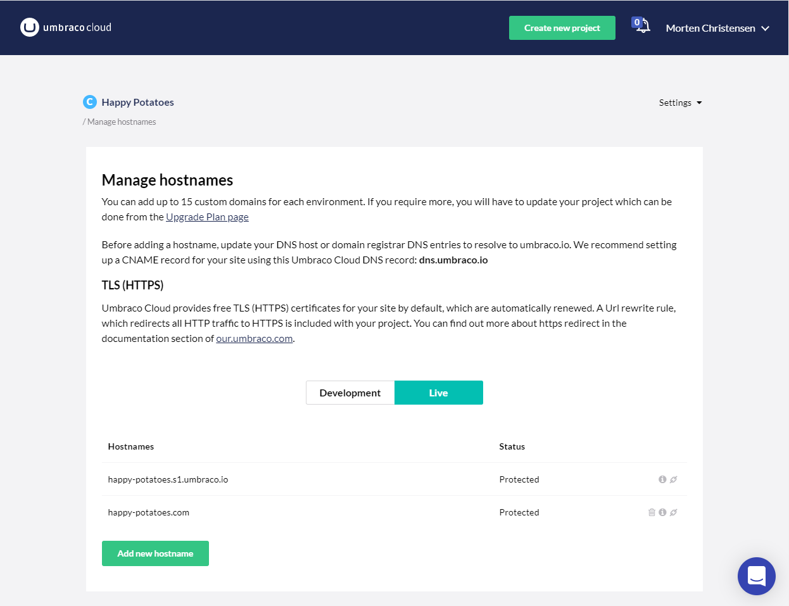

# Managing hostnames

When you create an Umbraco Cloud project we create the project URLs based on the name you give your project.

Let's say you have a project named `Snoopy`. These will be the default hostnames:

* Umbraco Cloud Portal: *www.s1.umbraco.io/project/snoopy*
* Live site: *snoopy.s1.umbraco.io*
* Development environment: *dev-snoopy.s1.umbraco.io*
* Staging environment: *stage-snoopy.s1.umbraco.io*

To access the backoffice add `/umbraco` to the end of the Live, Development or Staging URL.

## Domains

Under *Settings* in the Umbraco Cloud Portal, you'll find **Hostnames**. This is where you go when you want to bind hostnames to your Cloud environments.

You can bind any hostname to your project environments. Keeping in mind that the hostname will need to have a DNS entry so that it resolves to the Umbraco Cloud service.

Once you add a hostname to one of your environments make sure to update the hostname DNS entry to resolve to the umbraco.io service. We recommend setting an CNAME record for your root hostname (e.g. mysite.s1.umbraco.io) pointing to **dns.umbraco.io** or an A record using IP 104.19.191.28 or 104.19.208.28. Check with your DNS host or hostname registrar for details on how to configure this for your hostnames.

:::warning
Adding an A-Record to the static ip is only recommended when setting up a CNAME record is not an option. The static IP is highly volatile towards changes to the Umbraco Cloud infrastructure and as such it may change.
:::

You will also have to specify the hostname for each root node if you are using a multisite setup.

* Go to the Umbraco Backoffice
* *Right-click* the root content node
* Choose **Culture and Hostnames**
* Add your hostname
* Hit *Save*

Once you've assigned a hostname to your Umbraco Cloud environment, you may want to hide the default umbraco.io URL (e.g. *snoopy.s1.umbraco.io*). We've created a rewrite rule for this purpose - find it in the [Rewrites on Cloud](Rewrites-on-Cloud/#hiding-the-default-umbraco-io-url) article.

### Automatic TLS (HTTPS)

All hostnames added to an Umbraco Cloud project's environment will get a TLS (HTTPS) certificate added by default. The certificate is issued by Cloudflare and valid for 1 year after which it will be automatically renewed. Basically everything is handled for you, so the only thing you need to worry about is updating the DNS records for your hostname.

:::note
Hostnames added prior to December 8th 2020 will be issued by Let's Encrypt and will continue to be renewed until the hostname is removed or re-added. If a hostname is removed and then re-added the DNS should be configured as mentioned in the section above.
:::

## [Upload certificates manually](Security-Certificates)

On the Professional and Enterprise plan, you can manually add your own certificate to your Umbraco Cloud project and bind it to one of the hostnames you've added.

## [Rewrites on Umbraco Cloud](Rewrites-on-Cloud)

Learn more about best practices for working with rewrite rules on Umbraco Cloud projects.
