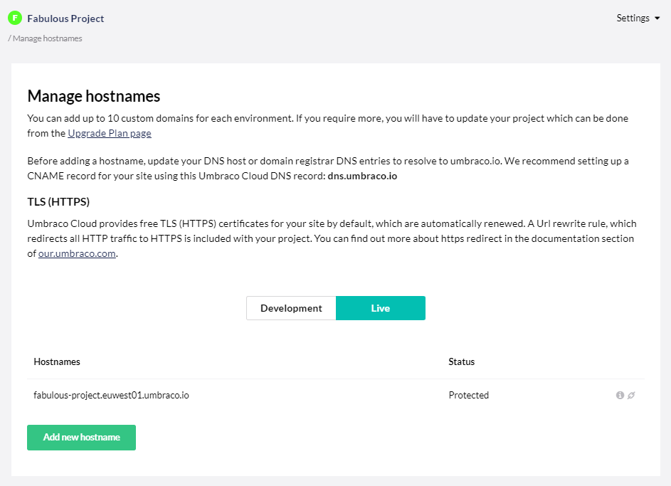
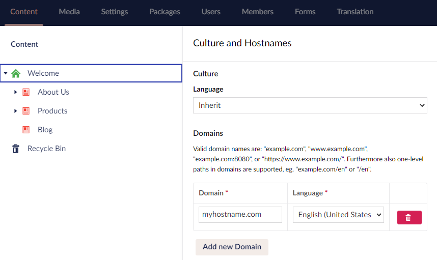

# Managing Hostnames

When you create an Umbraco Cloud project, the project URLs are based on the name of your project.

Let's say you have a project named `Snoopy`. The default hostnames will be:

* Umbraco Cloud Portal - www.s1.umbraco.io/project/snoopy
* Live site - snoopy.euwest01.umbraco.io
* Development environment - dev-snoopy.euwest01.umbraco.io
* Staging environment - stage-snoopy.euwest01.umbraco.io

To access the backoffice add `/umbraco` at the end of the Live, Development or Staging URL.

## Domains

Under *Settings* in the Umbraco Cloud Portal, you'll find **Hostnames**. This is where you bind Hostnames to your Cloud environments.



You can bind any hostname to your project environments. Ensure that the hostname has a DNS entry so that it resolves to the Umbraco Cloud service.

Once you add a hostname to one of your environments, ensure to update the hostname DNS entry to resolve to the `umbraco.io` service. 

We recommend:

* Setting a CNAME record for your hostname using **dns.umbraco.io** or
* An A record using an IP, either `104.19.191.28` or `104.19.208.28`.

:::note
Once you have updated your DNS we recommend that you check if the correct records are being picked up using a site like [whatsmydns.net](https://www.whatsmydns.net/) before adding the hostname on Umbraco Cloud.
:::

Check with your DNS host or hostname registrar regarding configuration details for your Hostnames.

:::warning
Adding an A-Record to the static IP is only recommended when setting up a CNAME record is not an option. The static IP is highly volatile towards changes to the Umbraco Cloud infrastructure and as such, it may change.
:::

<iframe width="800" height="450" src="https://www.youtube.com/embed/NAGnvMbVZu4" frameborder="0" allow="autoplay; encrypted-media" allowfullscreen></iframe>

To specify the hostname for each root node using a multisite setup, follow these steps:

1. Go to the **Umbraco Backoffice**.
2. Right-click the root content node.
3. Select **Culture and Hostnames**.
4. In the Culture and Hostnames window, click **Add New Domain**.
5. Enter your **Domain** name and select the **Language** from the drop-down list.
    
6. Click **Save**.

Once you've assigned a Hostname to your Umbraco Cloud environment, you may want to hide the default `umbraco.io` URL (e.g. *snoopy.euwest01.umbraco.io*). To do so, see the [Rewrites on Cloud](Rewrites-on-Cloud/#hiding-the-default-umbracoio-url) article.

### Automatic TLS (HTTPS)

All hostnames added to an Umbraco Cloud project's environment will get a TLS (HTTPS) certificate added, by default. The certificate is issued by Cloudflare and valid for 1 year after which it will be automatically renewed. Everything around certificates and renewals is handled for you and you only need to make sure that the DNS records are configured according to our recommendations listed above.

:::note
Hostnames added prior to December 8th 2020 will be issued by Let's Encrypt and will continue to be renewed until the hostname is removed or re-added. If a hostname is removed and then re-added the DNS should be configured as mentioned in the section above, and then the certificate will be issued and renewed by Cloudflare (with Digicert as the Certificate Authority).

:::warning
From November 1st, 2021 you will no longer be able to use Latch on Umbraco Cloud.
This will effectively mean that unless changing the settings, the site will not be accessible for users, therefore make sure to update your hostname to Automatic TLS with Cloudflare.
:::

To change the certificate for your hostname, see the [How to move away from using Umbraco Latch](Move-away-from-Latch) article.

You will need to **remove the old DNS entry** before the Cloudflare service generates a new certificate for your Hostname.
:::

### Is your Domain hosted on your own Cloudflare account?

Cloudflare is a popular DNS provider, which offers a variety of different services to improve performance and security. We also use it for DNS and Hostnames on Umbraco Cloud.

When your own domain is also hosted with Cloudflare, you need to enroll the hostname you want to add to your Umbraco Cloud project in a slightly different way:

1. When creating a CNAME or A-record for your hostname in Cloudflare, you need to start with Proxy Status set to **DNS Only**.
2. Once your hostname is marked with **Protected** under the Hostname page for your Umbraco Cloud project and you can access your website through the hostname, you can choose to change Proxy Status to **Proxying**.
3. This is mostly relevant when you need to use specific Cloudflare services like Page Rules, Workers, and so on.
4. If you keep the Proxy Status set to **DNS Only**, Umbraco Cloud will handle the automatic TLS setup to ensure that your hostname is always protected with HTTPS.

### Using Certificate Authority Authorization (CAA) for your domain?

CAA is a [DNS resource record type](https://tools.ietf.org/html/rfc6844) defined in RFC 6844 that allows a domain owner to indicate which Certificate Authorities (CAs) are allowed to issue certificates for them. If you use CAA records on your domain, you will either need to remove CAA entirely or add the following through your DNS provider:

```sql
example.com. IN CAA 0 issue "digicert.com"
```

This is necessary because DigiCert is the Certificate Authority for the certificates issued on Umbraco Cloud.

It is possible for CAA records to be set on the subdomain, but it's not something that is commonly used. If there’s a CAA record at, e.g., app.example.com, you’ll need that removed or updated. If you want to use wildcards and allow certificates for any subdomain the CAA record should look like this:

```sql
example.com. IN CAA 0 issuewild "digicert.com"
```

## [Upload certificates manually](Security-Certificates)

On the Professional and Enterprise plan, you can manually add your own certificate to your Umbraco Cloud project and bind it to one of the hostnames you've added.

## [Rewrites on Umbraco Cloud](Rewrites-on-Cloud)

Learn more about best practices for working with rewrite rules on Umbraco Cloud projects.
