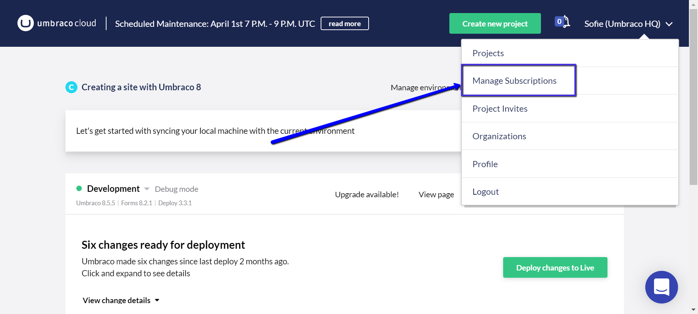
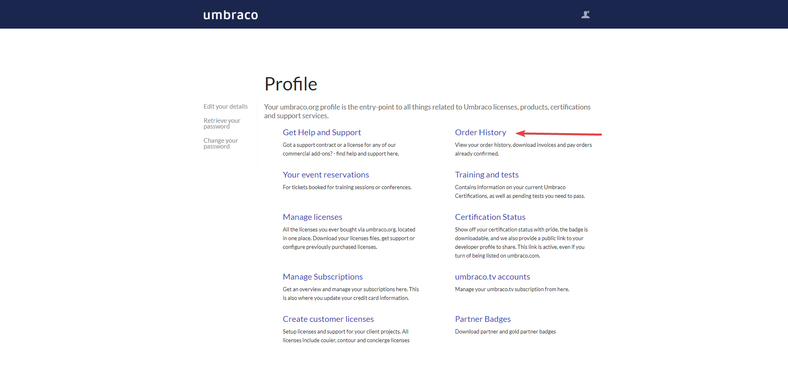
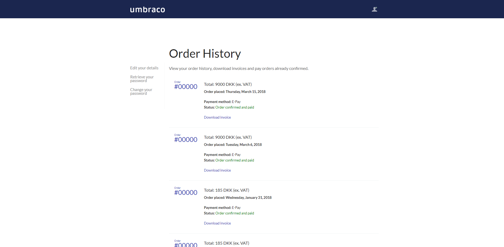

# Manage Subscriptions

In this article you will be able to find information on how to manage your subscriptions. You will also be able to find information on how to change ownership of your projects.

Umbraco Cloud subscriptions are managed from the Umbraco Shop, which can be access through [umraco.com](https://umbraco.com) or by following the "Manage Subcriptions" link on the Profile dropdown on the Umbraco Cloud Portal.

## Invoices

You are able to find all your invoices when you log into [the shop on Umbraco.com](https://shop.umbraco.com/profile/sign-in?returnURL=%2fprofile).

Once you have logged in you can see an overview of your account where you will be able to find your [Order History](https://shop.umbraco.com/profile/options/order-history/). It is in this section you are able to see all your invoices.

Under the Order History you are able to get an overview of all your invoices. The overview has the following details.

- Order number
- Total price ex. VAT
- Date of purchase
- Payment method
- Status of the order
- A download link for the invoice

:::note
If you have not yet paid for your invoice, the download link will change to a payment link.
:::

## Changing your Credit Card information

If you have to change your credit card information you can do that under [Manage Subscriptions](https://shop.umbraco.com/profile/options/manage-subscriptions/). When changing your credit card information you will have to change the information on all subscriptions where the credit card is being used.

## How to change ownership of subscriptions and projects

You might find yourself in a situation where you will need to change the ownerships of subscriptions or projects. That can be done in the following ways.

### Subscriptions

Changing subscription ownerships is not something you can do by yourself. You will need to reach out to our __Support Team__ and they will do it for you.

Whomever is taking over a subscription will need to have an existing account on umbraco.com. If they do not have an account they can [register here](https://shop.umbraco.com/profile/register).

When you have registered your user. You will need to login to your [profile] (https://shop.umbraco.com/profile/edit-your-details/) and fill out the following info under the invoicing information section. Please make sure you fill out the following:

- Company Name 
- Address
- Country 
- VAT number (if within EU)

:::note
Do note that it will have to be the owner of the subscription who reaches out when changing the owner.
:::

### Projects

Handing over a project to someone else can be done by [adding them to the project as a Team Member](../Team-Members) from the portal. Make sure that you grant them admin rights when adding them so they have full control over the project. When they have been added they can remove you from the project.

:::note
Remember to change the [technical contact details](../Team-Members/Technical-Contact) on the project to the new owner, as Umbraco will send updates such as automated upgrade notifications to whomever is listed under technical contact.

You can change the technical contact details under the Edit team section in the Backoffice.
:::
