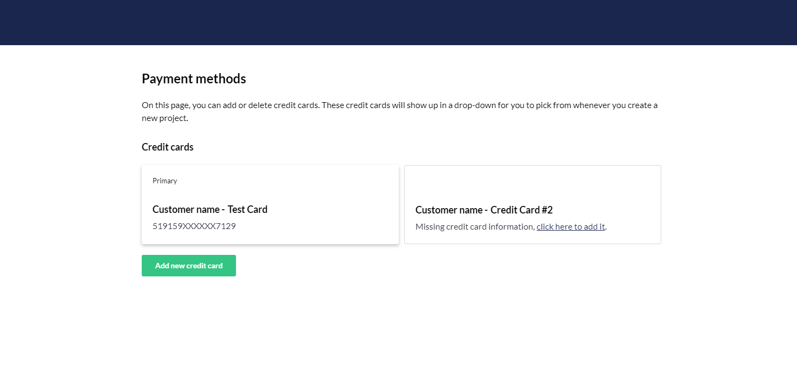

# Payment on Umbraco Cloud

:::note
This article is only for customers in the new payment system released on the 28th of April.
For  customers on Umbraco Cloud before the 28th of April handling subscriptions is done through [the shop on Umbraco.com](https://shop.umbraco.com/profile/sign-in?returnURL=%2fprofile).
:::

In this article you will be able to find information on how to manage your subscriptions, download and pay invoices and change your credit card on Umbraco Cloud

## Manage Subscriptions

To manage you subscription on Umbraco Cloud, go to the menu in the top right corner and select "Manage subscription".

You will then be send to the the overview of the subscriptions that you have running on your Umbraco Cloud user.

## Payment methods

To change your payment method on Umbraco Cloud, go to your profile and select "Payment methods" in the left side menu.

On this page you can see the credit cards already added or add a new one.

Once a credit card have been added it will show up in a drop-down when creating new projects.

It is also possible to change which card to use for paying your projects on Umbraco Cloud, this can be done from the project page of the project you want to change the subscription for.

