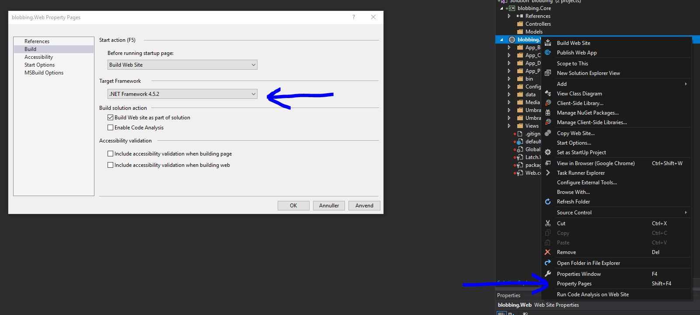

# Setup Your Site to use Azure Storage for Media and Image Processor Cache
For Umbraco Cloud sites there are some scenarios when you may want, or need, to consider using Azure Blob Storage for your media.  Particularly if your site contains large amounts of media - about 1GB or more.  Having your site’s media in Azure Storage can also help your deployments complete more quickly and has the potential to positively affect site performance as the Image Processor cache is moved to Azure Storage.  It also allows you to easily serve your media from the Azure CDN.

Setup consists of adding several packages to your site and setting the correct configuration.  Of course, before you begin you’ll need to create an Azure Storage Account and a container for your media and your ImageProcessor cache as well.  In this example we assume your media container is “media” and your cache is “cache”.  You can, optionally, enable an Azure CDN for this storage container and use it in the cache.config below.	

## Media and Deployment
As Umbraco Cloud deployments are done using a web connection, large media deployments can be slow and are subject to timeouts and other restrictions associated with large uploads over a web connection.

If this sounds like you, you should evaluate the Azure Blob Storage provider. It is relatively simple to setup, has very few limitations and can result in better site performance as well as faster media loading times - especially if your media takes advantage of an Azure CDN.

## Setup

### Changing the .NET framework target version

Umbraco Cloud runs .NET version 4.5 by default, but most of the packages you will need requires version 4.5.2, luckily this is also the maximum version compatible with Cloud currently. So the first thing to do is to change your project to target that.

After cloning down the site you can go to the property pages and change the Target Framework:



Now you should build again - you may need to reinstall some packages so they work with the new Framework, you can do so like this:

`PM > Update-Package PackageName -Reinstall`

### Packages

These packages are only available via NuGet, so ideally you’ll have your site setup to use Visual Studio. You can copy/paste the `PM>` commands into the Package Manager Console. If you don't see the Package Manager Console window, you can open it from the menu View -> Other Windows -> Package Manager Console.

#### File System Provider for Azure Blob Storage

You’ll replace the default FileSystemProvider with the `UmbracoFileSystemProviders.Azure` provider.  We recommend doing this first and verifying it behaves as expected before proceeding with the ImageProcessor setup.

```PM> Install-Package UmbracoFileSystemProviders.Azure```

The package is also available on Our Umbraco [https://our.umbraco.com/projects/collaboration/umbracofilesystemprovidersazure/](https://our.umbraco.com/projects/collaboration/umbracofilesystemprovidersazure/)
The project source can be found here [https://github.com/JimBobSquarePants/UmbracoFileSystemProviders.Azure](https://github.com/JimBobSquarePants/UmbracoFileSystemProviders.Azure)

There are detailed instructions available on the project page, also summarized here.

Update `~/Config/FileSystemProviders.config` replacing the default provider with the following:
```xml
<?xml version="1.0"?>
<FileSystemProviders>
  <!-- Media -->
  <Provider alias="media" type="Our.Umbraco.FileSystemProviders.Azure.AzureBlobFileSystem, Our.Umbraco.FileSystemProviders.Azure">
    <Parameters>
      <add key="containerName" value="media"/>
      <add key="rootUrl" value="http://[myAccountName].blob.core.windows.net/"/>
      <add key="connectionString" value="DefaultEndpointsProtocol=https;AccountName=[myAccountName];AccountKey=[myAccountKey]"/>
      <!--
        Optional configuration value determining the maximum number of days to cache items in the browser.
        Defaults to 365 days.
      -->
      <add key="maxDays" value="365"/>
      <!--
        When true this allows the VirtualPathProvider to use the deafult "media" route prefix regardless 
        of the container name.
      -->
      <add key="useDefaultRoute" value="true"/>
      <!--
        When true blob containers will be private instead of public what means that you can't access the original blob file directly from its blob url.
      -->
      <add key="usePrivateContainer" value="false"/>
    </Parameters>
  </Provider>
</FileSystemProviders>
```
If you are using IISExpress (as with Visual Studio) you’ll need to add a static file handler mapping to `~web.config` - this should be added automatically, but you should check that it's there!
```xml
<?xml version="1.0"?>
  <configuration>
    <location path="Media">
      <system.webServer>
        <handlers>
          <remove name="StaticFileHandler" />
          <add name="StaticFileHandler" path="*" verb="*" preCondition="integratedMode" type="System.Web.StaticFileHandler" />
        </handlers>
      </system.webServer>
    </location>
  </configuration>
```

#### Image Processor
You’ll need to install the following ImageProcessor packages (latest versions recommended):

* ImageProcessor.Web.4.9.3.25 or later
* ImageProcessor.Web.Config.2.4.1.19 or later
* ImageProcessor.Web.Plugins.AzureBlobCache.1.4.2.19 or later

You can find more information about ImageProcessor and related packages here [https://imageprocessor.org/](https://imageprocessor.org/)

Since Umbraco includes a version of ImageProcessor.Web by default, you will need to update that package first using NuGet:

```PM> Update-Package ImageProcessor.Web```

```PM> Install-Package ImageProcessor.Web.Config```

Then install the ImageProcessor package that places the cached files in the Azure Blob storage:

```PM> Install-Package ImageProcessor.Web.Plugins.AzureBlobCache```


#### Configuration
Once the packages have been installed you need to set your configuration as below.  Some of these may have been set when you installed the ImageProcessor packages.

Update `~web.config`
```xml
<configuration>
  <sectionGroup name="imageProcessor">
      <section name="security" requirePermission="false" type="ImageProcessor.Web.Configuration.ImageSecuritySection, ImageProcessor.Web" />
      <section name="processing" requirePermission="false" type="ImageProcessor.Web.Configuration.ImageProcessingSection, ImageProcessor.Web" />
      <section name="caching" requirePermission="false" type="ImageProcessor.Web.Configuration.ImageCacheSection, ImageProcessor.Web" />
    </sectionGroup>
  </configSections>
  <imageProcessor>
      <security configSource="config\imageprocessor\security.config" />
      <caching configSource="config\imageprocessor\cache.config" />
      <processing configSource="config\imageprocessor\processing.config" />
    </imageProcessor>
</configuration>
```

Update `~/config/imageprocessor/security.config`

You have to manually add `prefix="media/"` to the service element, otherwise ImageProcessor will not run and the original image will be served.
```xml
<?xml version="1.0" encoding="utf-8"?>
<security>
  <services>
    <!--<service name="LocalFileImageService" type="ImageProcessor.Web.Services.LocalFileImageService, ImageProcessor.Web" />-->
    <service prefix="media/" name="CloudImageService" type="ImageProcessor.Web.Services.CloudImageService, ImageProcessor.Web">
      <settings>
        <setting key="MaxBytes" value="8194304"/>
        <setting key="Timeout" value="30000"/>
        <setting key="Host" value="https://[your blob account].blob.core.windows.net/media"/>
      </settings>
    </service>
    <service prefix="remote.axd" name="RemoteImageService" type="ImageProcessor.Web.Services.RemoteImageService, ImageProcessor.Web">
      <settings>
        <setting key="MaxBytes" value="4194304" />
        <setting key="Timeout" value="3000" />
        <setting key="Protocol" value="http" />
      </settings>
      <whitelist>
        <add url="https://[your Azure CDN].vo.msecnd.net/" />
        <add url="https://[your blob account].blob.core.windows.net/" />
        <add url="https://[your Umbraco cloud site].s1.umbraco.io" />
        <add url="http://localhost" />
        <add url="http://127.0.0.1" />
      </whitelist>
    </service>
  </services>
</security>
```

Update `~/config/imageprocessor/cache.config` by removing the default “DiskCache” config entry.
```xml
<?xml version="1.0" encoding="utf-8"?>
<caching currentCache="AzureBlobCache">
  <caches>
    <cache name="AzureBlobCache" type="ImageProcessor.Web.Plugins.AzureBlobCache.AzureBlobCache, ImageProcessor.Web.Plugins.AzureBlobCache" maxDays="365" memoryMaxMinutes="60" browserMaxDays="7">
      <settings>
        <setting key="CachedStorageAccount" value="DefaultEndpointsProtocol=https;AccountName=[myAccountName];AccountKey=[myAccountKey]" />
        <setting key="CachedBlobContainer" value="cache" />
        <setting key="UseCachedContainerInUrl" value="true" />
        <setting key="CachedCDNRoot" value="[CdnRootUrl]" />
        <setting key="CachedCDNTimeout" value="2000" />
        <setting key="SourceStorageAccount" value="DefaultEndpointsProtocol=https;AccountName=[myAccountName];AccountKey=[myAccountKey]" />
        <setting key="SourceBlobContainer" value="media" />
        <setting key="StreamCachedImage" value="false" />
      </settings>
    </cache>
  </caches>
</caching>
```
The final note here is that setting this up will only make it so new media files are added to Blob Storage, if you already have some media files on your project you should copy the contents of the media folder and upload it all to the media blob you set up. Finally you can delete the media folder locally as it is no longer needed. 


## Environment and Deployment considerations
By default this provider will use a single blob container for the media used by all sites in a project. So development and live will all use the same media files. If this works with your workflow it is the recommended configuration. If you cannot use the same media across all environments then you will need to set up a different blob storage container for each environments. Each container will have a unique address and access keys.

## Excluding media from deployments
This is not something that should be done unless you really have a good reason to do it. But if nothing works and you wish to deploy changes without getting a lot of errors related to media files you can set the following in the `~/config/UmbracoDeploy.Settings.config` file:
```xml
<?xml version="1.0" encoding="utf-8"?>
<settings xmlns="urn:umbracodeploy-settings">
  <excludedEntityTypes>
    <add type="media-file" />
  </excludedEntityTypes>
</settings>
```
