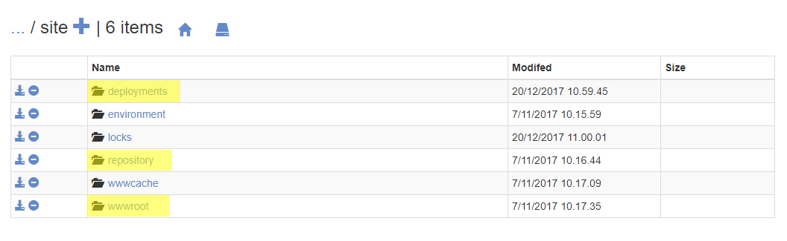

# View the files on your Cloud environments

When you clone down your Umbraco Cloud project to your local machine, you'll easily be able to see all the project files in the folder you specify when cloning down the project. Sometimes you might also want to view the files you have on your Umbraco Cloud environments - perhaps to make sure that everything is in sync or if you suspect that a deployment or extraction hasn't gone quite as planned.

In Kudu you can view your project files if you navigate to **CMD** under the **Debug console** menu. Here you'll be presented with a navigable file structure.

All your project files will be under `/site`.

I've highlighted the three folders you are going to use the most when visiting Kudu:

* **deployments**: This folder contains log files for the deployments and extractions that has been run on the environment
* **repository**: This is your Git repository - you'll find a clone of your site's structure files (`/wwwroot`) - this is the folder changes are pushed to and pulled from when working locally
* **wwwroot**: This folder contains your site's structure files - these are the files used to run the site on the environment

**Note**: `/wwwroot/` contains the files used to show your website to the world. When you push changes from your local machine, they are pushed to the Git repository (`/repository/`), and when this finishes successfully the changes are copied into the live site.

Find general information about Kudu and how to access the tool in the [Power tools](../) article.