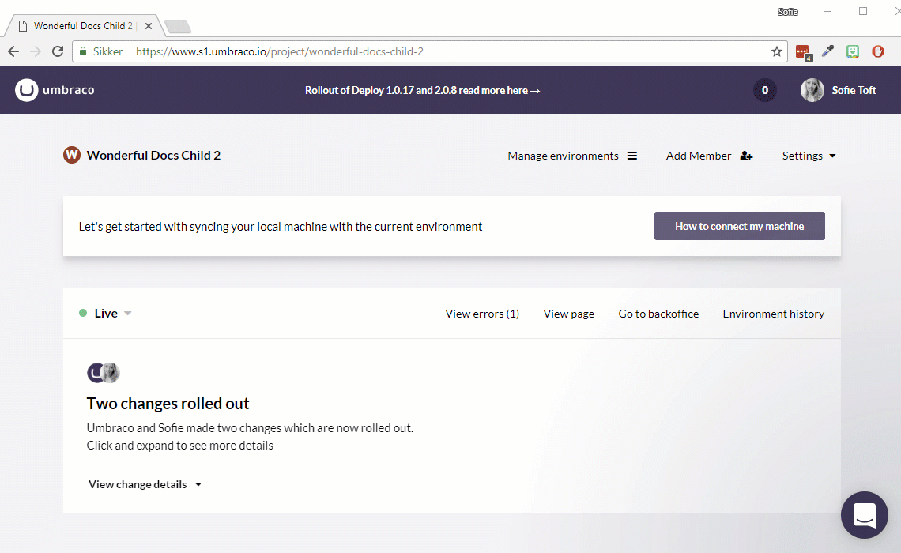
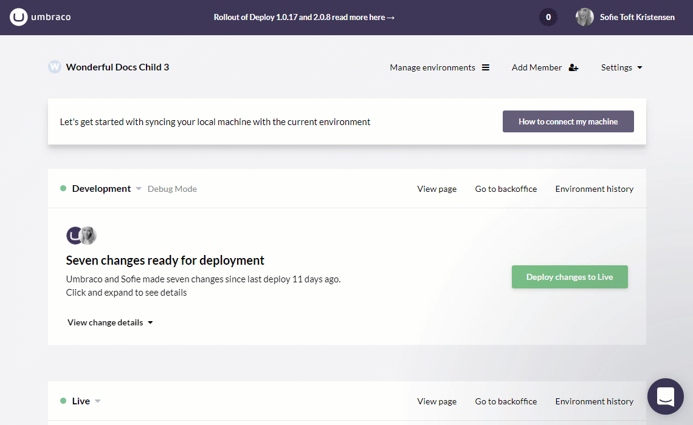

# Power tools (Kudu)

Kudu is an open source engine behind git deployments to Azure. It gives us basic access to the file system trough command line or powershell all from the comfort of a web browser. It also powers the way we deploy to Umbraco Cloud sites.

## How to access Kudu

Two things are required for you to be able to access Kudu:

1. Your profile needs **admin rights** on the project
2. You must **allow experimental features** on your profile (read more about this below)

Kudu is available for each environment on your Umbraco Cloud project. You can find the link by clicking the environment name in the Umbraco Cloud portal.

When you are prompted to login, use your Umbraco Cloud credentials.

### Allow experimental features

You will need to allow for experimental features on your Umbraco Cloud profile before you can see the Power Tools option.

1. Find your profile by clicking your name / image in the top-right of the Umbraco Cloud Portal
2. Expand "*Advanced settings*"
3. Make sure "*Allow experimental features*" is ticked
4. Update your profile

## What can you do from Kudu?

The power tools can be used for various things, and we are often referring to the tools in our troubleshooting guides.

* [The file structure](File-structure-on-cloud)
* [Run an extraction manually](Manual-extractions)
* [Generate UDA files](generating-uda-files)

## Important notes

Kudu is **not** a tool meant for adding and removing files on your project. This should always be done via Git([Local to Cloud](../../Deployment/Local-to-Cloud)) and the Deploy engine([Cloud to Cloud](../../Deployment/Cloud-to-Cloud)).

We recommend that you **only** use Kudu when you are following one of our guides.