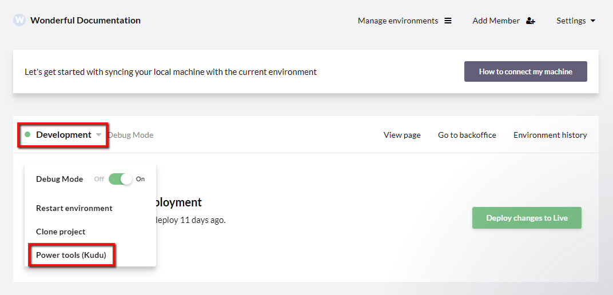

# Power tools (Kudu)

*What is Kudu!?*

## How to access Kudu

Two things are required for you to be able to access Kudu:

1. Your profile needs **admin rights** on the project
2. You must **allow experimental features** on your profile (read more about this below)

Kudu is available for each environment on your Umbraco Cloud project. You can find the link by clicking the environment name in the Umbraco Cloud portal.

When you are prompted to login, use your Umbraco Cloud credentials.

### Allow experimental features

You will need to allow for experimental features on your Umbraco Cloud profile before you can see the Power Tools option.

1. Find your profile by clicking your name / image in the top-right of the Umbraco Cloud Portal
2. Expand "*Advanced settings*"
3. Make sure "*Allow experimental features*" is ticked
4. Update your profile

## What can you do from Kudu?

The power tools can be used for various things, and we are often referring to the tools in our troubleshooting guides.

### Run an extraction 

When you deploy from one environment to another on your Umbraco Cloud project, the Deploy engine is running an extraction. What this means, is that the files from the Git repository is merged into the files used on the site.

Run an extraction following these steps:

1. Access Kudu
2. Navigate to **CMD** under the **Debug console** menu
3. In the file structure, navigate to `site/wwwroot/data`
4. The `/data` folder contains:
    a. `backoffice` folder containing files for the backoffices users
    b. `revision` folder containing all your projects UDA files
    c. *deploy-marker* indicating the state of the latest extraction (`deploy-complete` or `deploy-failed`)
    d. `deploy.log` containing logs from the latest extraction
5. While in this folder, type the following command in the CMD console: `echo > deploy` - this will initiate an extraction on the environment
6. While the extraction is running, the *deploy-marker* will change name to `deploy-progress`
7. The extraction will end in one of two possible outcomes:
    1. `deploy-complete`: The extraction succeeded and your environment is in good shape!
    2. `deploy-failed`: The extraction failed - open the file, to see the error message (the same error message will be shown on your environment in the Umbraco Cloud Portal)

### Generate UDA files

## Important notes