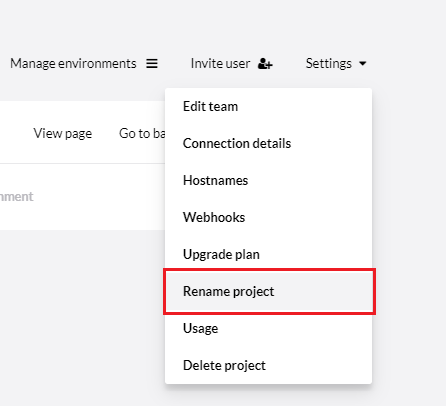

# Project settings

When working with an Umbraco Cloud project, you can handle a lot of the project configuration directly in the Umbraco Cloud Portal.

The things you can configure include hostnames/domains, SSL certificates, database connections, and deployment webhooks.


## [Edit team](../Team-Members)

Manage the team members on your project. You can also add a [Technical contact](../Team-Members/Technical-Contact.md) from this page to your project.

## [Connection details](../../Databases)

Find connection details to your Umbraco Cloud databases. You will need to allow your IP in order to connect to the databases with your local machine - this can also be done from this page.

## [Hostnames](../Manage-Hostnames)

Binding hostnames to your Umbraco Cloud project is done from the **Hostnames** section on the Umbraco Cloud Portal.

## [Certificates](../Manage-Hostnames/Security-Certificates)

Used to upload and bind your own custom security certificate to your hostnames instead of using the TLS (HTTPS) certificates provided by the Umbraco Cloud service.

## Public access

By default, all Staging and Development environments on Umbraco Cloud projects are protected by *basic authentication* which require you to enter your Cloud credentials in order to view the frontend. You can disable/enable this authentication with one click on the **Public access** page.

:::note
Access to disabling/enabling basic authentication requires your project to be on the Standard plan or higher.

On **Trial** projects, the basic authentication is enabled on the Live environment and cannot be removed unless the project is upgraded to a paid plan.

Should you for some reason still have basic authentication enabled on your Live environment after upgrading your Trial, please reach out to our friendly support team, who will be able to help you move forward.
:::

On the **Public access** page you can also allow IPs which will allow for viewing the frontend of the Staging and/or Development environments when accessed from the allowed IPs.

## [Webhooks](../../Deployment/Deployment-webhook)

On Umbraco Cloud projects, it is possible to configure a deployment webhook on your environments. This will be triggered upon successful deployments, you can configure where you would like information about the deployment to be posted.

## Upgrade Plan

From the **Settings** menu you can upgrade your project to a standard or a Professional plan, depending on your needs.

The option is not available if you are already on the specific plan or if you are running in Trial mode.

## [Payment](../Manage-Subscriptions/new-shop.md)

From here, you can see the payment history for your project, change the credit card, as well as download the latest invoices for your project.

:::note
This only applies to new customers on Umbraco Cloud after the 28th of April, for old projects, the invoices and payment history is still available from the [Umbraco Shop](https://shop.umbraco.com/profile/sign-in).
:::

## [Usage](../Usage/)

On your Umbraco Cloud project, it is possible to see the usage of Custom Domains, Media Storage, Content Nodes, and Bandwidth for your project. You can also check if it is using above or below the allowed amount for the plan that your project is on.

## Advanced Settings

In the **Settings** drop-down list, you have the option to enable **Advanced** settings for your project.

You can enable IIS logging for each of your environments from here. The log files can be accessed through kudu in `C:\home\LogFiles\http`. There is a rolling size limit on the log files of 100 MB. Once the limit is reached, the oldest log files will be overwritten by new ones.

Be aware when enabling IIS logging, the site will have to restart. For more information about IIS logging look at the [Official Microsoft Documentation](https://docs.microsoft.com/en-us/iis/configuration/system.webserver/httplogging).

## Renaming and Deleting

### Renaming the Cloud Project

You can rename your Umbraco Cloud project from the **Settings** drop-down list.


:::note
If you are working locally, you need to update the origin of your local git repository to point to the new clone url. Alternatively, you can make a fresh local clone of the project, once you’ve changed your project name.
:::

### Renaming the Project file and folder

To rename your Umbraco Cloud project files and folder, do the following:

1. Navigate to the `.umbraco` file at the root of the project and view the following:

    ```csharp
    [project]
    base = "src/UmbracoProject"
    csproj = "UmbracoProject.csproj"
    ```

    The `base` property provides the folder location which contains the application and the `csproj` property is the name of the .csproj file.

2. Rename the `UmbracoProject` directory and `.csproj` file.

3. Update the `.umbraco` file with the new name and any C# code namespaces reflecting the name of your project.

4. Additionally, if you prefer to organise your code, you can add additional Class Library projects that are referenced by the Umbraco application .csproj file.

   For example: Rename `UmbracoProject.csproj` to `MyAwesomeProject.Web.csproj` and have one or more additional class library projects such as `MyAwesomeProject.Code.csproj`

    ```csharp
    [project]
    base = "src/MyAwesomeProject/MyAwesomeProject.Web"
    csproj = "MyAwesomeProject.Web.csproj"
    ```

:::note
Its a good idea to update the namespace used in the `Program.cs`, `Startup.cs` and `_ViewImports.cshtml` files so the naming is consistent throughout your project structure. Once updated, you will need to clear out the `bin` and `obj` folders locally to avoid build errors. When you are done, commit the changes and push them to Cloud.
:::

### Deleting the Project

If you want to delete your Umbraco Cloud project, you can find the option to do this from the **Settings** drop-down list as well. Deleting your Umbraco Cloud project is permanent - all data, media, databases, configuration, setup, and domain bindings are removed in the process.

:::note
Deleting your Umbraco Cloud project will also cancel any subscriptions you have set up for the project.
:::
