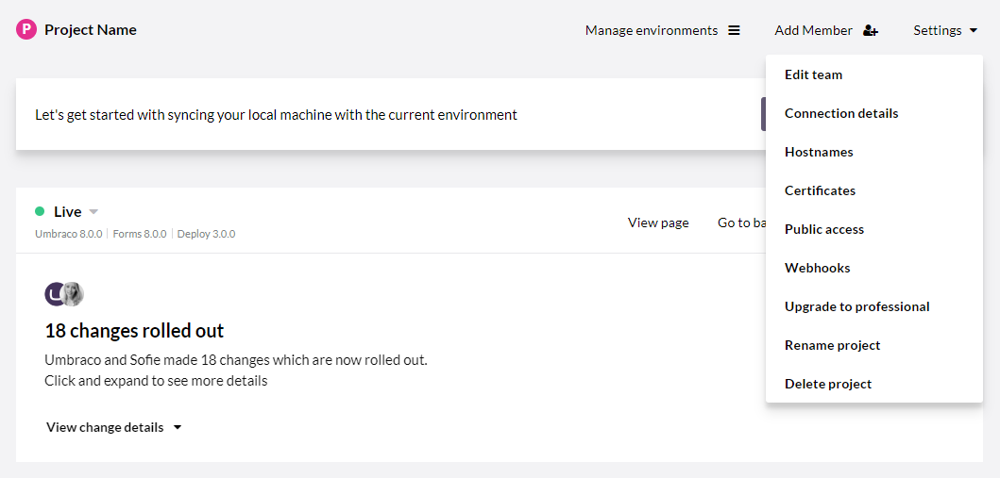

# Project settings

When working with an Umbraco Cloud project you can handle a lot of the project configuration directly in the Umbraco Cloud Portal.

The things you can configure include hostnames / domains, SSL certificates, database connections and deployment webhooks.

## [Edit team](../Team-Members)

From this page you can manage the team members on your project.

This is also where you need to go, to add a [Technical contact](../Team-Members/Technical-contact.md) to your project.

## [Connection details](../../Databases)

This is where you go to find connection details to your Umbraco Cloud databases.

You will need to whitelist your IP in order to connect to the databases with your local machine - this can also be done from this page.

## [Manage domains](../Manage-Domains)

Binding hostnames and domains to your Umbraco Cloud project is easily done from the Umbraco Cloud Portal - the page is called **Manage Domains**.

This is also the page you go to when you want to add security certificates to your project.

## Manage IP Whitelist

This is where you go to whitelist IP's for the basic authentication that's enabled on Development and Staging environments. Simply add the IP's to the list under the environment you want to open access to, and we'll take care of the rest!

If you are on a Trial plan, you can also whitelist IP's for bypassing the basic authentication on the Live environment - on paid projects the basic authentication will be disabled by default on the Live environment.

## Upgrade your project

From the *Settings* menu you can easily upgrade your Umbraco Cloud Starter plan to a Professional plan.

The option will not be available when you are already on a Professional plan or if you are running in Trial mode.

## Renaming and deleting

You might need to rename your Umbraco Cloud project - find the option to do that from the *Settings* menu. 

**NOTE**: If you are working locally you need to update the origin of your local git repository to point to the new clone url. Alternatively to make a fresh local clone of the project, once you’ve changed your project name.

If you want to delete your Umbraco Cloud project you can find the option to do this from the *Settings* menu as well. Deleting your Umbraco Cloud project is permanent - all data, media, databases, configuration, setup, and domain bindings are removed in the process.

**Note**: Deleting your Umbraco Cloud project will also cancel any subscriptions you have set up for your project.

## [Deployment Webhook](../../Deployment/Deployment-webhook)

On Umbraco Cloud projects we've made it possible to configure a deployment webhook on your environments. This will be triggered upon successful deployments, you can configure where you would like information about the deployment to be posted.
