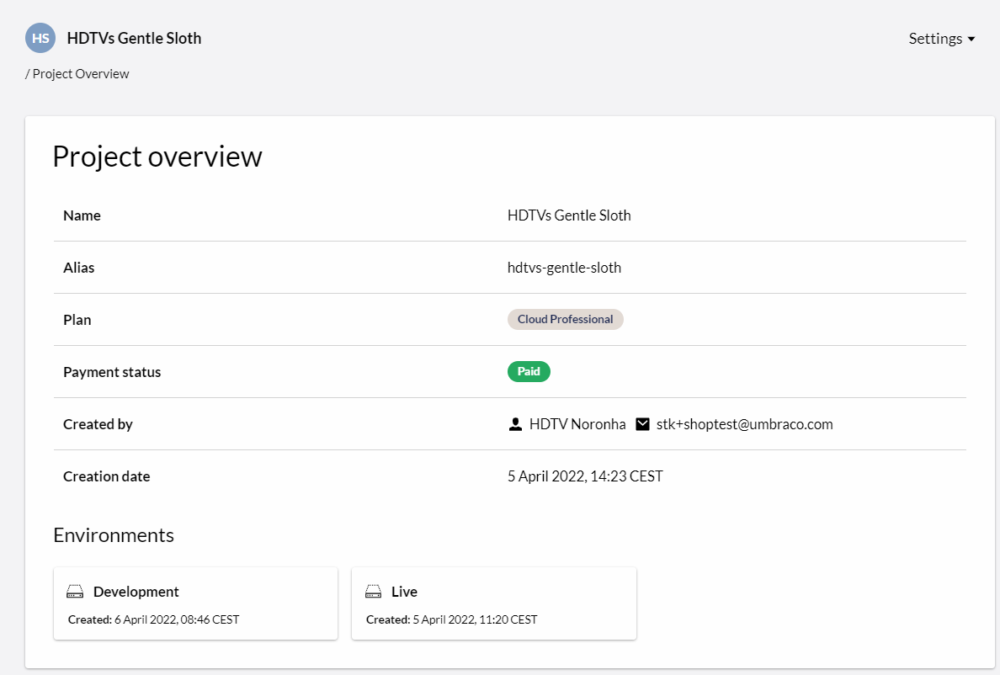
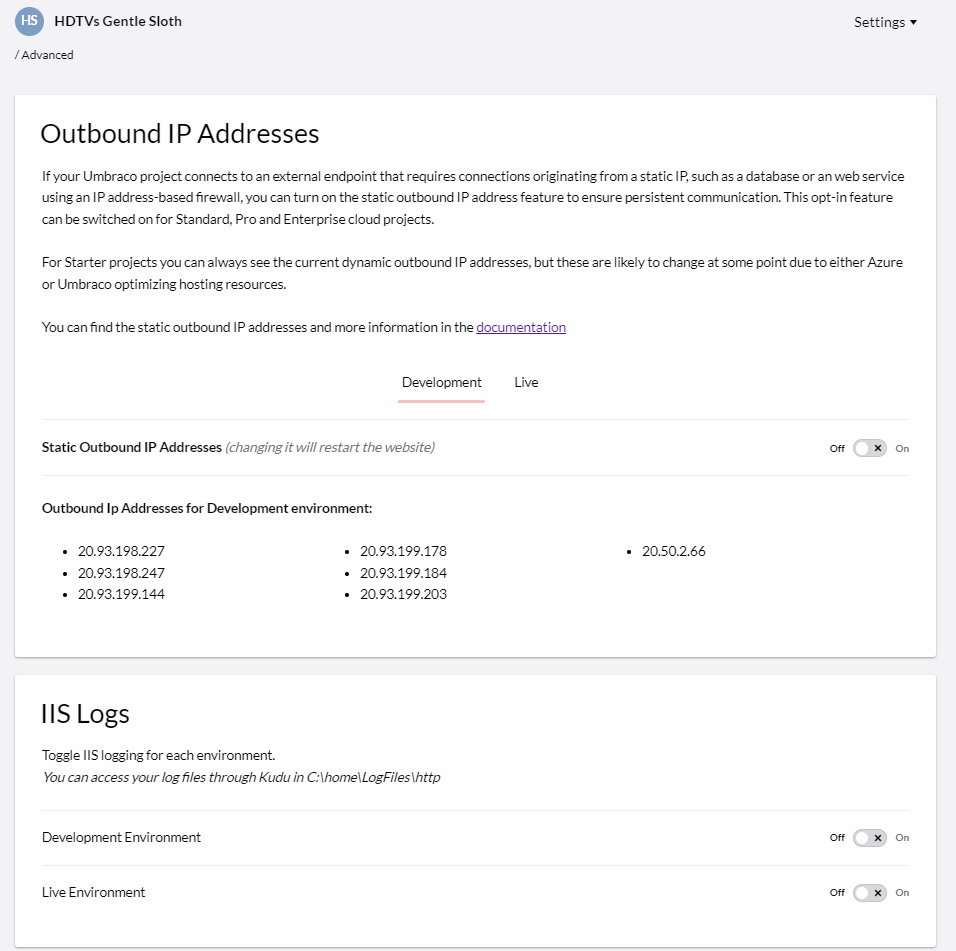

# Project Settings

When working with a Umbraco Cloud project, you can handle a lot of the project configuration directly in the Umbraco Cloud Portal. You can manage team members, database connections, hostnames/domains, security settings, SSL certificates, deployment webhooks, upgrade plan, project usage, advanced settings, rename, or delete the project.

## Overview

You can view the **Overview** of your Umbraco Cloud project from the **Settings** menu.

## [Edit team](../Team-Members)

Manage the team members on your project. You can also view the backoffice user groups for each team member, add a [Technical contact](../Team-Members/Technical-Contact.md), or add an [Account contacts](../Team-Members/Accounts-Contact.md) for your project.

## [Connection details](../../Databases)

Find connection details to your Umbraco Cloud databases. You need to allow your IP to connect to the databases with your local machine.

## [Hostnames](../Manage-Hostnames)

Binding hostnames to your Umbraco Cloud project is done from the **Hostnames** section in the **Settings** menu on the Umbraco Cloud Portal.

## [Security](../Manage-Security)

Manage transport security settings for your project. You can configure certain transport security options for all hostnames or specific hostnames within your project.

## [CDN Caching and Optimization](../Manage-CDN-Caching/index.md)

Manage CDN Cache settings for your project. You can modify default settings, which apply to all hostnames added to the current Project. Alternatively, you can setup specific settings per hostname, if you want to have different settings for certain hostnames.

## [Certificates](../Manage-Hostnames/Security-Certificates) (Only available on **Professional** or **Enterprise** plan)

Used to upload and bind your custom security certificate to your hostnames instead of using the TLS (HTTPS) certificates provided by the Umbraco Cloud service.

## [Webhooks](../../Deployment/Deployment-webhook)

It is possible to configure a deployment webhook on your environments on Umbraco Cloud projects. This will be triggered upon successful deployments, you can configure where you would like information about the deployment to be posted.

## Upgrade Plan

You can upgrade your project to a **Standard** or a **Professional** plan, from the **Settings** menu, depending on your needs. The option is not available if you are already on the specific plan or if you are running in **Trial** mode.

## Rename project

### Renaming the Cloud Project

You can rename your Umbraco Cloud project from the **Settings** menu.

:::note
If you are working locally, you need to update the origin of your local git repository to point to the new clone URL. Alternatively, you can make a fresh local clone of the project, once you’ve changed your project name.
:::

### [Renaming the Project file and folder](https://our.umbraco.com/documentation/Umbraco-Cloud/Set-Up/Working-Locally/#renaming-the-project-files-and-folders)

You can rename your project from the **Rename Project** section in the **Settings** menu on the Umbraco Cloud Portal. When you rename a project, the default hostnames and clone URLs assigned to the project are updated to match the new project name. You can also rename your project files and folders locally.

## Advanced

Manage **Advanced** settings for your project from the **Settings** menu:

- [Enable static outbound IP addresses](../External-Services) for projects on a **Standard**, **Professional**, or **Enterprise** plan.
- Enable IIS logging for each of your environments. The log files can be accessed through kudu in `C:\home\LogFiles\http`. There is a rolling size limit on the log files of 100 MB. Once the limit is reached, the oldest log files will be overwritten by new ones.

    :::note
    When enabling IIS logging, the site will have to restart. For more information about IIS logging, look at the [Official Microsoft Documentation](https://docs.microsoft.com/en-us/iis/configuration/system.webserver/httplogging).
    :::

## [Payment](../Manage-Subscriptions/new-shop.md)

From here, you can see the payment history for your project, change the credit card, as well as download the latest invoices for your project.

:::note
This only applies to new customers on Umbraco Cloud after the 28th of April, 2021. For old projects, the invoices and payment history are still available from the [Umbraco Shop](https://shop.umbraco.com/profile/sign-in).
:::

## [Usage](../Usage/)

On your Umbraco Cloud project, it is possible to see the usage of Custom Domains, Media Storage, Content Nodes, and Bandwidth for your project. You can also check if it is using above or below the allowed amount for the plan that your project is on.

### Delete Project

You can delete your Umbraco Cloud project from the **Settings** menu. Deleting your Umbraco Cloud project is permanent - all data, media, databases, configuration, setup, and domain bindings are removed in the process.

:::note
Deleting your Umbraco Cloud project will also cancel any subscriptions you have set up for the project.
:::
