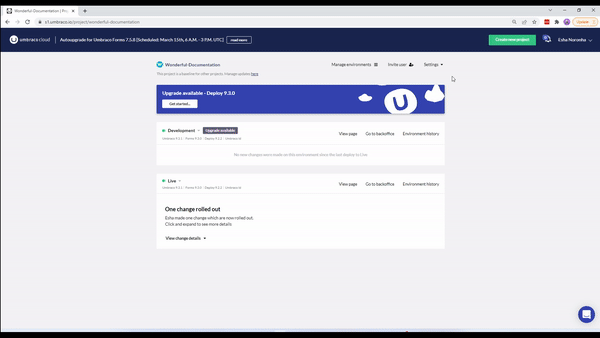

# Account Contacts

To ensure we notify the billing information to the right people, you need to add an **Account Contacts** to your project. This contact is our primary source of contact for project payment communications.

:::note
If you have more than one project on Umbraco Cloud, you will need to add an account contact to each of the projects manually.
:::

To add an account contact, do the following:

1. Go to the Project in the Umbraco Cloud Portal.
2. Click **Settings** and go to **Edit Team**.
3. In the **Account contacts** section, click **Add account contact**.
    
4. In the **Add new account contact** window, enter the **Name** and **Email**.
    
5. Click **Confirm**.

    

To edit an account contact, do the following:

1. Go to the Project in the Umbraco Cloud Portal.
2. Click **Settings** and go to **Edit Team**.
3. In the **Account contacts** section, select the contact whose details you wish to change and click **Edit**.
4. In the **Edit account contact** window, enter the updated **Name** or **Email**.
    
5. Click **Confirm**.

    

<iframe width="800" height="450" title="Adding an Account Contact to your Umbraco Cloud Project" src="https://www.youtube.com/embed/GnX4svXWE8U?rel=0" frameborder="0" allow="autoplay; encrypted-media" allowfullscreen></iframe>
