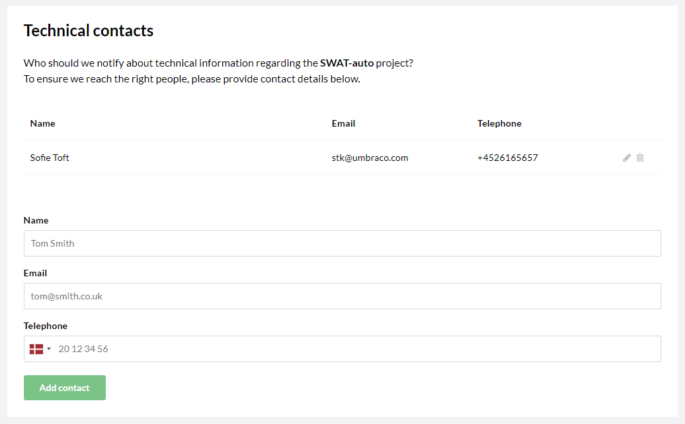

# Technical Contact

One of the biggest benefits of having an Umbraco Cloud project is that you do not need to worry about the hosting. This is something we handle for you.

When we do maintenance on our Umbraco Cloud servers we send out information to all our Umbraco Cloud customers. In order to reach the correct person for this information, you need to add a **Technical contact** to your project.

## How to add a technical contact

* Go to the **Edit team** page in the Umbraco Cloud Portal - find it under _Settings_
* Below the team members you'll find a form

Fill in the fields:

* Full name
* Email
* Phone number

You can update the information at any time. If needed, it's possible to add more than one technical contact to an Umbraco Cloud project.