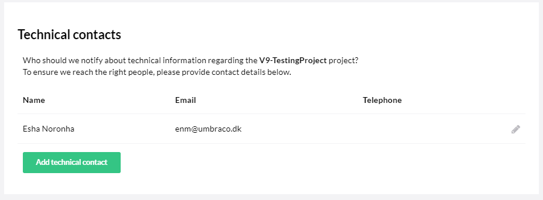
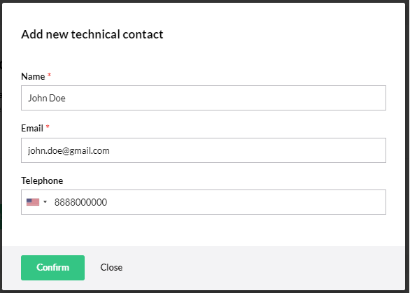
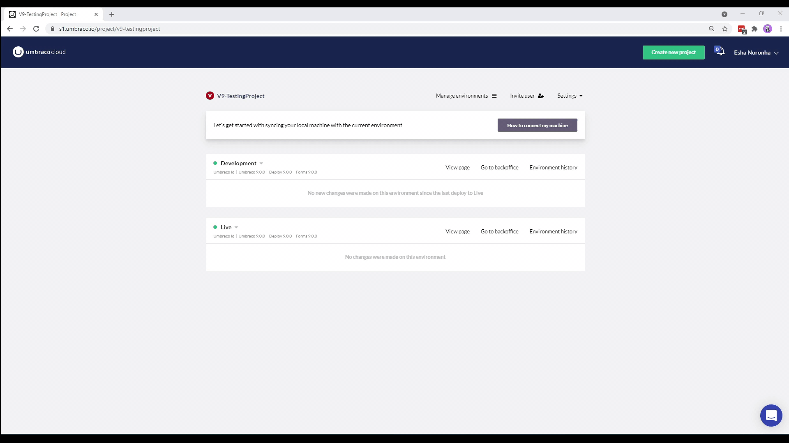

# Technical Contact

One of the biggest benefits of having an Umbraco Cloud project is that you do not need to worry about the hosting. We handle it for you.

When we do maintenance on our Umbraco Cloud servers, we send out information to all our Umbraco Cloud customers. In order for us to reach out to the correct person, you need to add a **Technical Contact** to your project.

:::note
If you have more than one project on Umbraco Cloud, you will need to add a technical contact to each of the projects manually.
:::

When you create a **New Project**, the user used to create the project will automatically be added as the technical contact. To update the technical contact or add more than one technical contact, do the following:

1. Go to the Project in the Umbraco Cloud Portal.
2. Click **Settings** and go to **Edit Team**.
3. In the **Technical Contact** section, click Add **Technical Contact**.
    
4. In the **Add New Technical Contact** window, enter the **Name**, **Email** and **Telephone Number**.
    
5. Click **Confirm**.

    