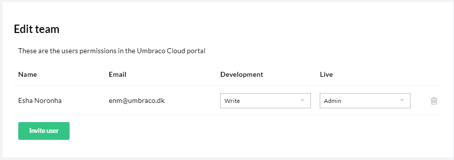

# Team Members in the Project Portal

This article is about team members that are added via the **Invite User** button in the Umbraco Cloud Portal. If you are looking for more information about Users in the Backoffice, see [Users](../../../Getting-Started/Data/Users/). Users added through the backoffice do not have access to the Umbraco Cloud Portal.

Team members are users that you add to your project via the Invite User button in the Umbraco Cloud Portal. They are automatically added as users in the Backoffice of all environments for the project. These users are able to clone down the project locally and login using the same credentials they use for Umbraco Cloud.

When adding a user, the default permission will be *Write*. If the *Admin* checkbox is ticked, the user will be given Admin rights to the project.

## Team Member Roles

Roles for each environment can be set in the **Edit Team** page available from the **Settings** dropdown. Permissions can be set per environment. For example, a user can have Write access on the Development environment, and Read access on the Live environment.

* **Read**: A team member with Read permissions can only view the project in the portal as well as the backoffices. They are not able to deploy or change anything on the project itself. They can clone down the project, but cannot push changes they have made locally. By default, they are added as an admin in the backoffice so they can make changes in the backoffice. If you want to change this, see Team Member Permissions in the Umbraco Backoffice below.

* **Write**: A team member with Write permissions can do everything on a project except deleting it and editing the team. A user with Write permissions is able to deploy changes between environments through the portal. They have access to the git repositories and can push local changes to the environment.

* **Admin**: Has access to everything on a project. An admin can delete a project and edit the team. An admin can deploy changes between environments in the Project Portal and has access to git, as well as the Power Tools Kudu.

## [Technical Contact](Technical-Contact.md)

For us to reach the correct person when sending out information about server maintenance, you need to add a technical contact to your Umbraco Cloud project.
