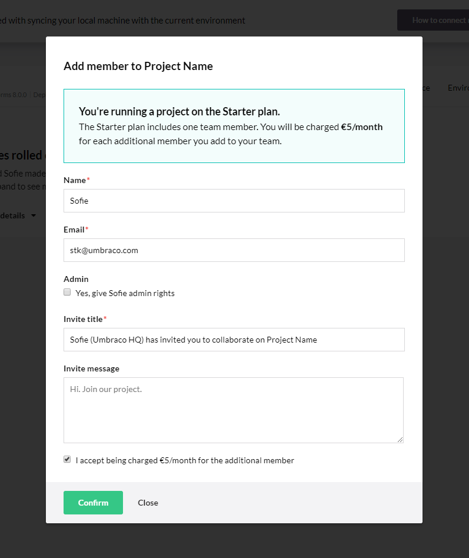

# Team members in the Project Portal
This article is about team members that are added via the Invite Member button in the Umbraco Cloud Portal. If you are looking for more information about Users in the Backoffice, see [Users](../../../Getting-Started/Data/Users/). Users added through the backoffice do not have access to the Umbraco Cloud Portal.

<iframe width="800" height="450" src="https://www.youtube.com/embed/Ib4QvzFYu_o?rel=0" frameborder="0" allow="autoplay; encrypted-media" allowfullscreen></iframe>

Team members are users that you add to your project via the Invite Member button in the Umbraco Cloud Portal. These users are automatically added as users in the backoffice of all environments for the project. These users are able to clone down the project locally and login using the same credentials they use for Umbraco Cloud.



When adding a team member the default permission will be *Write*. If the *Admin* checkbox is ticked they will be given Admin rights to the project.

## Team member roles
Roles for each environment can be set on the *Edit Team* page available from the *Settings* dropdown. Permissions can be set per environment. For example, a user can have Write access on the Development environment, and Read access on the Live environment.

* Read: A team member with Read permissions can only view the project in the portal as well as the backoffices. They are not able to deploy or change anything on the project itself. They can clone down the project, but cannot push changes they have made locally. Since by default they are added as an admin in the backoffice, they can make changes in the backoffice. If you want to change this, see Team Member Permissions in the Umbraco Backoffice below.

* Write: A team member with Write permissions can do everything on a project except deleting it and editing the team. A user with Write permissions is able to deploy changes between environments through the portal. They have access to the git repositories and can push local changes to the environment.

* Admin: Has access to everything on a project. An admin can delete a project, and edit the team. An admin can deploy changes between environments in the Project Portal and has access to git, as well as the Power Tools Kudu.


## Team Member Permissions in the Umbraco Backoffice
By default all team members created through the Portal are created as admin users in the backoffice. This can be overwritten by adding custom rules to the CloudUsers.config file in the /config directory.

To match a Team Member with a group of permissions in the CloudUsers.config file you'll need to either match by e-mail or by the User Type of the Team Member using the "match" or "matchEmail" attributes.

You can specify:

* UserType: The name of a Backoffice User Type thus default permissions on Content Nodes
* Start Nodes for Content and Media: You'll need to add the GUID of the node.
* Language: The Culture Code for the backoffice user interface language
* Disable Umbraco Access: When this is set to false, the user cannot login to the backoffice. Useful if your editors are working in the staging environment (by using the deploy feature, they'll still be able to push content to live)
* Apps: Aliases of the Umbraco apps where the user should have access. You can specify "*" to give access to all apps.

```xml
<PermissionGroups>
  <Group match="*">
    <UserType>Editor</UserType>
    <StartNodeContent>0319fe65-a558-45a1-bd88-f93429e1dc04</StartNodeContent>
    <StartNodeMedia>fc22bc00-54ee-52bf-b54c-92477dc95136</StartNodeMedia>
    <Language>da</Language>
    <DisableUmbracoAccess>true</DisableUmbracoAccess>
    <Apps>
    <App>Content</App>
    <App>Media</App>
    </Apps>
  </Group>
  <Group match="admin" matchEmail="@umbraco.">
    <UserType>Admin</UserType>
    <StartNodeContent></StartNodeContent>
    <StartNodeMedia></StartNodeMedia>
    <Language>en</Language>
    <DisableUmbracoAccess>false</DisableUmbracoAccess>
    <Apps>
    <App>*</App>
    </Apps>
  </Group>
</PermissionGroups>
```

## [Technical contact](Technical-Contact.md)

In order for us to reach the correct person when sending out information about server maintenance you need to add a technical contact to your Umbraco Cloud project.
