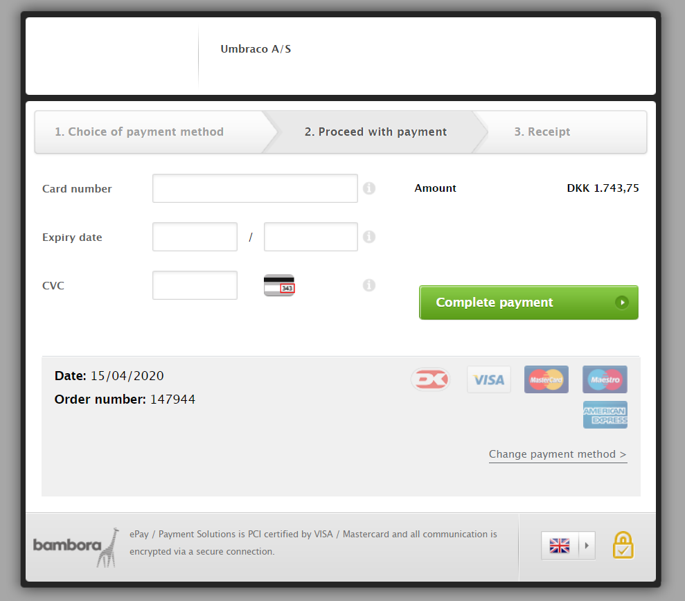

# Upgrade your Umbraco Cloud Plan
In this article, you can read about how you can upgrade your Umbraco Cloud plan, and what you need to be aware of before you do so.

## Before you upgrade your plan
Before you decide to upgrade your Umbraco Cloud plan, you need to consider a few things.

If you are on the Starter plan, you can either upgrade your plan to a Standard plan or a Professional plan.

If you are on the Standard then you have the option to upgrade to a profesional plan.

When you upgrade from the Starter plan to the Standard plan, the price will increase from €30 a month to €185, while with the standard plan you will get a development environment for no additional cost and it is possible to add a staging environment for an additional cost.

## How to upgrade your plan

The first step to upgrading an Umbraco Cloud plan is to access the project in the project overview at Umbraco.io. 

In the project overview you can find all the project that you have been invited to or have created, from there find the project that you want to upgrade the plan for.

Under the project on the right side you have a dropdown menu called settings.

In the menu you can find a tab called *"Upgrade plan"*. 

Clicking on the tab you will directed you to the overview of the plans that you can upgrade to.

From here you can see the different plans that you can upgrade to and the price per month and the limitations between each of the plans.

If on a Starter plan you can upgrade to the Standard and the professional, if you are on the Standard plan you can upgrade to the professional plan.

To upgrade to the plan of your choosing click on the green button, which will then take you to the Umbraco shop.

If you already have a Umbraco shop account you can fast checkout by logging in, otherwise you will need to enter the details and VAT ID for your company.

**Note:** It is currently only possible to to pay with VISA and Mastercard, if you are unable to use these cards, then please reach out to our friendly support who will be more than happy to help.

## downgrade your plan

If you need to downgade the plan you are on, please reach out to our friendly support, they can help you in doing so.

