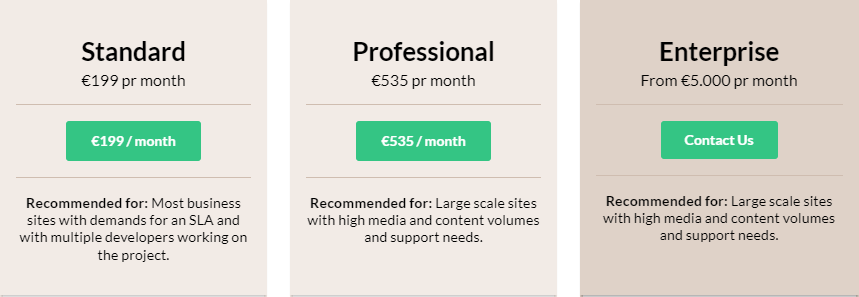

# Upgrade your Umbraco Cloud Plan

In this article, you can read about how you can upgrade your Umbraco Cloud plan and what you need to be aware of before you do so.

## Before you upgrade your plan

Before you decide to upgrade your Umbraco Cloud plan, you need to consider a few things:

- Changing a plan for a project on the new platform will change the outgoing IP of the project. If your solution has an external service that requires whitelisting the outgoing IP of the project, please visit the documentation for [external services](https://our.umbraco.com/documentation/Umbraco-Cloud/Set-Up/External-Services/) prior to upgrade.

- If you are on the Starter plan, you can either upgrade your plan to a Standard or a Professional plan.

- On the Standard plan you have the option to upgrade to a professional plan.

- When you upgrade from the Starter plan to the Standard plan, the price will increase from €32 a month to €199.

- With the Standard plan you will get a Development environment for no additional cost and it is possible to add a Staging environment for €50.

- The Professional plan costs €535 per month and you get both a Development and a Staging environment for free.

## How to upgrade your plan

The first step to upgrading your Umbraco Cloud plan is to access your project in the project overview at [Umbraco.io](https://www.s1.umbraco.io/projects).

- In the project overview you can find all the projects that you have been invited to or have created.

- From here you need to find the project that you want to upgrade the plan for.

Under the project on the right side you have a dropdown menu called settings:

In the menu, you can find a tab called *"Upgrade plan"*.

- Clicking on the tab will direct you to the overview of the plans that you can upgrade to.

- From here you can see the different plans, the price per month, and the limitations between each of the plans.

- If you are on a Starter plan you can upgrade to the Standard and the Professional plan.

- If you are on the Standard plan you can upgrade to the Professional plan.

To upgrade to the plan of your choosing, click on the green button for the plan that you want to upgrade to and then your project will be upgraded.

:::note
The change in price will take effect from the next period of your subscription.

If you change the plan in the middle of the month, the time from that date until the start of the next subscription period, will be added to the next invoice.
:::

## Automatic plan upgrades

If your project/website exceeds any of the usage limits, you will automatically get upgraded to a plan that fits your actual usage to ensure your website keeps running smoothly.

We will send an email to the project owner and the technical contact(s) of the project to let you know that this has happened. The upgrade to a new plan will be reflected in your next bill and will count from the day of the upgrade.

When you get upgraded to a new plan, you also get access to all the features that are included in this plan. [Check out the list of features for the various Umbraco Cloud plans](https://umbraco.com/umbraco-cloud-pricing/).

## Downgrade your plan

If you’d like to downgrade, this is possible if you make sure to lower your limit to fit the desired plan.

When you’ve lowered the required data usage, reach out to Umbraco Support and they’ll be able to help downgrade your plan. When downgrading to a lower plan, this will come to effect immediately, meaning that your usage limits will be reduced and any extra features related to your previous plan will be deactivated. You will pay for the old plan until the next scheduled bill.

If you have any questions regarding this, feel free to reach out to [Umbraco Support](mailto:contact@umbraco.com).
