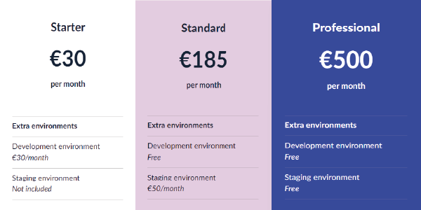
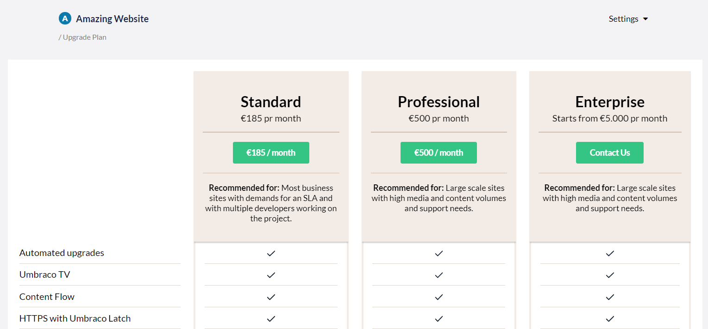

# Upgrade your Umbraco Cloud Plan
In this article you can read about how you can upgrade your Umbraco Cloud plan and what you need to be aware of before you do so.

## Before you upgrade your plan
Before you decide to upgrade your Umbraco Cloud plan, you need to consider a few things:

 - If you are on the Starter plan, you can either upgrade your plan to a Standard or a Professional plan.

- On the Standard plan you have the option to upgrade to a Profesional plan.

- When you upgrade from the Starter plan to the Standard plan, the price will increase from €30 a month to €185.

- With the Standard plan you will get a Development environment for no additional cost and it is possible to add a Staging environment for €50.

- The Professional plan costs €500 per month and you get both a Development and a Staging environment for free.

:::center

:::

## How to upgrade your plan

The first step to upgrading your Umbraco Cloud plan is to access your project in the project overview at [Umbraco.io](https://www.s1.umbraco.io/projects).

- In the project overview you can find all the project that you have been invited to or have created.

- From here you need to find the project that you want to upgrade the plan for.

Under the project on the right side you have a dropdown menu called settings:

In the menu you can find a tab called *"Upgrade plan"*.

- Clicking on the tab will directed you to the overview of the plans that you can upgrade to.

- From here you can see the different plans, the price per month and the limitations between each of the plans.

- If you are on a Starter plan you can upgrade to the Standard and the Professional plan.

- If you are on the Standard plan you can upgrade to the Professional plan.

To upgrade to the plan of your choosing, click on the green button for the plan that you want to upgrade to and then your project will be upgraded.
 
:::note
The change in price will take effect from the next period of your subscription.

If you change plan in the middle of the month, the time from that date until the start of the next subscription period, will be added to the next invoice.
:::

## Downgrade your plan

If you need to downgrade the plan you are on, please reach out to our friendly support team, they can help you in doing so.

You can either contact them through the chat on Umbraco.io or send them an email to contact@umbraco.com, they will be more than happy to help.
