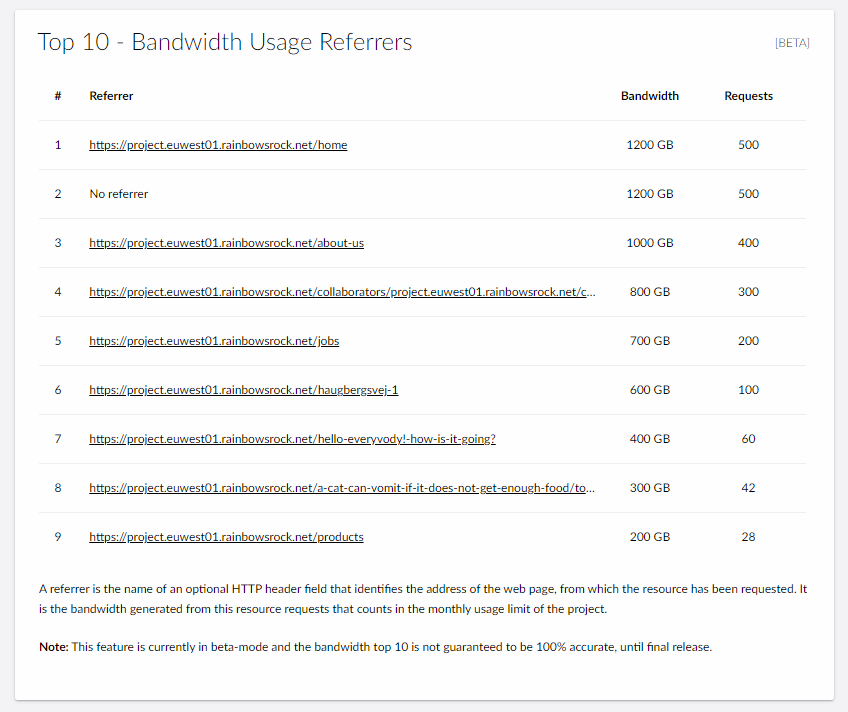
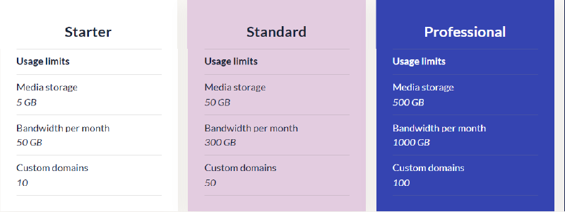

# Usage on your Umbraco Cloud project

From the Usage page, you can see the current usage of custom domains added to the project, the size of the media library as well as the bandwidth usage of the project.

You can also get an overview of the usage limitations for your Umbraco Cloud project as well as the plan that the project is on. In the Umbraco Cloud Settings menu you can find a page called Usage.

It is also possible to see a top 10 of the HTTP referers causing the most bandwidth. A referer is the name of an optional HTTP header field that identifies the address of the web page, from which the resource has been requested. It is the bandwidth generated from these resource requests that counts in the monthly usage limit of the project.

:::note
the top 10 bandwidth are currently in a beta state, as the bandwidth listed does not always match the total bandwidth shown for the project.
:::

## Usage limits

In the below image, you can see the Usage limitatons for the specific plans on Umbraco Cloud:

On Umbraco Cloud, you can always upgrade your project to a higher plan if you have reached the limit of what you are allowed on your project. You can **Upgrade Plan** from the **Settings** drop-down list on your project.

You can see the prices for the different plans on Umbraco Cloud on our [website](https://umbraco.com/umbraco-cloud-pricing/) or when you are upgrading your plan.

:::warning
When one of the limits reaches 90%, you’ll see a warning banner in the portal and an email is sent to the project owner and the technical contact(s) of the project, notifying you that you’re getting close to your limit(s).

:::
