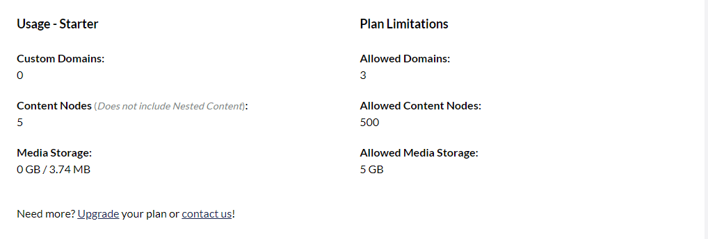

# Usage on your Umbraco Cloud project

In the Umbraco Cloud settings tab, we recently introduced a new setting called Usage.

From here you can see your current usage of Content nodes, Custom hostnames and Media storeage and the usage limitations for your Umbraco Cloud project and the plan that the project is on.

## Usage limits

On the image below you can see the Usage limitatons for the specific plans on Umbraco Cloud.

On Umbraco Cloud you can always upgrade your project to a higher plan if you have reached the limit of what you are allowed on your project.

This can also be done from the setting tab on your project.

You can see the prices for the different plans on Umbraco Cloud on our [website](https://umbraco.com/umbraco-cloud-pricing/) or when you are upgrading your plan.
