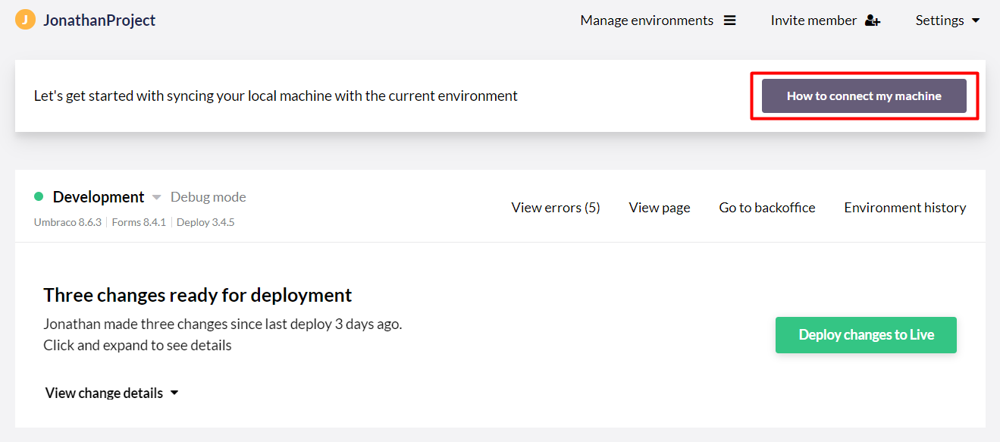
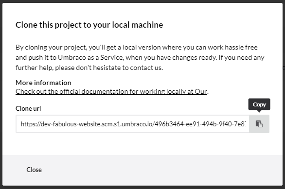
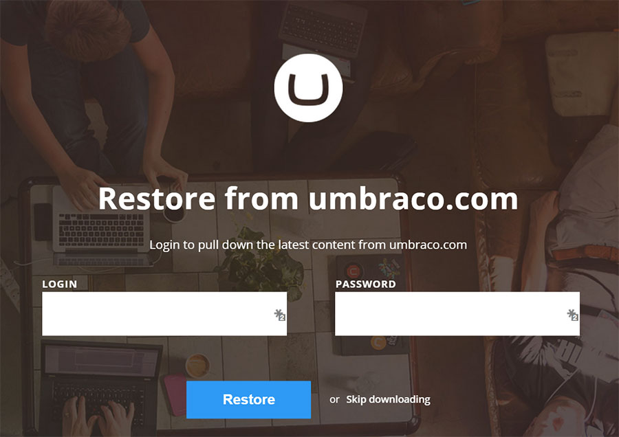

# Working with a local clone of an Umbraco Cloud site
To work with a local copy of your site you'll need to use Windows and have a local web server installed (like WebMatrix / IIS). If you're not using Windows you can still work with your site's files (Templates, Css, JavaScript, etc...) but you'll need to deploy these to your development site before you can "see" your updates - head over to our chapter on [Working with UaaS Cli](../Working-With-UaaS-Cli/) for more documentation on this.

## Video tutorial

<iframe width="800" height="450" src="https://www.youtube.com/embed/p5oMCMboxQ8?rel=0" frameborder="0" allow="autoplay; encrypted-media" allowfullscreen></iframe>

:::note
 To use Gitkraken with umbraco Cloud you need to have a license since the free version does not work with Private repositories.
:::
## Step-by-step

From the Umbraco Cloud portal copy your development environments git repository endpoint using the *How to connect my machine* option and then clone the site using your favorite Git client. We like [Fork](https://git-fork.com/),  [SourceTree](https://www.sourcetreeapp.com/), [Git Extensions](https://gitextensions.github.io), or [GitKraken](https://www.gitkraken.com/).
Here are the steps to clone your site (**We'll use Fork in this example.**):

1. Click the Connect my machine button to get the Clone project dialog.

    

2. Copy the Clone Url from the portal for your dev environment

    

3. From Fork select Clone

    

4. Set your destination path to where you keep your local work
5. Paste the URL in to the URL box
6. Choose a name for the local project folder (preferably using the project name)
7. Click 'Clone the repo!'

    
8. You’ll be prompted to log in - Use the same credentials as you use for Umbraco Cloud.

Now you have an exact copy of your Umbraco Cloud environment locally.

We like to use Microsoft WebMatrix or Visual Studio Code when working locally, but you can use Visual Studio or another development tool or web server of course. When you run your local site for the first time you’ll be prompted to restore your site's content. Wait until this process completes as it also creates the local SqlCE database for your site.

That's it! Now you can work with your site locally as you would with any other Umbraco site. You can create content, add media, even create your own custom code. When you're ready to deploy your changes make sure to have a look at the [deployments](../../Deployment/) documentation.

Note: If you have more than "a few" media items see our recommendations for working with [media in Umbraco Cloud](../Media/).
