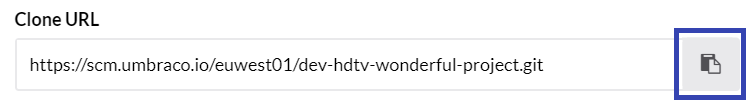
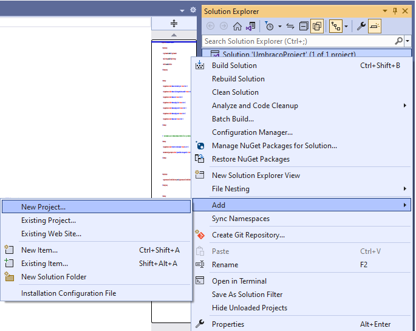

# Working with a Local Clone of an Umbraco Cloud Site

To work with a local copy of your site, you'll need to use Windows with a local web server installed (like WebMatrix/IIS). If you're using Mac, see the [Working with Mac](../Working-With-UaaS-Cli/) article. In this article, you will find:

- [Video Tutorial](#video-tutorial)
- [Cloning an Umbraco Cloud Project](#cloning-an-umbraco-cloud-project)
- [Running the site Locally](#running-the-site-locally)
- [Working with Visual Studio](#working-with-visual-studio)
    - [Adding a Solution File to your Cloud Project](#adding-a-solution-file-to-your-cloud-project)
    - [Adding Additional Projects to your Solution](#adding-additional-projects-to-your-solution)
- [Renaming the Project Files and Folders](#renaming-the-project-files-and-folders)

## Video Tutorial

<iframe width="800" height="450" src="https://www.youtube.com/embed/e3spd6Nqrf8?rel=0" frameborder="0" allow="accelerometer; autoplay; encrypted-media; gyroscope; picture-in-picture" allowfullscreen></iframe>

## Cloning an Umbraco Cloud Project

To clone a Umbraco Cloud project, follow these steps:

1. Open the project you wish to clone in the Umbraco Cloud Portal
2. Click on the arrow next to the **Development** environment.
3. Select **Clone project**.

   
4. **Copy** the clone URL to copy the Development environment's git repository endpoint.

    
5. Use your favorite Git client to clone down the project. In this guide, we will continue to use **Git Bash**.
6. In the **Git Bash** terminal, type the following command:

   ```cs
   git clone <Git clone URL>
   ```

    where the `<Git clone URL>` is the URL you copied from the cloud development environment.
    

7. Press **Enter**.

8. Once the project has been cloned down, you will get a folder either with the cloud project name or the name you gave the project.

    

9. Now, you have an exact copy of your Umbraco Cloud Development environment that you can run locally.

## Running the Site Locally

To run Umbraco locally, you will need to [install the latest .NET SDK](https://dotnet.microsoft.com/download) (if you do not have this already).

With dotnet installed, run the following commands in a terminal application of your choice. You can also refer to the `Readme` file in the project folder.

1. Navigate to the newly created project folder and then run the following commands:

    ```cs
    cd src/UmbracoProject
    ```

2. Build and run the new Umbraco .Net Core project:

    ```cs
    dotnet build
    dotnet run
    ```

3. The terminal output will show the application starting up and will include localhost URLs which you can use to browse to your local Umbraco site.

    

4. We recommend to setup a developer certificate and run the website under HTTPS. If you haven't configured one already, run the following dotnet command:

    ```cs
    dotnet dev-certs https --trust
    ```

5. The first time the project is run locally, you will see the **Restore from Umbraco Cloud** screen.

    If the environment you have cloned already contains Umbraco Deploy metadata files (such as Document Types, Templates, etc), these are automatically extracted with the option to restore content from the Cloud environment into the local installation.

    

6. Click **Restore** to restore your site's content, if any. Wait until this process is completed as it also creates the local SqlCE database for your site.

## Working with Visual Studio

When working locally, we recommend using Visual Studio but you can use any other development tool of your choice.

1. Once the project has been cloned down, you will get a folder either with files for your Umbraco Cloud project.

    

2. Navigate to `src/UmbracoProject`. Here, you will find the files for your Umbraco installation.

    

3. Open the `UmbracoProject.csproj` file in Visual Studio and start building and running your solution in Visual studio.

4. You can create content, add media, create your own custom code. When you're ready to deploy your changes make sure to have a look at the [deployments](../../Deployment/index.md) documentation.

    :::note
    If you have more than "a few" media items, see our recommendations for working with [Media on Umbraco Cloud](../Media/index.md).
    :::

### Adding a Solution File to your Cloud Project

Working with Visual Studio, you will likely want a solution file, so you and your team can work with an Umbraco Cloud project and have the option to add additional projects.

If you want to a solution File to your Cloud project, you can do it either:

- [Using the Command Line](#using-the-command-line)
- [Using Visual Studio](#using-visual-studio)

#### Using the Command Line

Using the terminal of your choice, navigate to the root of the git repository of your Umbraco Cloud project and enter the following command.

```cs
dotnet new sln --name <MyAwesomeSolution>
```

#### Using Visual Studio

1. Open the `UmbracoProject.csproj` project in Visual studio.

2. Click on the solution:

   

3. Using the **Save as** option save the solution file:

   

4. Provide a **File name** to create the solution file in the folder that you specified.

    :::note
    When creating a solution file, we recommend placing it in the root of the git repository.
    :::

### Adding Additional Projects to your Solution

:::note
When creating new projects along side the default UmbracoProject, we recommend adding the projects to the `src` folder in the git repository.
:::

If you want to add additional projects to your solution, you can do it either through the:

- [Command Line](#command-line)
- [Visual Studio](#visual-studio)

#### Command Line

Run the following commands to add additional projects to your solution:

```cs
dotnet new classlib --name MyAwesomeProject.Web --output src/MyAwesomeProject.Web
dotnet sln add .\src\MyAwesomeProject.Code\MyAwesomeProject.Code.csproj
dotnet sln add .\src\MyAwesomeProject.Web\MyAwesomeProject.Web.csproj
```

#### Visual Studio

1. Go to the solution explorer and select your solution:

   

2. Right click the solution and choose `Add` -> `New Project...`

   

3. Add a class library using the latest .NET SDK to your project:

   

4. Once the Class library has been added, you can see the project(s) that have been added in the Solution explorer:

   

## Renaming the Project Files and Folders

1. At the root of the project there is a `.Umbraco` file which contains the following:

    ```cs
    [project]
    base = "src/UmbracoProject"
    csproj = "UmbracoProject.csproj"
    ```

2. These two properties provide the folder location of the application and the the name of the .csproj file to build.

3. You can rename the folder and .csproj file as per your wish. You can also update any C# code namespaces to reflect the name of your project.

4. Additionally, add additional Class Library projects that are referenced by the `.csproj` file, if you prefer to organize your code that way.

   Example: Rename `UmbracoProject.csproj` to `MyAwesomeProject.Web.csproj` and have one or more additional class library projects such as `MyAwesomeProject.Code.csproj`

    ```cs
    [project]
    base = "src/MyAwesomeProject/MyAwesomeProject.Web"
    csproj = "MyAwesomeProject.Web.csproj"
    ```

5. We recommend updating the Namespace in the `Program.cs`, `Startup.cs`, and the `_ViewImports.cshtml` files, so the naming is consistent throughout your project structure.

6. Once updated, clear out the `bin` and `obj` folders locally to avoid build errors. When you are done, commit the changes and push them to Cloud.

7. If you have already built and run the project locally using the original project file and folder, make an update in your local .git repository to reflect the change that has been made. When a Cloud project first runs, a git hook is created to trigger a schema update via Umbraco Deploy when changes are pulled from an upstream environment.

8. The file you'll need to update is the `post-merge` within `.git/hooks/` in your cloned environment files. It can be opened with a text editor.

9. You can either delete the file so it will be recreated with the new path or update it. The default contents are shown below and can be updated to reflect the new path to the `umbraco/Deploy` folder.

    ```sh
    #!/bin/sh
    echo > src/UmbracoProject/umbraco/Deploy/deploy
    ```
