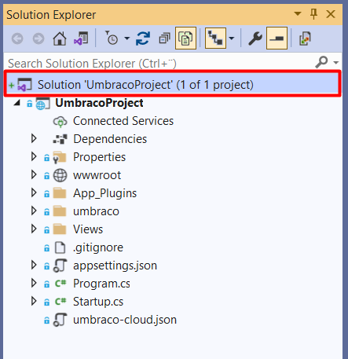
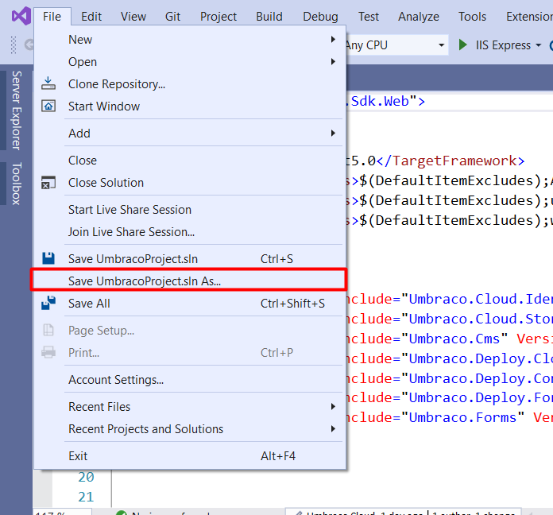
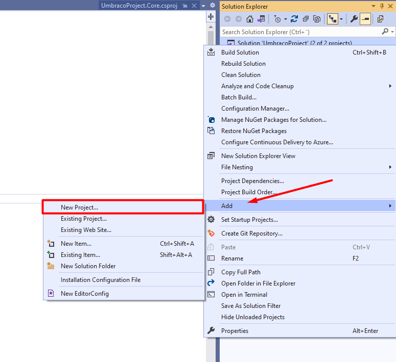

# Working with Visual Studio

In this article you will learn how to work with Visual studio and Umbraco 9 with a Umbraco Cloud project on your local machine.

## Getting started with 

The first step to get started working with Umbraco 9 and Visual studio is to clone down your project from Umbraco Cloud.

This can be done by following the [Working Locally guide](../Working-Locally) for Umbraco Cloud.

Once the project have been cloned down you will get a folder with the name you gave the project, with the files for your Umbraco Cloud project.


With the files in place you can now navigate to your project folder and make sure to go to src/UmbracoProject, here you will find the files for your Umbraco installation.

You will notice that in the folder there is a csproj-file called: `UmbracoProject.csproj`:


Opening this file will open up yor project in visual studio and you can start building and running your solution and start working with Visual studio.

### Adding a Solution file to your cloud project

Working with Visual Studio you will likely want a solution file, so you and your team can easily work with the Umbraco Cloud project from within Visual Studio and have the option to add additional projects.

there is two options to how this can be done:

1. From the terminal of your choice navigate to the root of the git repository for your Umbraco Cloud project, and enter the following command.

```Text
dotnet new sln --name MyAwesomeSolution
```

2. The second option for adding a solution file is by running the `UmbracoProject.csproj` which will open your project in Visual studio, once the project is open, click on your solution:



Then you can go ahead and save the solution file as:



And it will create the solution file for you in the folder that you specified.

:::note
When creating a solution file we recommend that you place it in the root of the git repository.
:::

### Adding additional projects to your solution

If you want to add additional projects to your solution, you can do it from the command line or through Visual studio.

:::note
When creating new projects along side the default UmbracoProject, we recommend that they are added to the src folder in the git repository.
:::

1. Adding additional projects through Command line.

 using the following `dotnet new` command, it is possible to add additional projects to your solution:

```Text
dotnet new classlib --name MyAwesomeProject.Web --output src/MyAwesomeProject.Web
dotnet sln add .\src\MyAwesomeProject.Code\MyAwesomeProject.Code.csproj
dotnet sln add .\src\MyAwesomeProject.Web\MyAwesomeProject.Web.csproj
```

2. Adding additional projects through Visual Studio

To add a new project through Visual studio, go to the solution explorer and select your solution:


Right click and choose `Add` -> `New Project...`



Add a class library using .NET 5 to your project:


Once the Class library have been added you can see the project(S) that have been added in the Solution explorer:


### Renaming the project file and folder

At the Root of the project there is a file called .Umbraco which contains the following:

```Text
[project]
base = "src/UmbracoProject"
csproj = "UmbracoProject.csproj"
```

These two properties help inform us the folder location which contains the application and the second is the name of the .csproj file to build.

You can rename the folder and .csproj file to whatever you want, you may also want to update any C# code namespaces to reflect the name of your project.

In addition to this you are able to add additional Class Library projects that are referenced by the Umbraco application .csproj file, if you prefer to organise your code that way.

An examoke could be to rename `UmbracoProject.csproj` to `MyAwesomeProject.Web.csproj` and have one or more additional class library projects such as `MyAwesomeProject.Code.csproj`

```Text
[project]
base = "src/MyAwesomeProject/MyAwesomeProject.Web"
csproj = "MyAwesomeProject.Web.csproj"
```

We recommend that you update the Namespace in the `Program.cs`, `Startup.cs` and the `_ViewImports.cshtml` files, So the naming is consistent throughout your project structure.

Once updated you will need to clear out the bin and obj folders locally to avoid build errors. When you are done, commit the changes and push them to Cloud, and that's it.
