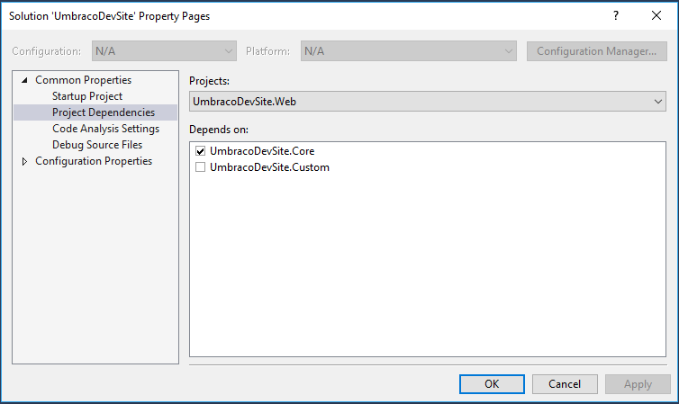

# Working With Visual Studio

This section shows you how to work with an Umbraco Cloud site setup in Visual Studio using the approach outlined in ["Visual Studio"](../Visual-Studio/). If you haven't already setup your Umbraco Cloud site in a Visual Studio solution then please refer to the ["Visual Studio"](../Visual-Studio/) setup page.

## Getting started
As mentioned in the previous section about the Visual Studio setup, using the recommended approach, you will start with two Projects in Visual Studio - A project called `*.Web` with the Umbraco site (from Umbraco Cloud) configured as a Website project, and a project called `*.Core` configured as a class library for all of your code.

_So what goes where?_

Anything that is used within Umbraco like plugins and configuration should by default be placed in the `*.Web` project. Here is a list of other elements that you want to place in the Website project:

* Website assets like css, javascript and related images
* Views, Partial Views and Partial View Macro
* Configuration (web.config and all the umbraco specific or related config files)
* Usercontrol ascx-files
* Plugins (typically located in App_Plugins)
* Meta data (the files that Umbraco Deploy serializes to disk for Document Types, Data Types, Media Types, Member Types, Member Groups, Templates and currently also Dictionary Items)

Media files will also be placed under the `*.Web` folder and you will be able to see these through Visual Studio, because a Website projects shows all files on disk by default. Media files from the /media/ folder should not be committed to the git repository, but more on that in the next section about 'What should be committed'.

We recommend placing all your code in the `*.Core` project (instead of, for example, using App_Code for that). This includes, but is not limited to:

* Controllers for MVC, Web Api
* Controllers for Umbraco Plugins, Surface, API
* Models and ViewModels
* Data Access (the `*.Core` project references Umbraco so you can use the Umbraco datalayer as needed)
* Extensions methods

You can of course add additional projects to the Visual Studio solution when needed. The only thing you must remember is to add that new project as a dependency to the `*.Web` project, so the assembly output is copied to the website's bin folder.

Once you have added a new project to the solution right-click on the solution in Visual Studio and select "Properties". This brings up the Solution Property Pane where you can select dependencies as shown below:

  

## Using Umbraco namespaces in your *.Core project
In order to use Umbraco's features in your *.Core project, you have to add references to the DLLs in your *.Web/bin.

You can do this by simply right-clicking on **References** and selecting **Add Reference**. Browse and select the DLLs you'd like to use and then hit **OK**. Don't forget to build.

## Git - what should be committed

When working with this solution setup its important to remember that you have one git repository for your source code, and one within the `*.Web` folder for committing and deploying your changes to Umbraco Cloud.

The cloned git repository from Umbraco Cloud comes with its own `.gitignore` so files that should NOT be committed are already handled. As a rule of thumb all files that are required to run the Umbraco site should be committed to the git repository in the `*.Web` folder and deployed to Umbraco Cloud. This includes assemblies (`*.dll`). Please note that its especially important to commit the files under the `*.Web/data/` folder as these files are the serialized versions of the meta data (Document Types, Data Types, Media Types, Member Types, Member Groups, Templates and currently also Dictionary Items) for the site.

For the `*.Core` part of the solution as well as the solution file and default `.gitignore` file you commit that to the source code repository. You should ideally set a remote for this git repository to your own git host like Github, Bitbucket or Visual Studio Team Services.

These are the files and folders you typically want to commit in your own source code repository:

* The project and code files in `*.Core`
* The solution file `*.sln`
* `.gitignore`
* UaaSClone.cmd (used for re-establishing the `*.Web` folder with the git repository from Umbraco Cloud)

## Setup for new team members

When you are working in a team you will have additional people that will use this same setup, but they will only clone your source code repository from your Github, Bitbucket or Visual Studio Team Services account.
In doing so they will, by default, not get the `*.Web` folder and the umbraco site, because that part is not contained within the source code repository. So to make it easy to get up and running we added a `UaaSClone.cmd`, which can be run after cloning the source code repository.
Running this command line tool will clone the Umbraco Cloud repository to the right folder, so the Visual Studio setup remains valid. 

## Working with NuGet

Some Umbraco packages are available on NuGet and you can install NuGet packages into the `*.Web` project to add functionality to your site. Remember, this is just a normal Visual Studio solution so you can work with NuGet packages exactly like you're used to, install them in the project where you need them. Make sure that you should always install any NuGet packages you need in the `*.Web` project in order for them to work in your website and deploy to your other environments.

For example, if you need to program something in your `*.Core` project and you depend on a NuGet package for the code you're writing, you should install that NuGet package in both:

- Install it in `*.Core` so you can write the code you need against the library you working with (obtained from NuGet)
- Also install it in `*.Web` so that the library files also end up in your website and your compiled code works there as well
