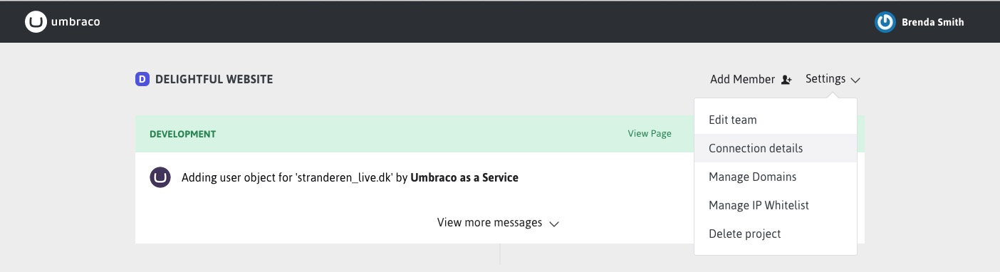
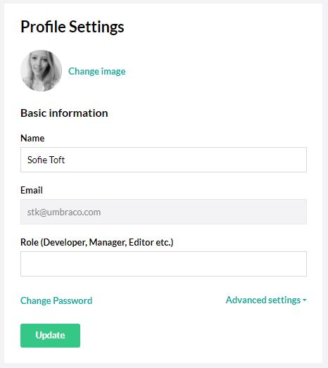

#Set Up
Now that you've created a project there are a few things you may want to do to make working with your project easier. As you get ready to launch your live site there are some other considerations to take into account as well.

Most of the set up can be accomplished by using the options from your project's Settings drop down. Some of the setup applies to all of your projects, so you'll make these updates from your profile section.

#Project settings

##Naming a Project
This is a very personal choice of course, but thake the time to get it right as you can't change a project's name once it's been created.  Umbraco Cloud ensures unique project name, so there's no worries about duplicate names.

##Deleting a Project
This does what it says. Once you've confirmed deletion of a project it is permanently removed as are all data, media, databases, configuration, setup, and domain bindings. So, make sure this is what you want.

##Domains (Hostname binding)
You can bind any hostname to your sites that you like. Keeping in mind, of course, that the hostname will need to have a DNS entry so that it resolves to the Umbraco Cloud service.

Once you add a domain here makes sure to update the hostame DNS entry to resolve to the umbraco.io service. We recommend setting an ALIAS record for your site's root domain (e.g. mysite.s1.umbraco.io), rather than an A record for the umbraco.io service IP address. Check with your DNS host or domain registrar for details on how to configure this for your domain.

###Hiding the Default umbraco.io Url
Once you've assigned a hostname to your live site you may want to "hide" the site's default Url (e.g. mysite.s1.umbraco.io) for various reasons. Perhaps for SEO or just making it clear to your users that the site can be accessed using just one hostname.

One approach for this is to add a redirect to your live site's web.config. To accomplish this, add a redirect rule to the live site's web.config in the `<system.webServer><rewrite><rules>` section. For example, the following rule will redirect all requests for the site's mysite.s1.umbraco.io Url to the mysite.com Url and respond with a permanent redirect status.
        
        
    <rule name="Redirects umbraco.io to actual domain" stopProcessing="true">
      <match url=".*" />
      <conditions>
        <add input="{HTTP_HOST}" pattern="^(.*)?.s1.umbraco.io$" />
        <add input="{REQUEST_URI}" negate="true" pattern="^/umbraco" />
        <add input="{REQUEST_URI}" negate="true" pattern="localhost" />
      </conditions>
      <action type="Redirect" url="http://<your actual domain here>.com/{R:0}" 
              appendQueryString="true" redirectType="Permanent" />
    </rule>

**Note:** This will not rewrite anything under the `/umbraco` path so that you can still do content deployments. You don't have to give your editors the umbraco.io URL, and they won't see the umbraco.io URL if you give them the actual domain name. This rule will also not apply on your local copy of the site running on `localhost`.  

##Security Certificates
You can apply certificates to your live site by uploading them from the Manage Domains page. Your certificates need to be .pfx format and must be set to use a password. Each certificate can then be bound to a hostname you have already added to your site. Make certain you use the hostname you will bind the certificate to as the common name (CN) when generating the certificate.

###Running your site on HTTPS only
Once you've applied a certificate to your site you can make sure that anybody visiting your site will always end up on HTTPS instead of the insecure HTTP.

To accomplish this, add a redirect rule to the live site's web.config in the `<system.webServer><rewrite><rules>` section. For example, the following rule will redirect all requests for the site http://mysite.com URL to the secure https://mysite.com URL and respond with a permanent redirect status. 

    <rule name="HTTP to HTTPS redirect" stopProcessing="true">
      <match url="(.*)" />
      <conditions>
        <add input="{HTTPS}" pattern="off" ignoreCase="true" />
        <add input="{HTTP_HOST}" pattern="localhost" negate="true" />
      </conditions>
      <action type="Redirect" url="https://{HTTP_HOST}/{R:1}" redirectType="Permanent" />
    </rule>        

**Note:** This redirect rule will not apply when the request is already going to the secure HTTPS URL. This redirect rule will also not apply on your local copy of the site running on `localhost`.

##IP Whitelist
You can add specific IP addresses to the whitelist to automatically allow any client from these addresses to access your development or staging sites without the initial authorization dialog. This can reduce the amount of times you or your team wil need to enter your credentials in order to access your sites.

As with all things security related, make sure you use this feature judiciously as it will allow access to your Umbraco backoffice login page without requiring the initial authentication. Of course, the Umbraco backoffice will still require authentication.

#Profile Settings

###Name
The name that will be displayed on Umbraco Cloud

###Email
This email address is used for logging in to Umbraco Cloud and will receive email notifications from the portal.

###Change password
Change the password for your Umbraco Cloud account.

##Advanced settings

###Timezones
From your profile settings you can set your timezone. This applies to the display of status messages in the Umbraco Cloud portal and makes it easier to determine the actual time a particular status was created.

###Experimental Features
You can enable the availability of experimental features for your projects. This includes features that may not be functionally complete and are not supported by Umbraco HQ. We recommend enabling this only if you fully understand the feature you will be using or are strictly using the project as a test.

####Other Set Up Topics
 - [Working with your site locally](Working-Locally/)
 - [Adding team members](Team-Members/)
 - [Working with Visual Studio](Visual-Studio/)
 - [Additional media topics](Media/)
 - [Config transforms for each environment](Config-Transforms/)
 - [Examine index management](Examine-Configuration/)
