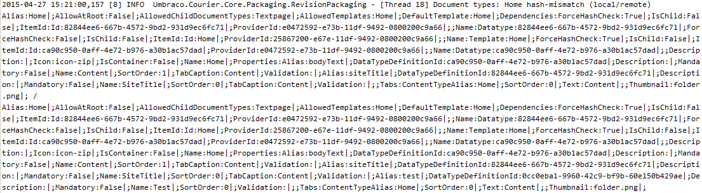

# Troubleshooting Content/Media transfers 

If the schema (this includes DocumentTypes, MediaTypes, DataTypes, Templates, Macros and Dictionary items) is different between the two environments you are deploying between, you will need to deploy the updates for these before you can complete the Content transfer (this can contain Media from the Media section as well). Environments need to be in-sync before a Content and/or Media transfer can succeed.

In the image above the content transfer is not possible because a Document Type and a Data type is out of sync between the source and target environments. 

While Content and Media transfers are done using the Umbraco backoffice you use the Umbraco Cloud Portal in order to deploy the schema changes, which exists on disk and are deployed through the underlying Git repository. If you are working locally, you deploy the changes using your local Git client.

The following articles explain in detail how the deployment process works:

* [Deploying from Local to Cloud](https://our.umbraco.com/documentation/Umbraco-Cloud/Deployment/Local-to-Cloud/)
* [Deploying between two Cloud environment](https://our.umbraco.com/documentation/Umbraco-Cloud/Deployment/Cloud-to-Cloud/)

If you continue to see conflicts between the schema parts that were deployed then please refer to the Debugging section below.

## Debugging for Courier

If you continue to see conflicts between the schema parts (being DocumentTypes, DataTypes, Templates, etc.) that was just deployed you need to dive into the log files to debug exactly what the problem is.

In order to find the log entries that deals with conflicts in the schema you should log for an entry like the following:

    2015-04-27 14:59:20,546 [10] INFO  Umbraco.Courier.Core.Packaging.RevisionPackaging - [Thread 45] Document types: Home hash-mismatch (local/remote) e5c6dc5f2eee6521b2d024f7777bbd9e / 2628e7c3e4bc7215fd398a2bbb13f423

This error is not very descriptive and if you’re not sure what the differences are then you can investigate it a little bit deeper. If you add a key to your appSettings section in web.config you get to actually see what data we’ve tried to compare, unhashed.
In web.config (on both ends, both source and target), you can add the following key (note: on both the source and target environment):

    <add key="DeployHashDebug" value="true" />

Now when you get the above error, you’ll get the same message with a little more information:

Using a text compare tool like WinMerge we can pretty easily figure out that the property “Test” was added to the local document type but isn’t found on the remote instance.

