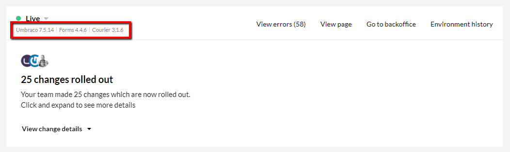

# Troubleshooting with Courier

Umbraco Courier is the deployment engine running Umbraco Cloud projects that have been created before May 2017 and have not yet been upgraded to Umbraco Deploy.

On this page, you can find troubleshooting guides that you should use when your project is using Umbraco Courier.

## How do I know which deployment engine my project is using?

In the Umbraco Cloud Portal, you can see which deployment engine each environment is using.

The environment in the image below is using Courier version 3.1.6

## Troubleshooting guides

* [Schema mismatch when transferring content and/or media](Schema-Mismatch-Courier)
* [Structure Errors](Structure-Errors-Courier)

## My deployment did not complete successfully. How do I find out what went wrong and what needs to change?

On rare occasions you may find that a deployment fails and there is no useful information in the error message.  In most cases you should try the deployment a second time, but if that also fails you will need to dig a little deeper.

### It’s time to get your Git on!  

The first step is to find out what state the site’s Git repository is in (for the source site, usually dev but could also be stage). In order to do this we’ll use the Kudu console that is available for every site in Umbraco Cloud.  Here are the steps to find out what state your repository is in:

1. Copy the URL from your site’s HTTPS Clone URL in the portal

2. Using the URL without the actual repository name, the GUID part, open a new browser tab and login. Just the URL like `https://dev-mysite.scm.s1.umbraco.io/`

3. You’ll see the Kudu site, which includes your site’s Git repository

4. From the menu select Debug Console > Powershell

5. In the file explorer navigate to Site > Repository

6. Now in the Powershell console enter
  `PS> git status`

7. The status of your repository will be displayed. If you see output similar to the following, you’re getting somewhere:

    `. # On branch master  # Your branch and 'origin/master' have diverged`

8. Now you need to resolve any merge conflicts and commit any outstanding unmerged paths. In most cases, you can use the following Git command to commit the outstanding paths (it may take a minute or two for Git to process the commit):

    `PS> git commit -m “Latest merged files here”`

9. If the Git commit didn’t work for you, you’ll need to go even a little deeper. There are a few options here; 1) if the files marked as “Unmerged paths” have a name like ‘03dbdfb1-7780-4368-8f1e-2bc2a18012ec.courier’ you can remove them using the Git command:

    `PS> git rm <full path from console>/03dbdfb1-8f1e-2bc2a18012ec.courier`

10. And 2) If the files listed in “Unmerged paths” are files your site is using, you’ll need to manually edit these files to resolve the merge conflict and then add them back to your repository using the Git command:

    `PS> git add myfilename`

11. Once you have resolved any conflicts you need to commit any outstanding changes:

    `PS> git commit -m “Manually resolved merge conflicts, yay!”`

12. Now check the status of the repository to make sure it’s clean:

    `PS> git status`

13. Whew! Just imagine having to do this without Git!

14. Now you can return to the Umbraco Cloud portal and deploy your site again

## Upgrading to Umbraco Deploy

Umbraco Deploy is the successor to Umbraco Courier. All new projects on Umbraco Cloud are using the Umbraco Deploy, which is a new and much-improved deployment engine that will ensure even smoother deployments between your Umbraco Cloud environments.

There are two roads you can take, in order to upgrade your project to use the latest Umbraco Deploy engine:

1. Use the auto-upgrader on the Development environment in the Umbraco Cloud portal
    * This will upgrade your project to run the latest of everything
    
2. Upgrade from [Courier to Deploy](../Moving-From-Courier-to-Deploy) manually
