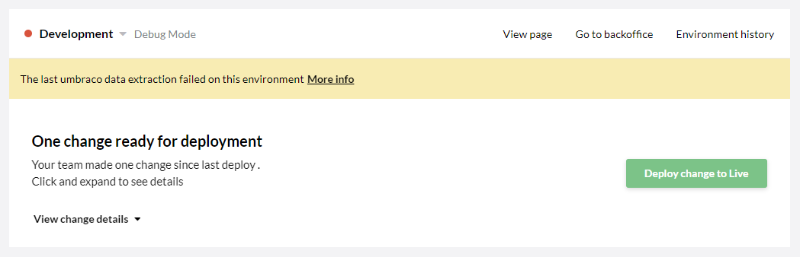

# Extraction error: Data Type collisions

When creating a new environment on your Umbraco Cloud project, you might encounter some issues regarding some of the default data types built into Umbraco.
The data types in question are:

* Content Picker
* Media Picker
* Member picker
* Multiple Media Picker (using Media Picker)
* Related Links

Since these 5 data types are part of the Umbraco CMS, these will be created by default on each new environment on Umbraco Cloud. If metadata-files / structure files for these data types has been generated on your Live environment, you might run into extraction errors on your newly created Development or Staging environment - new environments will be exact clones of the Live environment, thus containing all structure and metadata files from that environment.

## How do I know I have this issue?

The issue will present itself as an extraction error on your Development or Staging environment once you're created them.

Open the error message by clicking **More info**.

In the case illustrated above, there are four data types which each has two `UDA files`.

What this means is that a file has been generated for each datatype on both the Live and the Development environment. The Umbraco Deploy engine needs to create one instance of each datatype, but is currently not able to do so, since it doesn't know which files to built the data types based on.

See steps below on how to resolve the issue.

## How to resolve the issue

1. Access the backoffice of the affected environment (Development or Staging)
2. Find the **Data Types** folder in the Developer section
3. Delete **only** the data types mentioned in the error message
    * In the case above, I would need to delete *Member Picker*, *Multiple Media Picker*, *Related Links* and *Content Picker*
4. [Access Kudu](../../../Set-up/Power-Tools) for the affected environment
5. Follow the [Kudu Documentation](../../../Set-up/Power-Tools/Manual-Extractions) to run an extraction on the environment
6. When you get a `deploy-complete` marker, the issue has been resolved!

When you've followed these steps, go through your Development / Staging environment and make sure everything has been created as expected.

Final step you need to take before your Development / Staging environment is completely insync with your Live environment is to [restore the content](../../../Deployment/Restoring-content).
