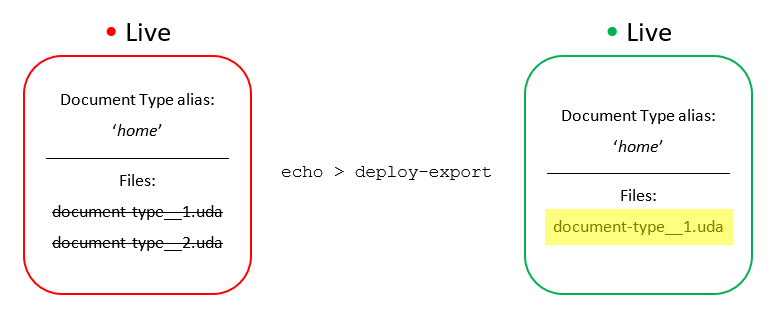
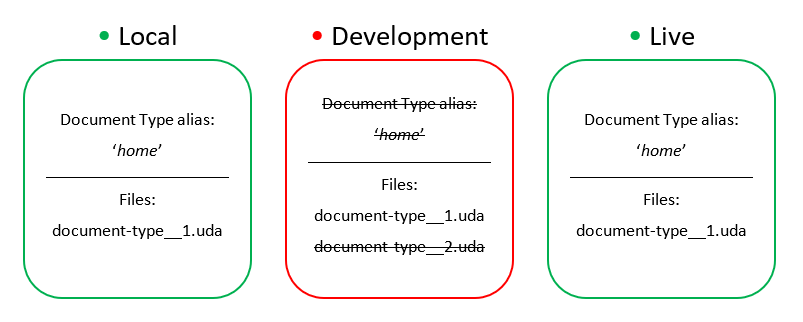
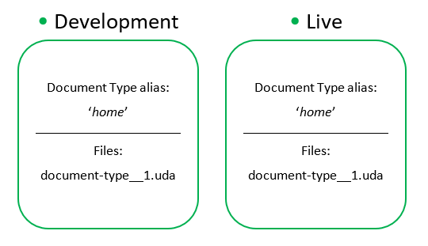

# How to resolve collision errors

:::note
If your project is using Umbraco Courier, please refer to this article instead: [Schema Mismatches with Courier](../../Courier/Structure-Errors-Courier)
:::

This guide is for solving collision errors on your Umbraco Cloud project. Use this guide when you encounter an error like this:

    Some artifacts collide on unique identifiers.
    This means that they have different Udis, yet
    they refer to the same unique Umbraco object
    and therefore cannot be processed.
    ---------------------------------------------
    Collisions for entity type "document-type":
    Collisions for unique identifier "home":
        UdaFile: ~/data/revision/document-type__4c04d968448747d791b5eae254afc7ec.uda
        UdaFile: ~/data/revision/document-type__f848c577f02b4ee5aea84f87458072a4.uda

The error means that two (or more) `.uda` files have been created for the same entity. The `.uda` files contain schema data for each of your entities e.g Document Types, Templates, Macros, Dictionary Items, Data types etc (for a full list of these entities see [What are UDA files?](../../../Set-Up/Power-Tools/generating-uda-files/#what-are-uda-files)).

In this example there are two `.uda` files who share the same alias which leads to a conflict: it is impossible for Deploy to know which of the files to use, so it gives up and sends an error back.

:::note
Does the collision error involve **Dictionary items**?
Use this guide instead: [Troubleshooting duplicate dictionary items](../Duplicate-Dictionary-Items)
:::

You can run into an error like this on all of your Cloud environment. Somestimes you might also run into it, on a local clone of your project. This guide will use an example, where two files are colliding on a Development and a Live environment.

## Table of content

* [Cause](#cause)
* [Video tutorial](#video-tutorial)
* [Using the error message](#using-the-error-message)
* [Deciding which file you want to use](#deciding-which-file-you-want-to-use)
* [Getting your environments in sync](#getting-your-environments-in-sync)

## Cause

<iframe width="800" height="450" src="https://www.youtube.com/embed/pF5SUh30FKI?rel=0" frameborder="0" allow="autoplay; encrypted-media" allowfullscreen></iframe>

The main cause of this problem is when an entity has been manually created in two or more environments, using the same alias.

Each environment on Umbraco Cloud are isolated and do not know what the other one is doing until they are synchronized. When an entity is created with identical aliases on two or more environments, it will create duplicate entities that are considered separate entities even though they look that same and share the same alias on both/all environments.

:::tip
When you have two or more Cloud environments, we recommend that you never create or make schema changes directly on the Live or Staging environments. You should work with schema only in your Development environment or even better, your local clone of the project.
:::

## Video tutorial

<iframe width="800" height="450" src="https://www.youtube.com/embed/S8tOVxKkqw8?rel=0" frameborder="0" allow="autoplay; encrypted-media" allowfullscreen></iframe>

You can find a full playlist about Collision errors on our [YouTube Channel](https://www.youtube.com/playlist?list=PLG_nqaT-rbpzgBQkZtRrdzIpeFbRNvO0E).

## Using the error message

The error message gives a lot of useful information which you can use to resolve the issue:

* Which entities are involved?
* The unique identifier (alias) for the involved entities
* Location and names of the colliding files

In the example above the entity involved is a Document Type with "home" as the alias. There are two colliding files both located in the `/data/revision` folder. The files are colliding because they share the same alias but have different GUIDs (also the name of the files).

## Deciding which file you want to use

In order to fix this problem, you will have to decide which of the colliding entities is the correct one and the one you want to use on your Live environment.

Let's use the example from the beginning of this article, where two `.uda` files for the Document Type "home" are colliding.

    Some artifacts collide on unique identifiers.
    This means that they have different Udis, yet
    they refer to the same unique Umbraco object
    and therefore cannot be processed.
    ---------------------------------------------
    Collisions for entity type "document-type":
    Collisions for unique identifier "home":
        UdaFile: ~/data/revision/document-type__4c04d968448747d791b5eae254afc7ec.uda
        UdaFile: ~/data/revision/document-type__f848c577f02b4ee5aea84f87458072a4.uda

For this example, it’s decided that the Document Type currently used on the Live environment is the one we want to use going forward.

 - *A visual representation of the error message*

In order to figure out which of the two colliding `.uda` files is the one for the Document Type being used on the Live environment follow these steps:

1. Access **Kudu** on the Live environment
2. Use the CMD console (found under the 'Debug console' menu) to navigate to your `site/wwwroot/data/revision` folder
3. Remove the colliding `.uda` files mentioned in the error message
4. Go back to the `/wwwroot/data` folder and run this command: `echo > deploy-export` in the console
5. This will regenerate all `.uda` files for the Live environment - this means only the currently used ones will be there afterwards
6. Run the command: `echo > deploy` in the same folder, to make sure everything is extracting correctly

You now know which `.uda` file you want. In this case: `document-type__1.uda`.

## Removing the unused file

:::warning
We strongly recommend that you resolve this locally since this will ensure that the changes you make are added to your Git repositories. Otherwise you may end up having the same problem next time you deploy.
:::

1. Clone down the Development environment to your local machine
2. Run the project locally and verify that you get the same extraction error as on your Cloud environments (*HINT: look for a `deploy-failed` marker in your local `/data ` folder*)
    * When you run the project, you should see an error message in the browser once the site starts to build
3. Remove the wrong `.uda` file (`document-type__2.uda`) from the `/data/revision` folder - you will not be able to see the Document Type in the backoffice because the failed extraction

4. Open CMD prompt and navigate to your local `/data` folder
5. Type the following command: `echo > deploy`
6. You will now see a `deploy-complete` marker in your local `/data` folder

:::note
**Does the error mention Templates?**
You might experience that `.uda` files for a template are colliding. When this is the case, we recommend that you copy the content of the `cshtml` file associated with the template you want to keep on your project - this way you'll have a backup of the code you want to use.
:::

## Getting your environments in sync

Before pushing the changes to the Development environment, you need to access the backoffice of the Development environment and remove the Document Type from there.

**Commit** and **push** the changes from your local clone to the Development environment, using your local Git client.

When the push from local to the Development environment has completed, refresh the Umbraco Cloud portal and you will see that the Development environment is now green, which means that the extraction error has been resolved.

Does your Development still have the red indicator?
Sometimes you might need to run another extraction on your Cloud environment after deploying in order to get a `deploy-complete` marker in your `/data` folder and turn your environment *green*. To do this, follow these steps:

1. Access **Kudu** on the affected environment
2. Use the CMD console to navigate to your `site/wwwroot/data/` folder
3. In the console, type the following command: `echo > deploy`
4. When the extraction is done, you should see a `deploy-complete` marker, which means the extraction error was successful (and the environment indicator will be green on the project page)

The final step is to deploy the pending changes from Development to your Live environment, to ensure everything is completely in sync.
