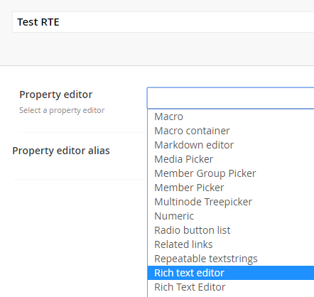

# Known issues with 3rd party packages / datatypes

## LeBlender
The popular LeBlender plugin works great with Umbraco Cloud, if you use the [Umbraco Courier Contrib](https://github.com/umbraco/Umbraco.Courier.Contrib) resolvers.

There is one little problem, however, LeBlender creates it's own Rich Text Editor datatype that is almost indistinguishable from the one that is built into Umbraco. Normally that would not be a problem, but this RTE can only contain 500 characters of text because it's configured incorrectly.

As you can see in the image above, There's two Rich Text Editors, the second one with the capital "T" in "Text" is the one that comes with Umbraco the other one with lowercase "t" is the one that LeBlender creates.

Normally this isn't a problem at all, when the LeBlender RTE is used in The Grid then everything will be stored correctly. The only problem occurs when you actually create a new datatype and were hoping to use it as a Rich Text Editor property on a document type (so not in the Grid). When you do that and try to enter more than 500 characters in that editor you will get an error saying: `String or binary data would be truncated`.

This can be fixed as follows. Clone your Cloud site to your local machine if you haven't done so yet and make the following changes:

1. In `~/App_Plugins/LeBlender/package.manifest` edit the Rich Text Editor property editor and add a `valueType` like so:

        {
          "name": "Rich text editor",
          "alias": "rte",
          "isGridEditor": true, 
          "editor": {
            "view": "rte",
            "valueType": "TEXT"
            }
          },

2. In `~/Config/ClientDependency.config` change the `version` number, just make it one higher or lower.

3. In `~/data/Revision/datatypes` find all `.courier` files with this XML element in them: `<PropertyEditorAlias>rte</PropertyEditorAlias>`. Open those files up and replace `<DataBaseDataType>Nvarchar</DataBaseDataType>` with `<DataBaseDataType>Ntext</DataBaseDataType>`.

When you're done making these changes locally you can commit them to git and push the changes to your Cloud site. After that it done you should be able to add more than 500 characters in your rich text editors. Even if you create a new RTE datatype now from the LeBlender one, it will store it's data in the correct column too so you should not see the `String or binary data would be truncated` error again.