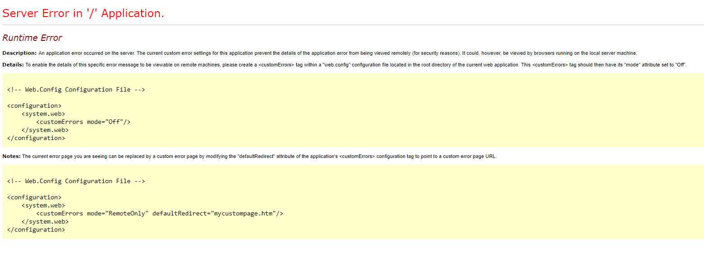

## The Frontend

An error in the Frontend often looks like this:

Errors in the frontend are presented in three ways:
* YSOD (.Net error page)
* Blank / not loading
* 404 (Page not found)

A **YSOD page** will either show the full error stacktrace or a generic error message if you have customErrors turned off. The full error message can be found in the [umbracoTraceLogs](Log-Files/#umbraco-logs). Not much more to say about this - if you can't figure out what is wrong when you have the stacktrace, try looking at the namespaces to see if you can figure out what process is throwing errors.

A **blank or not loading page** is likely due to bad rewrite rules - often it will end in a rewrite loop. Make sure you don't rewrite anything on these paths:
* ^/umbraco 
* ^/DependencyHandler.axd
* ^/App_Plugins
* You can see examples on how to set up rewrites correctly [here](../Set-Up/Manage-Domains/Rewrites-on-Cloud)

You should also check your console log in your browser to see if something is failing to load. Finally you can check the [umbracoTraceLogs](Log-Files/#umbraco-logs) and see if any errors are thrown!

A **404 page** could also be rewrite rules - look above what to check for. Other than that make sure your site and content structure is set up correctly - if you try to access a content node with no template related to it will throw this error!
