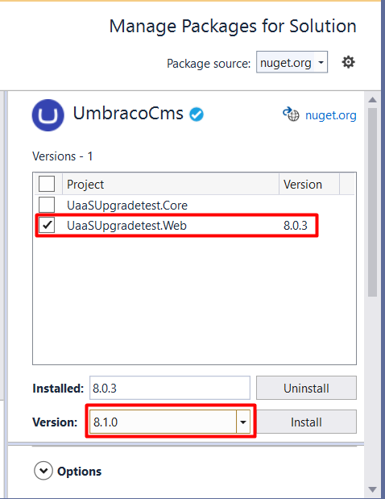
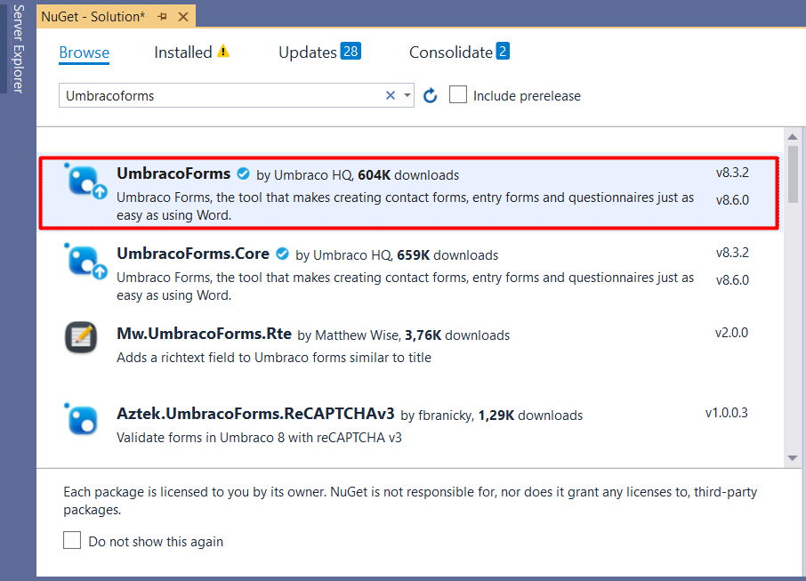
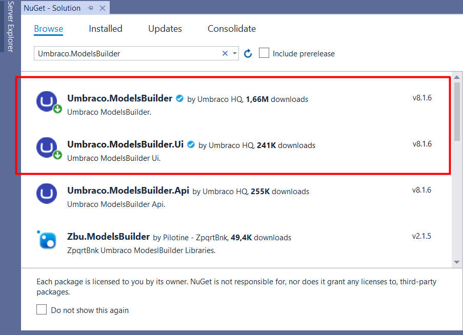

# Manual Upgrade of your cloud project cloned with UaaS.CMD tool

In this guide you will learn how you can manually upgrade your project from Umbraco 8.0.x to 8.5.1 when you are using [the UaaS.cmd tool and Visual Studio](../../Set-Up/Working-with-Visual-Studio).

:::note
The UaaS.cmd tool will provide you with Visual Studio solution with both a .Web and a .Core folder of the project.

This guide will only focus on upgrading the .Web part of the project
:::

## Upgrading the project

The first step to upgrade the project is to update the version of the CMS from 8.0.x to Umbraco 8.1.0.

This can be done by following these steps:

1. Open the Visual Studio solution locally.
2. Open the NuGet Package Manager.
3. Find the Umbraco CMS package.

4. Install version 8.1.0 in the .Web part of the project.

5. When prompted to overwrite the config file make sure to say "No".

Once the new version is installed you will meet an error if you start up the site. This is because we need to upgrade the Umbraco Forms package, the ModelsBuilder and Umbraco Deploy to the supported versions for it to work properly.

for version 8.1 we need:

- Forms version 8.5.3
- Modelsbuilder version 8.1.6
- Umbraco Deploy version 3.5.3

See the [product dependencies](../Product-Dependencies/) article for more details for which versions 8.1+ is compatible with.

### Update Umbraco Forms

The first package that should be upgraded is the UmbracoForms package.

This should be upgraded to version 8.5.3.

To upgrade Umbraco Forms:

1. Go to the NuGet Package Manager.
2. Find the UmbracoForms package.

3. Install version 8.5.3 on the project.

Once the package has been installed you can go ahead and update the ModelsBuilder.

### Update the Umbraco ModelsBuilder

We need to update the ModelsBuilder to version 8.1.6.

To upgrade the ModelsBuilder you will need to:

1. Go to the NuGet Package Manager.
2. Find the  ModelsBuilder.UI and  ModelsBuilder package.

3. Install version 8.1.6 on the project.

:::tip
Upgrading the ModelsBuilder to 8.1.6 will also **upgrade the entire Umbraco project to Umbraco 8.5.1**.

This is important to keep in mind as you continue the upgrade process.
:::

When the ModelsBuilder.UI and ModelsBuilder is done installing, it is time for the next step, which is upgrade the Umbraco Deploy version.

### Update Umbraco Deploy

Since the project is now on Umbraco 8.5.1 it means that we need Umbraco Deploy version 3.5.x in order to ensure compatibility.

Unlike the two other packages the Umbraco Deploy package is not available through NuGet. Instead, you will need to download it from the [Umbraco Nightly page](http://nightly.umbraco.org/?container=umbraco-deploy-release).

Make sure to download the latest version of Deploy 3.5.x which in this case is 3.5.3.

Once the product has been downloaded you need to:

1. Unzip the folder.
2. Copy the following folders to your projects .Web folder
    - `/App_plugins`
    - `/Bin`
3. Copy only the `/splash` folder from the `/Config` folder.
4. Use a merging tool to merge the `UmbracoDeploy.Settings.Config` in the `/Config` folder with the one from you project so you do not lose any settings you are currently using.

:::note
**Do not** copy the UmbracoDeploy.config over as it will overwrite the IDs for the Cloud environments, and you will not be able to deploy any changes.
:::

## Troubleshooting

After the upgrade is done you might encounter an issue with Newtonsoft.Json because the assembly's does not match.

To fix this do the following

1. Go to NuGet Package Manager
2. Go to "installed" packages and find Newtonsoft.Json

3. Install the latest stable version of Newtonsoft.Json

Once the installation is done you should be able to run the project without any errors and you can finalize the process.

## Finalizing the process

Once the files have been copied over to the project, build and run it to verify that everything works on the project.

If everything works as it should, login to the backoffice to initialize the upgrade of the internal components like the database.

Once the upgrade is done, make sure to verify once again that everything looks as expected on the site by running the site and going through the frontend and the backoffice.

Finally, commit the changes to git and push the changes up to your Umbraco Cloud environment.

In the Umbraco Cloud Portal you will now see that the project is running on Umbraco 8.5.1, Umbraco Forms 8.5.3 and Umbraco Deploy 3.5.3.

:::note
This guide has shown you how to upgrade your Umbraco Cloud project to Umbraco 8.5.1 along with the compatible versions of Umbraco Forms, Umbraco Deploy and the ModelsBuilder.

Umbraco 8.5.1 is the minimum version for hosting on our new upcoming Cloud service, however it is not the latest version of Umbraco.

We highly recommend that you look into upgrading your Umbraco Cloud project(s) to the latest version of Umbraco CMS as this will ensure that you have the most secure and up-to-date website. Links to guides on how to keep your Umbraco Cloud project(s) up to date can be found in the "Related articles" section below.
:::

:::links
## Related articles

- [Upgrades](../)
- [Product Dependencies](../Product-Dependencies)
- [Minor Upgrades](../Minor-upgrades)
- [Auto-magical Upgrades (Blog)](https://umbraco.com/blog/sofie-in-the-cloud-no-6-automagical-upgrades/)

:::
