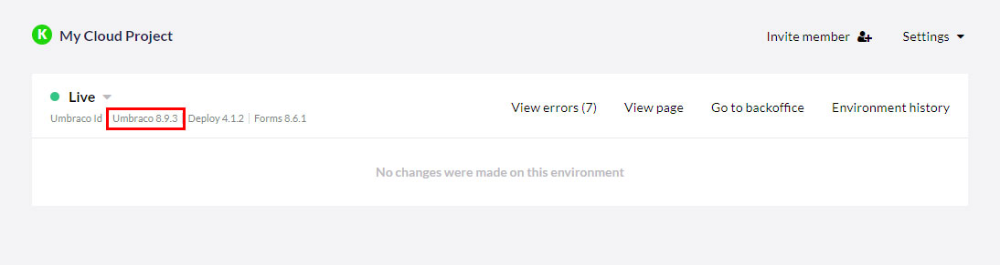

# Migrating to the new Umbraco Cloud infrastruture
In this article, you’ll find all relevant information to be aware of when a site is migrated from the old to the new Umbraco Cloud infrastructure. This article is kept up-to-date should any new information arise.

## Schedule and timing
Projects are scheduled for migration through Q4, 2021. When a project is scheduled the project owner and technical contacts will receive direct communication via email with the specific date and time.

### Rescheduling migration
In case the timing of the migration schedule does not work for you, it is possible to reschedule by reaching out to <a href="mailto:contact@umbraco.com">contact@umbraco.com</a>.

## Minimum requirements for migration
In order for an Umbraco Cloud project to be scheduled for migration, the following requirements need to be fulfilled.

### Minimum version requirements
The new infrastructure comes with minimum requirements on what version of Umbraco CMS and add-ons. In order to be scheduled for migration projects must run:

### Umbraco 8

|   |  Minimum required version |  
|---|---|---|---|
|  Umbraco CMS  |  8.1.0 |
|  Umbraco Deploy  |  4.0.5 |

### Umbraco 7

|   |  Minimum required version |  
|---|---|---|---|
|  Umbraco CMS  |  7.7.0 |
|  Umbraco Deploy |  2.0.18 |

You can find the Umbraco CMS, Forms and Deploy version for each environment listed on the project page in the Umbraco Cloud Portal:

More information on upgrading can be found in the [documentation article for upgrading to the latest minor](https://our.umbraco.com/documentation/Umbraco-Cloud/Upgrades/Minor-Upgrades/) or if you’re using the UaaS.cmd tool refer to the [manual upgrade documentation](https://our.umbraco.com/documentation/Umbraco-Cloud/Upgrades/Manual-Upgrades/Manual-Upgrade-UaaS-Tool).

__Projects that do not meet the requirements, cannot be scheduled for migration to the new infrastructure.__

### Updated DNS settings - you might need to update settings
Your projects need to be updated to use the new Cloudflare DNS settings. 
All CNAME records must point to __dns.umbraco.io__. If you require an A-Record this must point to `104.19.191.28` or `104.19.208.28`. See the [Manage Hostnames documentation](https://our.umbraco.com/documentation/Umbraco-Cloud/Set-Up/Manage-Hostnames/) for detailed instructions.

<iframe width="560" height="315" src="https://www.youtube.com/embed/GKUzEu_bgg0" title="YouTube video player" frameborder="0" allow="accelerometer; autoplay; clipboard-write; encrypted-media; gyroscope; picture-in-picture" allowfullscreen></iframe>

You can see if you are using the new Cloudflare DNS settings or the “old” Let’s Encrypt under Project settings -> Hostnames:

## Before the migration
A project is only scheduled for migration when all the requirements are met. If outgoing IP addresses on Umbraco Cloud are being used, i.e. adding them to an allow list, note that these will change when the project is migrated to the new infrastructure. In this case, it is recommended to add the new outgoing IP addresses to the allow-list prior to the migration. See the [Using external services with Umbraco Cloud documentation](https://our.umbraco.com/Documentation/Umbraco-Cloud/Set-Up/External-Services/#using-external-services-with-umbraco-cloud) for the full list and more information.

No other actions are required prior to migration.

## During the migration
We kindly ask users to hold off working on the project during the 4-hour migration window to ensure that deployments and other Umbraco Cloud services are not interrupted. 

Please do not:
* Interact with the backoffice on Dev/Stage/Live env.
* Update schema in the backoffice on Dev/Stage/Live env.
* Update project settings in the Cloud portal
* Initiate deployments between environments in the Cloud portal
* Interact with Git repositories(sync/push/pull) 

Work on the project(s) can resume immediately after receiving confirmation of a successful migration. 

## After the migration

### New Umbraco Environment URL
The URL will change from `my-project-alias.s1.umbraco.io` to `my-project-alias.euwest01.umbraco.io`. The [Umbraco Cloud Portal](../../Getting-Started/The-Umbraco-Cloud-Portal/index.md#the-umbraco-cloud-portal) URL to access the project does not change. It is only the environment URL that changes. Custom hostnames will continue to work as before.

### New GIT repository URL
There will be an improved repository URL you can switch to, but __it is not required as part of the migration__. The GIT repository will still be accessible from the same URL as before and any custom domains assigned to the project will continue to work as expected. 

We’re moving away from the rather verbose GUID-based URLs that are used on Cloud currently to something resembling what you already know from i.e. Github.

    https://my-project-alias.scm.s1.umbraco.io/<GUID>.git 

will become 

    https://scm.umbraco.io/euwest01/my-project-alias.git

This brings a whole host of advantages both for local development, password management and adds more flexibility overall. If a site has been migrated from the old infrastructure, the old GUID-based URL will continue to work after the migration as we do not want to break any potential CI/CD setup.

### New outgoing IP addresses (for allow lists)
The outgoing IP addresses on Umbraco Cloud will be changed once the projects are running on the new infrastructure. This is only relevant if you are working with an allow list. In this case, please add the new outgoing IPs prior to migration.

## Additional information
Several blog posts has been published detailing the journey to the new and improved infrastructure:

* [The future of Umbraco Cloud (December 2020)](https://umbraco.com/blog/the-future-of-umbraco-cloud/)
* [New DNS settings and requirements - Status on new Umbraco Cloud infrastructure, February 2021](https://umbraco.com/blog/status-on-new-umbraco-cloud-infrastructure-february-2021/)
* [New infrastructure is ready - Status on new Umbraco Cloud infrastructure, March 2021](https://umbraco.com/blog/status-on-new-umbraco-cloud-infrastructure-march-2021/)
* [Migration process - Status on new Umbraco Cloud infrastructure, April 2021](https://umbraco.com/blog/status-on-new-umbraco-cloud-infrastructure-april-2021/)
* [Migration schedule - Status on new Umbraco Cloud infrastructure, June 2021](https://umbraco.com/blog/status-on-new-umbraco-cloud-infrastructure-june-2021/)
