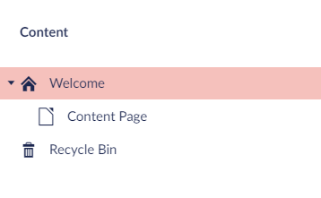

# MVC Sample

In `/samples/Umbraco.Headless.Client.Samples.Web/` you will find a .NET Core 2.2 based MVC website implementation. It presents one possible approach to creating a website using Umbraco Heartcore for Content Delivery.

The sample is built up around a sample project with the alias `demo-headless`. You can choose to test the sample with the sample project or connect the sample to your own project.

<iframe width="800" height="450" src="https://www.youtube.com/embed/yTB-tXi3Ldg?rel=0" frameborder="0" allow="autoplay; encrypted-media" allowfullscreen></iframe>

## Prerequisites

- [.NET Core SDK 2.2](https://dotnet.microsoft.com/download/dotnet-core/2.2)

## Run the sample on your local machine

Before running the sample you will need to define which Umbraco Heartcore project you want to fetch content from.

- Open the `appsettings.json` found in `samples/Umbraco.Headless.Client.Samples.Web/Umbraco.Headless.Client.Samples.Web/`
- Add your project alias or use the alias of the sample project, `demo-headless`

```json
{
    "Umbraco": {
        "ProjectAlias": "demo-headless",
        "ApiKey": ""
    }
}
```

The `ApiKey` can be left blank when using the `demo-headless` sample project. If you are testing with your own project and have chosen to protect the content exposed via the Content Delivery API you will need an API-Key. It is an option that has to be actively turned on via the Umbraco Backoffice in the Headless tree in the Settings section. Read more about this feature in the [Backoffice users and API Keys article](../../../Getting-Started-Cloud/Backoffice-Users-and-API-Keys).

The MVC sample can be run in one of two ways:

### 1. Use the command line

Using a commandline tool, run the following two commands in the `Umbraco.Headless.Client.Samples.Web` folder:

```
> dotnet restore
> dotnet run
```

The first command will restore the packages and the second will run the site.

### 2. Using an IDE

Run the application in Visual Studio or Visual Studio Code by hitting `F5`.

## Show your content

For the following section, an Umbraco  Heartcore project with the following content structure will be used:



To connect to your own project, you need to change the `ProjectAlias` value in the `application.json` file in the root of the solution.

When you've connected to your project and run it on your local machine, you will be presented with a page showing the properties and the data from the content node at the root of your website. This is because no view or controller has been defined for our content structure yet.

We will need to define and build a view and/or an MVC controller for the content types (Document Types) on our project, in order for us to start rendering out our content.

There are two ways to do this: 

- Define a view file using the Document Type alias or 
- Build a controller using the already defined UmbracoController

Each approach will is explained in more details below.

### Define a view file

1. Create a `homePage.cshtml` file in `Views/DefaultUmbraco` - the name of the file should be the alias of the Document Type the root content node is using
2. Set `Umbraco.Headless.Client.Net.Delivery.Models.Content` as the model
3. Set layout to `null` - this can be used later on, when you want to share one layout between more views

```csharp
@model Umbraco.Headless.Client.Net.Delivery.Models.Content
@{
    Layout = null;
}
```

When you build the solution and start it up, this view file will now be used as the frontend.

### Build a controller

1. Right-click the `Controllers` folder in Visual Studio and select *Add > Controller...*
2. Select *MVC Controller - Empty*
3. Use the alias of the Document Type used on the root content node for the name of the controller, e.g. `HomePageController`
4. Set the controller to use `UmbracoController` 
5. Set the `Index()` action to return `UmbracoContext.Content`

```csharp
using System;
using System.Collections.Generic;
using System.Linq;
using System.Threading.Tasks;
using Microsoft.AspNetCore.Mvc;
using Umbraco.Headless.Client.Samples.Web.Mvc;

namespace Umbraco.Headless.Client.Samples.Web.Controllers
{
    public class HomePageController : UmbracoController
    {
        public HomePageController(UmbracoContext umbracoContext) : base(umbracoContext)
        {
        }

        public IActionResult Index()
        {
            return View(UmbracoContext.Content);
        }
    }
}
```

The controller is now in place. In order to show our content on the frontend we also need to define a view.

6. Create a folder in `/Views` using the alias of the Document Type, e.g. `/HomePage`
7. Create an `Index.cshtml` file in the new folder
8. Follow steps 2-3 from the ['Define a view file' section](#define-a-view-file).
9. Build and run the solution

## Building view files

In order to render out the data from the properties on our content we need to use the `@Model.Value("")` approach, where the value will be the alias of the property you want to display data from. 

An example could be a textstring property with the alias `heading`. To render the data from this property on the frontend, we will need to use `@Model.Value("heading")`.

Below is a full example of how a basic view for a root node could look.

```html
@using Umbraco.Headless.Client.Net.Delivery.Models;
@model Umbraco.Headless.Client.Net.Delivery.Models.Content
@{
    Layout = null;
}

<!DOCTYPE HTML>
<html>

<head>
    <title>@Model.Name</title>
    <meta charset="utf-8" />
    <meta name="viewport" content="width=device-width, initial-scale=1, user-scalable=no" />
</head>

<body>

    <h1>@Model.Value("heading")</h1>

    <div>

        <p>@Html.Raw(Model.Value("bodyText"))</p>

        ("promoImage")?.Url)?width=300" />

    </div>

</body>
</html>
```

HTML is used to build the general structure of the article, while we use Razor to render data from our Umbraco Heartcore project.

## References

- [Overview of ASP.NET Core MVC](https://docs.microsoft.com/en-us/aspnet/core/mvc/overview?view=aspnetcore-2.2)
- [Tutorial: Get started with ASP.NET Core MVC](https://docs.microsoft.com/en-gb/aspnet/core/tutorials/first-mvc-app/start-mvc?view=aspnetcore-2.2&tabs=visual-studio)
- [API Documentation for Umbraco Heartcore](../../../API-Documentation)
- [Create an Umbraco Heartcore project](../../../Getting-Started-Cloud/Creating-a-Heartcore-project)
