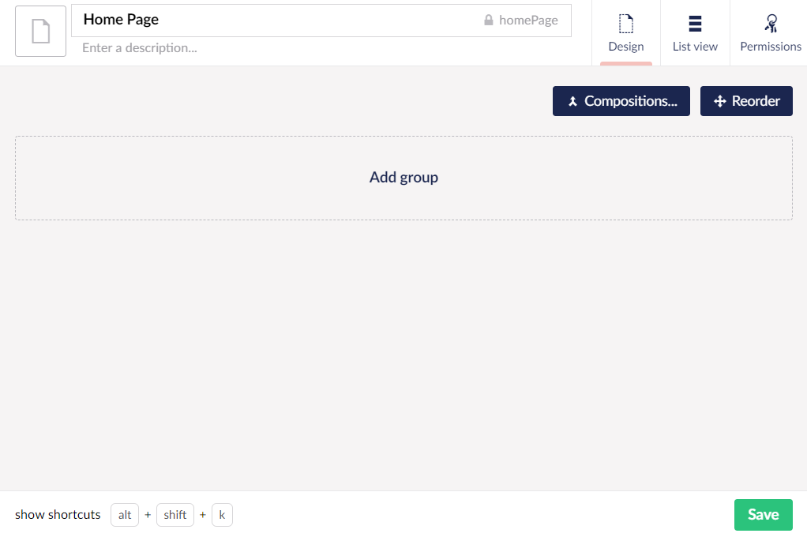
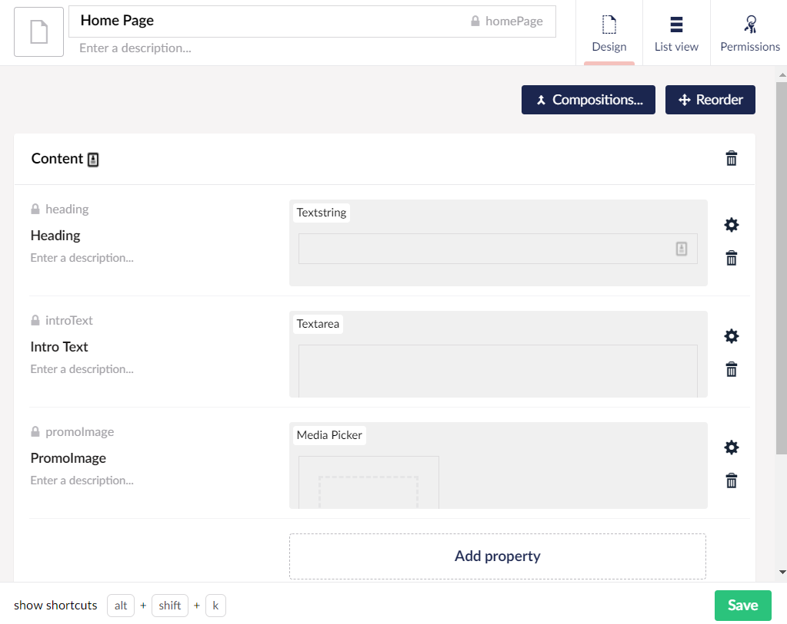
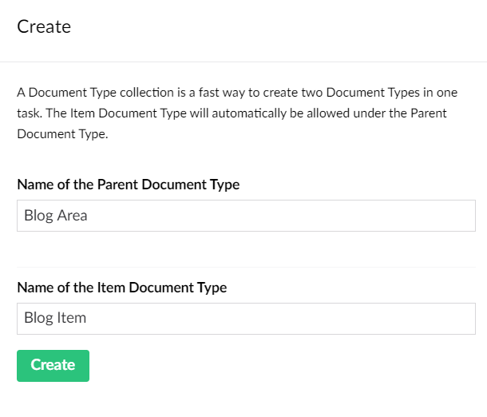
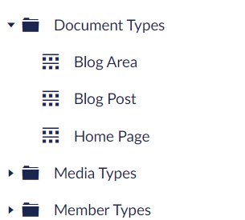
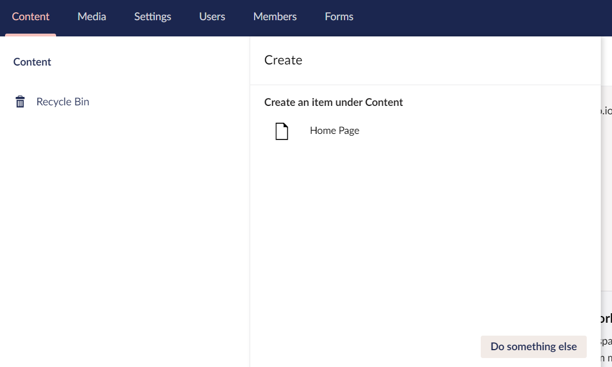
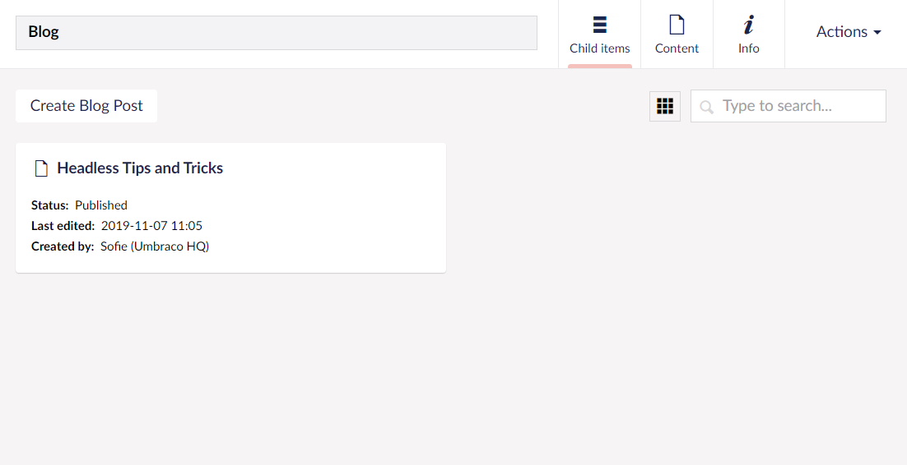

# Building an Umbraco Heartcore project from scratch

In this article you can learn how to get started with your Umbraco Heartcore project.

It will cover everything you need to know, in order to create your first piece of content in the Umbraco backoffice.

:::note
This guide will assume that you have already [setup an Umbraco Heartcore project](../../../Umbraco-Heartcore) without any content.
:::

## Introduction

When you log in to the Umbraco Backoffice, the first thing you will see is the Content section. This is where you will be creating content for your Umbraco Heartcore project. However, it will not be possible to create any content yet, as we will first need to define the content we are going to be creating.

Content in Umbraco is based on **Document Types** which will define what type of data we can put into our content. A Document Type consists of a set of **Properties** - also called fields. A Property is made up of a **Data Type** which is a custom configuration of a **Property Editor**. Umbraco comes with a set of Property Editors, including a *Text Area*, a *Date Picker*, a picker for media items and many more.

As we go through this tutorial and start building the content for our Umbraco Heartcore project, you will learn more about each of these concepts and how they all work together.

:::note
**New to Umbraco?**

If you are completely new to Umbraco, we recommend that you take the **Backoffice Tour** we've created! You can find it by selecting the question mark in the top-right corner.

:::

## Overview of tutorial

In this tutorial we will cover the following topic:

* Creating a basic Document Type
* Adding and defining properties
* Creating a Document Type Collection
* Setting permissions on Document Types
* Creating content

## Creating a basic Document Type

Document Types are managed from the **Settings** section in the Umbraco backoffice.

In order to get started with our first Document Type, follow these steps:

1. Right-click on the Document Types folder and choose **+ Create...**.
    * Or select the three ellipses on the right, when hovering the folder.
2. Choose the first option: **Document Type**.
3. Give the new Document Type a name like *Home Page*.
4. Save the Document Type by selecting the green **Save** button in the bottom-right corner.

We have now created our very first Document Type. It's currently a blank slate, and in the next section we will start adding groups and properties in order to be able to add various types of data to our content.

## Adding and defining properties

Before we can start adding properties to the Document Type, we need to add a **Group**.

:::tip
**Property Groups**

Groups are a way to group certain properties together. It can help content editors getting an overview of content nodes with many properties.

Groups also serves as a way to navigate a content node in the Content section.
:::

1. Select **Add Group** in the middle of the Document Type editor area.
2. Give the group a name like *Content*.

Now, let's add our first property to the Document Type.

3. Select **Add Property**.
4. In the *Property Settings* dialog, we'll start by giving the Property a name: *Heading*.
5. (Optional) Give the Property a description
6. Select **Add Editor**

:::tip
**Select Editor**

In this dialog you choose which editor to add to the Property. The editor you choose defines the type of data that can be added to the property.

**Create New** let's you create your own Data Types based on the editors in Umbraco.
**Use existing** provides you with the option to select on the pre-defined Data Types.
:::

7. Use the search field to find and select the pre-defined *Textstring* Data Type.
8. **Submit** the Property settings

We have now added the first Property to our Document Type.

Following the same steps, let's add a few more properties to the *Content* group:

| Name       | Property Settings        |
| ---------- | ------------------------ |
| Intro Text | *Textarea* Data Type     |
| PromoImage | *Media Picker* Data Type |

:::tip
**Media Picker**

This editor let's you upload or select an existing media item from the Media section, and add it to your content.
:::

With these properties added our Document Type now looks something like this:

Remember to save the Document Type by selecting the green **Save** button in the bottom-right.

This is a very simplified version of a Document Type, and you are welcome to add more groups and properties.

## Creating a Document Type Collection

So far, we've created a single Document Type with some text fields and a media picker. Before we start creating the actual content, we are going to add a few more Document Types, to allow for more variation in our Content section.

We will now expand on our site by adding a **Document Type Collection**.

1. Right-click on the Document Types folder and choose **+ Create...**.
    * Or select the three elipses on the right, when hovering the folder.
2. Choose the second option: **Document Type Collection...**.

:::tip
**Document Type Collections**

When working with content you might want to be able to relate certain types of nodes to each other. This could be articles you would like to nest under a News section, or it could be a Blog where it should be possible to create blog posts.

The Document Type Collection allows you to create 2 Document Types in one go, and at the same time, they will be given a parent/child relationship.

Example:
**Parent Document Type**: News Area
**Item Document Type**: News Article

In the Content section, you will with this setup be able to create a News Area content node, and then create your News Articles under that node. 
:::

For our Umbraco Heartcore project, we will want it to be possible to create blog posts under a blog area.

3. Name the Parent Document Type *Blog Area*.
4. Name the Child Document Type *Blog Post*.
5. Select **Create** to setup the two Document Types.

Once the Document Types have been created you will be redirected to the Item Document Type - in our case the *Blog Post*.

Following the steps outlined earlier in this tutorial, add a *Content* group and a few properties to both the *Blog Post* and the *Blog Area* Document Types.

**Blog Post**

| Name        | Property Settings           |
| ----------- | --------------------------- |
| SubTitle    | *Textstring* Data Type      |
| MainContent | *Richtext Editor* Data Type |

**Blog Area**

| Name            | Property Settings        |
| --------------- | ------------------------ |
| BlogDescription | *Textarea* Data Type     |

We should now have the following three Document Types in our Document Types tree:

## Setting permissions on Document Types

The final thing we need to do before we start creating content, is check that our Document Types have the correct permissions.

1. Select the *Home Page* Document Type in the tree.
2. Navigate to the **Permissions** tab in the top-right corner.
3. We will want to allow that Home Page Document Type can be used to create content at *root level*, so make sure the **Allow as root** is checked.

:::tip
**Allow as root**

By default it is possible to use any type of Document Type for creating content at the root of the Content tree in Umbraco.

However, once you've checked this permission setting on one Document Type, it will be the **only one** that can be used to create content at the root.
:::

4. Next to **Allowed child node types** select **Add child**, and in the dialog select our *Blog Area* Document Type.
    * Doing this, will allow us to create content of the Blog Area type under our Home Page.
5. **Save** the Document Type.

With the permissions set, we are now ready to start working on the content for the Umbraco Heartcore project.

## Creating content

In this next step of the tutorial, we will start creating content. The content we're going to create will be defined by the Document Types we've created, and you will see how the choices we've made impacts the editing experience one we start working with the content.

1. Go to the **Content** section.
2. Right-click on the Content tree and choose **+ Create...**.
    * Or select the three elipses on the right, when hovering the tree.

We now have the option to create a content item based on our Home Page Document Type.

3. Select the **Home Page**.
4. Give the content item a name: *Welcome to Umbraco Heartcore*.
5. Add some text to both the *Heading* and the *Intro text* properties.
6. To choose an image for the *PromoImage* property, select the plus-sign.
7. In the dialog you can do either of the following the choose an image:
    * Select the **Upload** button to choose an image from your file explorer or
    * Drag an image directly into the dialog.
8. Once you've chosen an image, select it in the dialog and click the green **Select** button in the bottom of the dialog.

:::tip
**Media items and images**

When you add media and images to your content using the default Media Picker Data Type, the items will automatically be added to the media library you can find in the **Media** section of the backoffice.

Select the **Media** section in the top navigation bar, and you can browse all the media items that has been uploaded on the project.
:::

9. When you're happy with the content in the properties, select the **Save and publish** button in the bottom right.

So far, our Content section looks like this:

10. Right-click the root node, *Welcome to Umbraco Heartcore*, and choose **Create...**
    * Or select the three elipses next to the node when hovering.
11. Select to create a **Blog Area**.
12. Give it a name: *Blog*.
13. (Optional) Add some text to the *BlogDescription* property.
14. To start adding blog posts to our Blog, right-click the *Blog* node in the Content tree.
15. Choose to **Create...** a new item based on the *Blog Post* Document Type.
16. Give the blog post a name and add some text to the *Subtitle* and *MainContent* properties.

:::tip
**Rich Text Editor**

The editor we chose for the *MainContent* property is a **Rich Text Editor**.

It gives us a lot of flexibility when writing text, as there are multiple formatting options.
:::

17. Once you're happy with how your blog post looks, select **Save and publish**.
18. To go back to the Blog Area, select the **arrow** next to the title of the blog post

You will now get an overview of the blog posts you've created. So far we've only created one, and creating more is done by selecting the **Create Blog Post** in the top-left corner.

We have now covered the very basics of how to create content in the Umbraco backoffice.

## What now?

Now you have some content on your Umbraco Heartcore project that you can start using.

You can use the Umbraco Heartcore REST API endpoints to fetch this content to where you need it. 

### Test with the provided samples

We've built a few client libraries with samples that you can use for testing. You can find them in the [Client Libraries section](../../Client-Libraries)

### Testing with the API Browser

In order to test how the content you've created will be formatted, when fetched through the Umbraco Heartcore REST API endpoints, you can use the API Browser in the Settings section of the backoffice. 

You can learn more about the API Browser and how to use it in the [API Browser article](../API-Browser).

