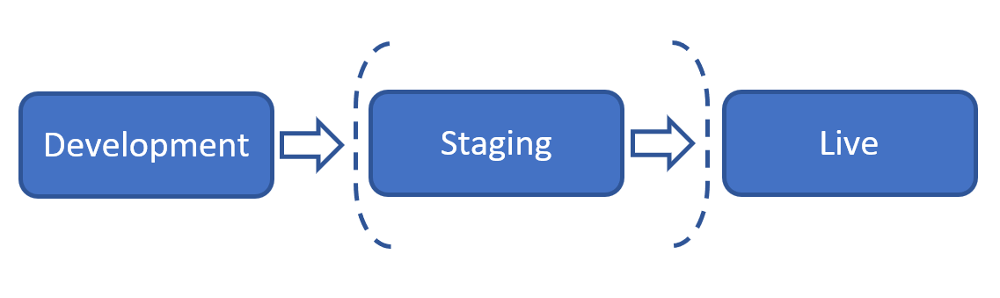

# Deployment workflow

Having multiple environments on your Umbraco Heartcore project can be a great asset for testing and for having a place where your content editors can work without interfering with anything on the Live environment.

<iframe width="800" height="450" src="https://www.youtube.com/embed/popG59FrE9U?rel=0" frameborder="0" allow="autoplay; encrypted-media" allowfullscreen></iframe>

When working with multiple environments, it is very important to follow the correct workflow. In this article you can learn more about this workflow and best practices for working with it.

The workflow uses a classic "left to right" deployment model, meaning that changes are first made in the Development environment and then deployed to the Staging or Live environment - depending on the plan your project is on.

We recommend that you do not work with Document Types directly on the Live environment. This should as a rule of thumb always be done on the "lowest most" environment: the Development environment.

The deployment approach is divided into two steps: 

1. Structure changes like Document Types and Data Types are **deployed** through the portal
2. Content and Media is **transferred/restored** through the Umbraco Backoffice

Each step is defined in more details in the following articles.

## [Structure deployment](Structure-deployment)

## [Content transfer/restore](Content-transfer)