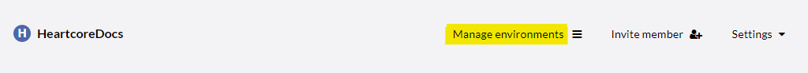
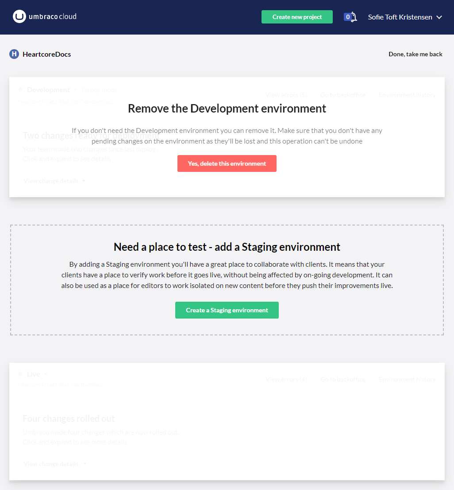

# Environments

In this article you can learn more about how to work with environments on your Umbraco Heartcore project.

Having multiple environments means that you have a place to tests both your content and your content structure before deploying it to the production environments, from where the content is served to your application. 

## What is an environment?

An environment on a Heartcore project can be defined as a *workspace* and is at the same time a git repository. When you have more than 1 environment on your project, these environments will act as branches to the master repository.

Umbraco Heartcore uses a deployment model that relies on Git and other core technology, which gives you to option to move both content and structure files from one environment to another. 

Learn more about the deployment model in the [Deployment workflow article](../Deployment-workflow).

## Video tutorial

<iframe width="800" height="450" src="https://www.youtube.com/embed/x4UlI7J0u_4?rel=0" frameborder="0" allow="autoplay; encrypted-media" allowfullscreen></iframe>

## Manage environments

How many environments you can work with depends on [the plan your Umbraco Heartcore project is running](https://umbraco.com/umbraco-heartcore-pricing/).

* Mini: 1 environment (Live)
* Starter: 2 environments (Development and Live)
* Professional: 3 environments (Development, Staging and Live)

When you upgrade your Heartcore project from the Mini to the Starter plan the Development environment will be added automatically. Once you've upgraded to the Professional plan, you will be able to add the Staging environment as well.

You can add and remove the environments any time you want, as long as you have multiple environments enabled.

Adding and removing environments is done from the Project view in the Cloud Portal.

This will open an overlay, where you can manage the environments on your Heartcore project.

Below is an screenshot of how that overlay looks on the Professional plan when only the Development environment is added. There's an option to delete the current Development environment and an option to create a Staging environment. How this overlay looks is dependant on the plan your project is on.

