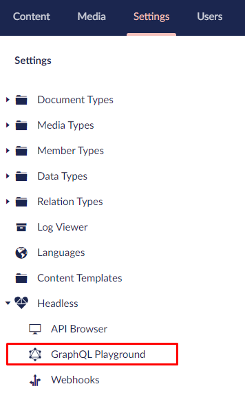
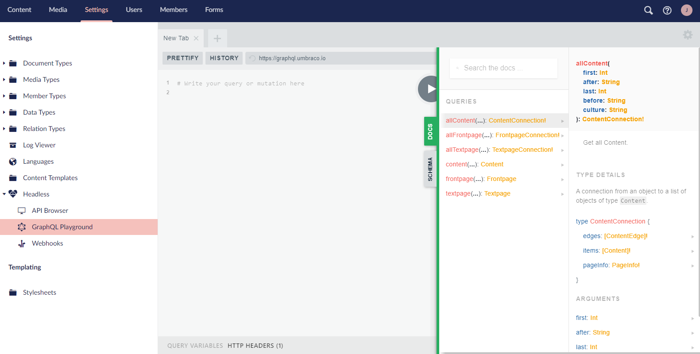
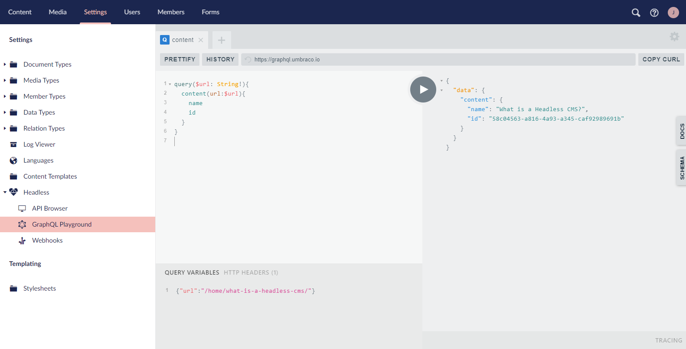

# GraphQL Playground

With the GraphQL query language, you will be able to limit the amount of data transferred to and from your Heartcore instance and the client by specifying exactly what kind of information you would like to get in your API calls.

You can test and build GraphQL queries directly in the backoffice-integrated GraphQL Playground.

In the Settings section in the Umbraco Backoffice, you will find the Headless tree. From there you can use the GraphQL Playground to test your queries against your project's schema.

The Playground comes with basic features such as real-time error highlighting, syntax highlighting, formatting, query history and more.

<iframe width="800" height="450" src="https://www.youtube.com/embed/8jp-HGtA0vM?rel=0" frameborder="0" allow="autoplay; encrypted-media" allowfullscreen></iframe>

## Accessing GraphQL Playground

1. Log into the project backoffice
2. Navigate to the Settings dashboard
3. Find the Headless tree near the bottom of the navigation list
4. Click on GraphQL Playground



From there, you can start querying as soon as your content is published.

## Features

### Documentation

The GraphQL Playground's built-in documentation can be found on the right side, under the "Docs" tab.

The documentation tab grants a quick overview of how content is structured using the Document Types in your solution. It also gives an idea of how to access specific properties on each of the Document Types as well as nested properties and properties from Compositions.



The documentation will be automatically updated as you add new Document Types to match the schema you have on your project.

## Schema

The Schema tab also can be found on the right side of the GraphQL Playground. It is located below the "Docs" tab.

The Schema menu explains the relationships between specific objects and properties in your solution, and will be updated automatically as you make changes to the project's schema meaning Document Types, Data Types, Document Type Compositions and Document Type Elements.


## Running GraphQL queries

To run a query use the left side of the GraphQL Playground to type in your query - could be something as basic as getting the names of all your content pages:

```graphql
{
  allContent {
    items {
      name
    }
  }
}
```

To learn more about querying, visit our [API documentation for GraphQL](../../API-Documentation/GraphQL/index.md).

:::note
The Heartcore GraphQL endpoint only supports queries - other operation types, that is mutations and subscriptions, are not supported.
:::

After that, press the "Play" button sitting in the center of the Playground. If the query is constructed correctly, the results will be loaded into the right section.


When you are satisfied with the result, you can copy the client URL (CURL) by clicking the `COPY CURL` button located in the top part of the Playground, next to the address bar.

## Sending HTTP headers

GraphQL Playground supports requests made with HTTP headers - in case e.g. an authorization token is needed.
The `HTTP HEADERS` section can be accessed from the bottom-left corner of the Playground window. By default, it contains the `umb-project-alias` header, which is the alias of your Heartcore project.
It is possible to add multiple headers.

## Query variables

It is also possible to define variables for queries - such variables's values can be changed in the bottom-left corner of the Playground window, next to the `HTTP HEADERS` section.



## History

If you happened to make an amazing query and afterwards erased it by accident, you would be able to re-use it by finding it in the History.
The History menu can be found in the top part of the Playground, above the query input section.

## Prettify

The Playground gives you an option to "prettify" your query with a click of a button, which makes it easier for humans to read.


