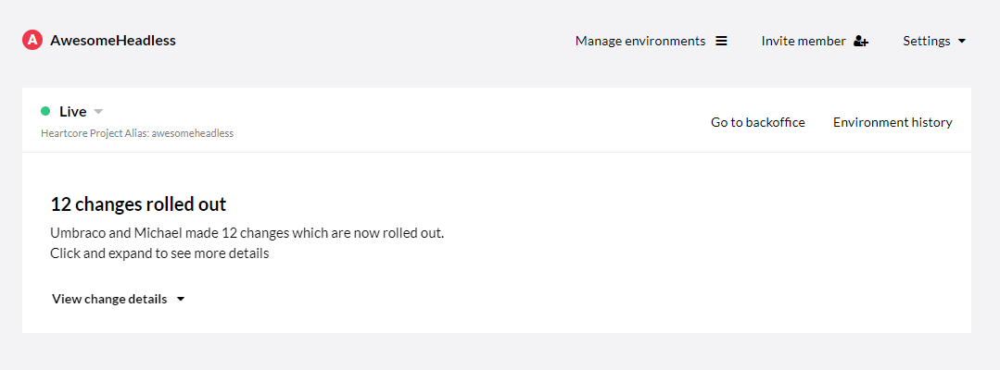
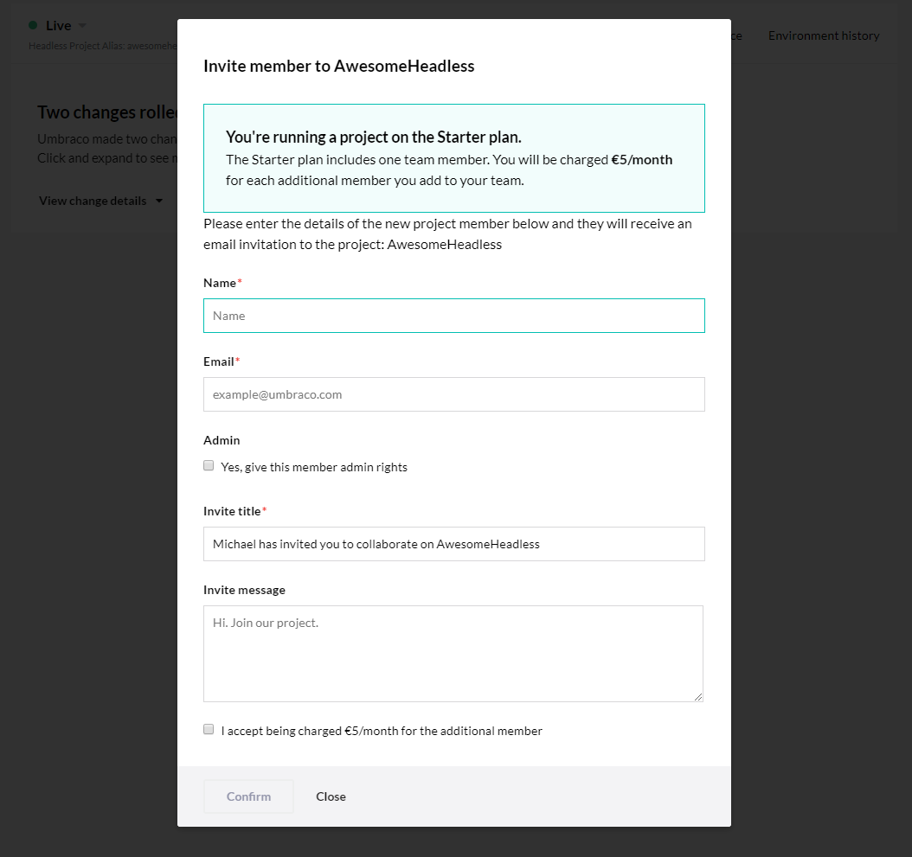
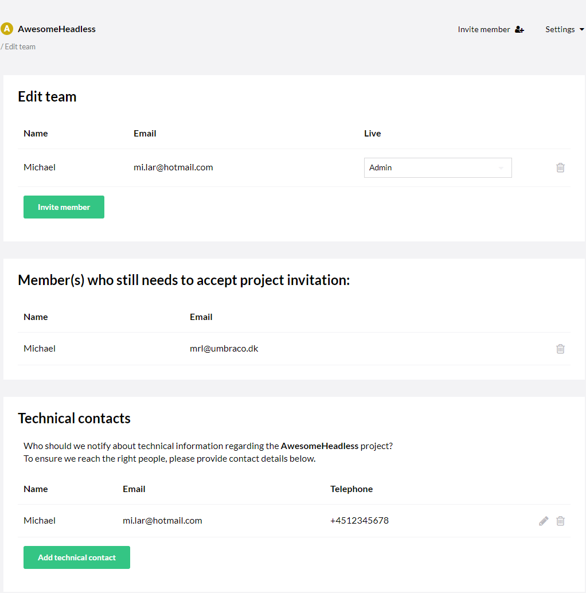
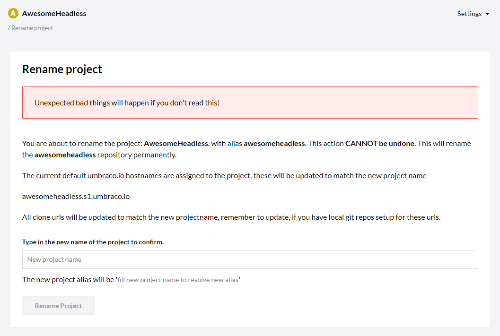
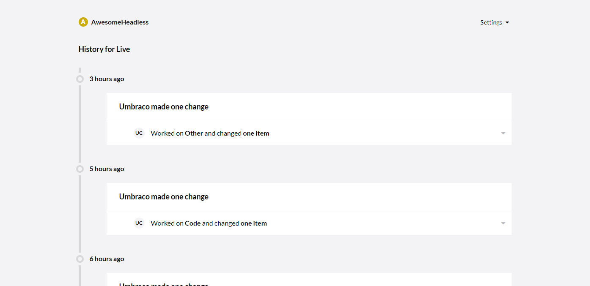

# The Umbraco Cloud Portal

In this article, you will learn more about the Umbraco Cloud Portal and what options that are available to you.

## Video tour of the Portal

<iframe width="800" height="450" title="Tour of the Heartcore Portal" src="https://www.youtube.com/embed/WmoovOIRQOo?rel=0" frameborder="0" allow="autoplay; encrypted-media" allowfullscreen></iframe>

## Written tour of the Portal

After you have logged into the [Umbraco Cloud Portal](https://www.umbraco.io), you are presented with the project list overview.

From here you can see a list of all your projects. If you have several projects, you can sort specific projects in groups.

Clicking on a project will take you to the project page where you will get an overview of your environment(s).

## Manage Environments

From here, you are able to create multiple environments, so that you can have a Development and eventually also a Staging environment. Depending on what plan you have chosen, you will have access to one or more environments on your project.

If you want to add an environment, all you have to do is click the big green button. Umbraco will create the environment for you.

When you are done, you can go ahead and click on 'Done, take me back' in the top-right corner to get back to the project overview.

## Invite member

In the top-right corner you will find the **invite member** option. This will allow you to quickly invite new team members to your project from a modal that pops up. This makes it very fast to invite new team members.

## Settings

Right next to the invite member option, you will find the **Settings** dropdown menu. Here you will find various links to more management and configuration options.

### Edit Team

As with the **invite member** option, you are able to add new team members to your project. It is also possible to change the roles of your team members here, provided that you have sufficient permissions. You can remove team members from this page as well as see any pending invitations you might have sent.

It is also here, that you are able to add or edit the Technical Contact information such as Name, Email and a telephone number.

:::note
When you invite a Team Member to your Heartcore project, they will automatically get access to the backoffice of the project as well.

You can add as many members to your project as you want.
:::

### Webhooks

Here you are able to set up a webhook that will gather all the information about each deployment. You can integrate webhooks with applications such as Slack. Doing so, you can get Heartcore to post a message in a chosen Slack channel after each deployment.

### Upgrade plan

Here you will be able to upgrade your trial to a plan that fits your needs.

## Payment

From here you can see the payment history for a certain project as well as download the latest invoices or for a specific month.

:::note
This only applies to new customers on Umbraco Cloud after the 28th of April, 2021. For old projects, the invoices and payment history are still available from the [Umbraco Shop](https://shop.umbraco.com/profile/sign-in).
:::

### Rename project

Here you can rename your project. All default umbraco.io hostnames will be updated to match the new name. When renaming a project you will also need to update the `Umb-Project-Alias` header when you are sending requests to the API, as changing the name of the project will also change the project alias.

### Delete project

From this page, you can delete your project. When deleting the project your subscription will automatically be cancelled as well. Deleting the project is a **permanent action**.

## Go to backoffice

Clicking on the 'Go to backoffice' link will open up a new tab with the login screen for the Backoffice. If you would like to learn more, you can read our documentation for the [Heartcore Backoffice](../The-Umbraco-Backoffice).

## Environment history

Here you will be able to see a timeline of your project's environment where you will get a detailed description of what changes have been made.

