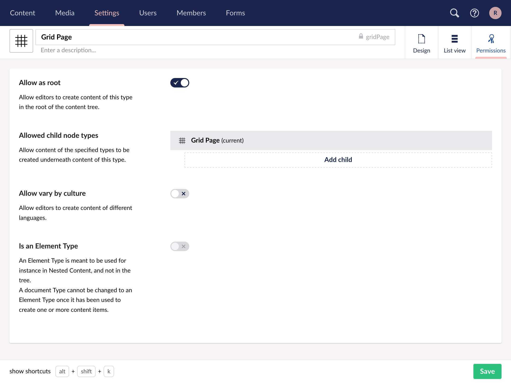
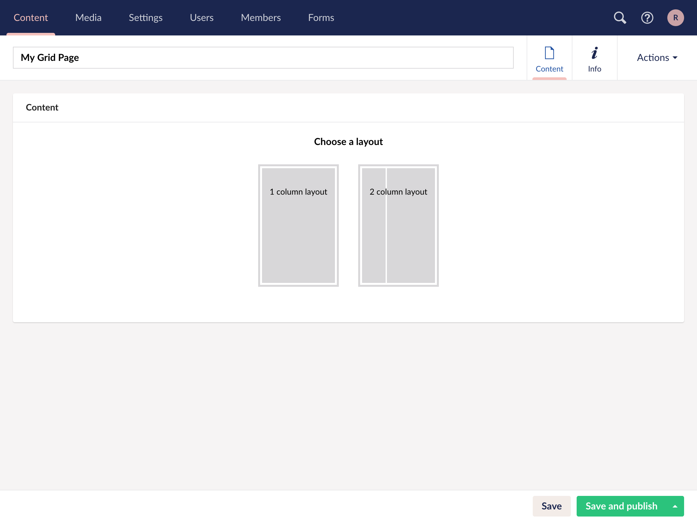
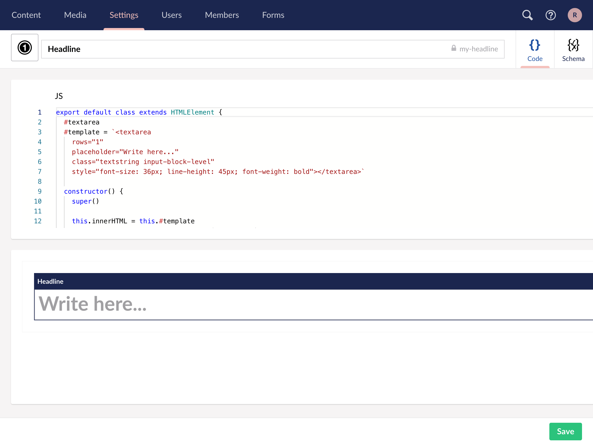
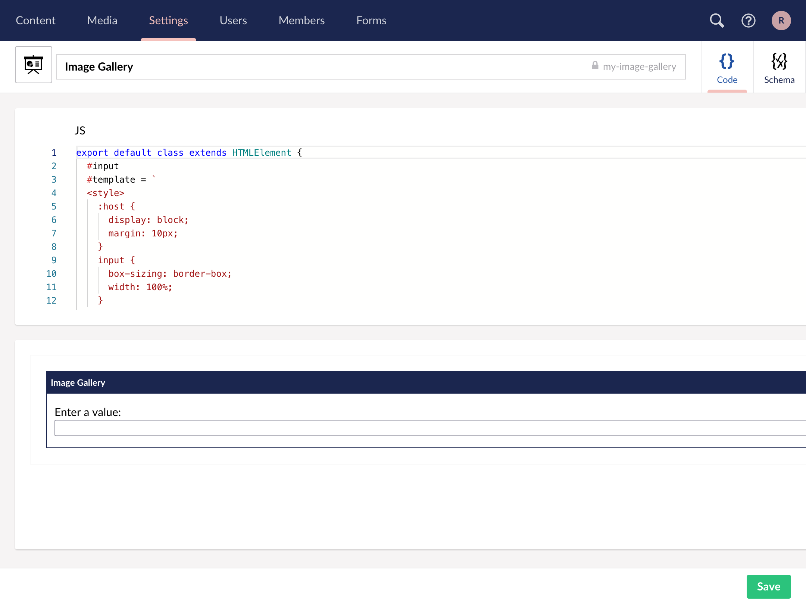
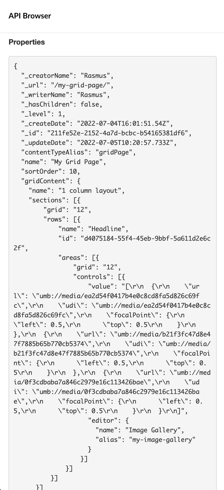
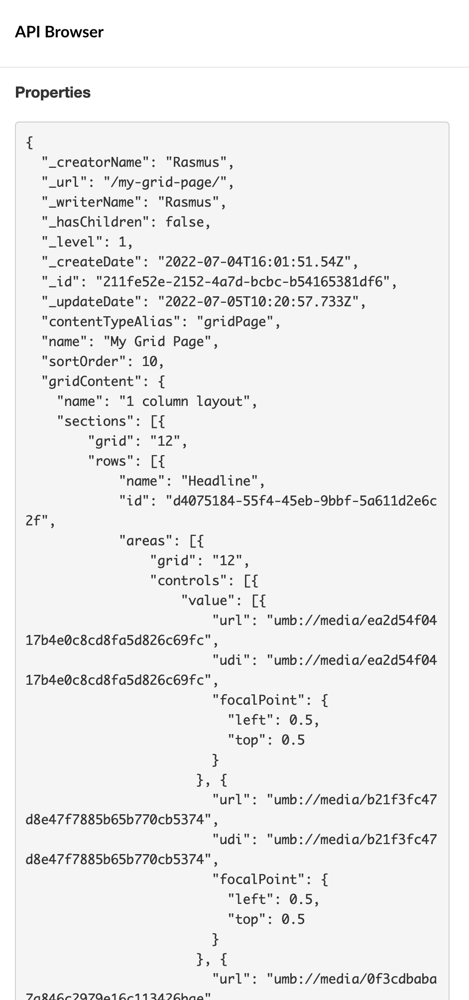

# Custom grid editors in Umbraco Heartcore

In this tutorial we'll create a custom grid editors using [custom elements](https://developer.mozilla.org/en-US/docs/Web/Web_Components/Using_custom_elements) and [Lit](https://lit.dev/). We'll look at how we can define how the API response for our data should look like.

## Create a document type and grid configuration

First, we'll need to create a document type containing the grid layout property editor. First go to the **Settings** section, create a new document type and call it **Grid Page**.


Add a new property and call it **Grid Content** and select the **Grid layout** editor and accept the defaults.


The document type should now look like this


To allow the document type to be created in the tree we need to change the permissions by clicking on **Permissions** and ensure **Allow as root** is checked.



To verify the configuration go to the **Content** section and create a new page based on the **Grid Page** document type we just created, give it a name and save it.



Try choosing a layout, adding a row and click an **Add content**, here we'll see that we've a couple of editors to choose from.


Try adding one of them to the page to see how they work.

## A look at a default grid editor

Before we start writing our own grid editor lets have a look at the **Headline** grid editor.



As we can see the page is divided in to two sections, one containing a text editor with the code for the editor and one with a preview of the editor.

Lets take a look at the code.

A custom editor inherits for `HTMLElement` and must be the default export.


```javascript
export default class extends HTMLElement {
```

A couple of [private fields](https://developer.mozilla.org/en-US/docs/Web/JavaScript/Reference/Classes/Private_class_fields) is defined, one for storing a reference to the `textarea` field and one with the HTML template.

```javascript
  #textarea
  #template = `<textarea
    rows="1"
    placeholder="Write here..."
    class="textstring input-block-level"
    style="font-size: 36px; line-height: 45px; font-weight: bold"></textarea>`
```

In the constructor we set the inner HTML of our custom element to our template and set the `#textarea` field to a reference to the textarea.

```javascript
  constructor() {
    super()

    this.innerHTML = this.#template
    this.#textarea = this.querySelector('textarea')
  }
```

The `click` method is called when the grid control is clicked, in this case we use it to set focus on the textarea.

```javascript
  click() {
    this.#textarea.focus()
  }
```

A `value` property is needed for the value to be stored when a page is saved and to set the value when the editor is loaded.

In this example the value property is setting and returning the value of the textarea.

```javascript
  get value() { return this.#textarea.value }
  set value(value) {
    this.#textarea.value = value || ''
  }
}
```

## Create a custom grid editor

For this tutorial we'll create an image gallery editor using [Lit](https://lit.dev). Lit builds on top of the Web Components standards and helps us avoid a lot of boilerplate code.


We'll start by going to the settings section and create a new **Grid Editor**. Choose an icon and name it **Image Gallery**, we're also going to change the alias to `my-image-gallery`.

::note
The alias is used as the custom element tag name and must be unique. By choosing a prefix that's less likely to used by any other HTML element, in this case `my-`, there's less chance for running into conflicts.
::



In the `JS` view we can see there's already some boilerplate code, lets replace it with the following

```javascript
import { LitElement, css, html } from 'https://cdn.jsdelivr.net/gh/lit/dist@2/all/lit-all.min.js'

export default class extends LitElement {
  static properties = {
    value: { type: Array },
  }

  static styles = css`
.container {
  display: grid;
  grid-gap: 5px;
  grid-template-columns: repeat(auto-fit, 200px);
  padding: 5px;
}
.add-button {
  font-family: var(--font-family-base);
  font-size: var(--font-size-base);
  line-height: var(--line-height-base);
  cursor: pointer;
  width: 200px;
  height: 200px;
  padding: 20px;
  padding-bottom: 30px;
  background-color: var(--color-white);
  border: 4px dashed var(--color-gray-8);
  text-align: center;
  box-sizing: border-box;
}
.add-button svg {
  display: block;
  fill: var(--color-gray-8);
  font-size: 85px;
  line-height: 1;
  display: inline-block;
  height: 1.15em;
  width: 1.15em;
  margin: 10px auto;
}
.add-button div {
  color: var(--color-black);
  font-size: 14px;
  font-weight: 700;
}
`

  render() {
    const items = this.value || []

    return html`<div class="container">
      <button class="add-button">
        <svg xmlns="http://www.w3.org/2000/svg" viewBox="0 0 512 512">
          <path d="M246.486 299.31l-85.604-91.047-58.21 107.66v29.658h289.12c-36.821-31.753-114.476-99.682-114.476-99.682l-30.83 53.411zM347 230.786c16.062 0 29.073-13 29.073-29.06 0-16.04-13.012-29.062-29.073-29.062-16.019 0-29.038 13.021-29.038 29.062 0 16.06 13.019 29.06 29.038 29.06zM37.74 102.699v306.569h434.688V102.699H37.74zm396.082 267.916H77.635l-.016-228.033h354.928v.017h1.275v228.016z"></path>
        </svg>
        <div>Add image</div>
      </button>
    </div>`
  }
}

```

The preview should now look like this


Lets break down the code

```javascript
import { LitElement, css, html } from 'https://cdn.jsdelivr.net/gh/lit/dist@2/all/lit-all.min.js'
```

Here we're importing `LitElement, css and html` from the Lit library.


```javascript
export default class extends LitElement {
```

We're exporting a default class inheriting from `LitElement`.


```javascript
  static properties = {
    value: { type: Array },
  }
```

We tell Lit that we've a `value` property which we expect to be an `Array`.

```javascript
  static styles = css`
.container {
  display: grid;
  grid-gap: 5px;
  grid-template-columns: repeat(auto-fit, 200px);
  padding: 5px;
}
.add-button {
  font-family: var(--font-family-base);
  font-size: var(--font-size-base);
  line-height: var(--line-height-base);
  cursor: pointer;
  width: 200px;
  height: 200px;
  padding: 20px;
  padding-bottom: 30px;
  background-color: var(--color-white);
  border: 4px dashed var(--color-gray-8);
  text-align: center;
  box-sizing: border-box;
}
.add-button svg {
  display: block;
  fill: var(--color-gray-8);
  font-size: 85px;
  line-height: 1;
  display: inline-block;
  height: 1.15em;
  width: 1.15em;
  margin: 10px auto;
}
.add-button div {
  color: var(--color-black);
  font-size: 14px;
  font-weight: 700;
}
```

We define the styles in a static field called `styles`, this will make Lit automatically inject a stylesheet into our custom element. The text returned needs to use the `css` tag from `Lit`. For more info see the [Lit styles documentation](https://lit.dev/docs/components/styles/)


```javascript
  render() {
    return html`<div class="container">
      <button class="add-button">
        <svg xmlns="http://www.w3.org/2000/svg" viewBox="0 0 512 512">
          <path d="M246.486 299.31l-85.604-91.047-58.21 107.66v29.658h289.12c-36.821-31.753-114.476-99.682-114.476-99.682l-30.83 53.411zM347 230.786c16.062 0 29.073-13 29.073-29.06 0-16.04-13.012-29.062-29.073-29.062-16.019 0-29.038 13.021-29.038 29.062 0 16.06 13.019 29.06 29.038 29.06zM37.74 102.699v306.569h434.688V102.699H37.74zm396.082 267.916H77.635l-.016-228.033h354.928v.017h1.275v228.016z"></path>
        </svg>
        <div>Add image</div>
      </button>
    </div>`
  }
}

```

The render method returns the HTML we want to show, it needs to be tagged with `html`.For more info see the [Lit templates documentation](https://lit.dev/docs/templates/overview/).

Lets save the editor and see how it looks when adding it to the a content item.


We now have a **Add image** button rendering, but clicking it does nothing. Lets do something about that. Go back to the **Settings** section and click on the **Image Gallery** grid editor.

We'll start by adding the following to the top of the file

```javascript
import { mediaPicker } from 'https://cdn.jsdelivr.net/npm/@umbraco/headless-backoffice-bridge@0/headless-backoffice-bridge.min.js'
```

This imports the `mediaPicker` function from the [backoffice bridge](https://github.com/umbraco/Umbraco.Headless.Backoffice.Bridge) library.

We'll add a function before the `render` function

```javascript
  showPicker() {
    mediaPicker.show({
      disableFolderSelect: true,
      onlyImages: true,
      showDetails: true,
      submit: (items) => {
        const selected = items[0]
        if(!this.value) this.value = []
        this.value.push(({ url: selected.udi, ...selected }))
        this.requestUpdate('value')
      }
    })
  }
```

This will open the media picker with a configuration that only allows selecting images and showing the detail view (which allows us to enter an alt text, caption and choose a focal point).

The submit callback is called when the **Submit** is clicked, it'll contain an array of the selected items (in this case it'll contain a single item, if we set `multiple` to `true` multiple items can be returned).

In our callback method we check if `this.value` has been initialized, if not we initialize a new array. We then push the selected image to the array. Note that we also store the `udi` (the id of the media) in a `url` property, we'll come back to why we do that later.

Since we add to the array and don't set the `value` property we need to tell lit that the property was updated, we do this by calling `this.requestUpdate('value')`.


We'll also need to add a click event to the button so it'll show the dialog

```html
<button type="button" class="btn-reset placeholder" @click=${() => this.showPicker()}>
```

::note
Clicking the button in preview mode does nothing, this is because of a limitation when previewing where we don't have access to the full backoffice. Saving and testing on a Content item should however work.
::

If we save and go back to our content page and click the `Add image` button, we should now see the image overlay.


Selecting an image doesn't currently do anything, lets do something about that. Lets go back to the grid editor code in the **Settings** section.

Go back to the **Content** section try to add some images to a page using the editor.

We now have an editor that we can add images to which gets rendered in the backoffice. Next step would be to add edit and delete functionality, but we'll leave that to the reader.

## Using module aliases

Up until now we've been using the full URL when importing 3rd party modules into our editors. While this works fine most of the time, we'll most likely run into issues when importing libraries that registers custom elements. This is because custom elements needs to be registered using an HTML tag and a tag can only be registered once.

Imagine we've an editor using custom elements from a 3rd party library. We then create another editor using the same library but in a newer version which adds some new functionality to the custom element we use.

One of two things will happen. The library checks if a custom element with the same name has already been registered and skips registration, which will leave us not knowing which version is used and might break our implementation, or it'll try to register the element with the same name but it'll fail because there's already a element registered with the same name.

In either case we'll end up with a broken editor experience, this is where editor aliases comes in.
Module aliases allows us to define a common name for a module that we can use in our editors instead of the full URL. A module alias can be defined by going to the **Headless -> Custom Editor Configuration** page in the **Settings** section.


Here we've defined an alias `@headless-backoffice-bridge` pointing a CDN URL of the [backoffice bridge library](https://github.com/umbraco/Umbraco.Headless.Backoffice.Bridge).

With this alias added we can update our import in our editor to

```javascript
import { mediaPicker } from '@headless-backoffice-bridge'
```

The alias will automatically be replaced the URL we've defined, similar to how `node` does.

By using the same alias in all our editors, we can ensure that only one version of the library is loaded and if we want to upgrade to a newer version, we'll only need to update the URL in one place.

## Describing the grid editor using JSON schema

Now that we've a working editor, lets add a couple of images to our page, when done, click **Save and publish**. Note down the **Id** on the **Info** tab, we'll need that in a bit.

Lets open the [API Browser](../../Getting-Started-Cloud/API-Browser/) by going to the **Settings** section and fold out the **Headless** node.

Type in `https://cdn.umbraco.io/content/<CONTENT_ID>` in the Explorer URL bar replacing `<CONTENT-ID>` with the id we copied before and then click **Go!**.

In the output we can see the JSON we've stored in the editor.



Notice our value stored is returned as a `string`, this makes it hard to consume, since we'll need to parse it as JSON our self everywhere we use that value. This is where [JSON schemas](https://json-schema.org/) comes in handy, lets go back to our grid editor implementation and see what we can do.

Looking at the default JSON schema we can see that the type is set to `string`, this tells Heartcore that our editor is returning it's data as a `string`. This is what we saw before in the API response. Since we're storing an array of images lets change the `type` to `array`. We also need to specify what the array is containing, we do that by adding an `items` property containing a `type: object` property.

The schema should now look like this

```json
{
    "$schema": "https://json-schema.org/draft/2020-12/schema",
    "type": "array",
    "items": {
        "type": "object"
    }
}
```

Lets go back to the API Browser, type the same URL as before and click **Go!**. Inspecting the output, we can already see an improvement, the value is now returned as an array which is already much better.



Remember the `url` property stored earlier? Lets make it return a URL instead of a UDI. Go back to the grid editor schema and update it to the following

```json
{
    "$schema": "https://json-schema.org/draft/2020-12/schema",
    "type": "array",
    "items": {
        "type": "object",
        "properties": {
            "url": { "type": "string", "format": "uri-reference" }
        }
    }
}
```


What we've done is added a `properties` object containing an `url` property, the url property has it's `type` set to `string`, and most importantly, `format` set to `uri-reference`. By specifying the `format` as `uri-reference` Heartcore will try to parse the value as an UDI and if the UDI is for either a document or media, the URL of that item will be returned instead. We can see that if we go back to the API Browser.


The response looks much better, we now have an array where each item has the URL to the media picked.

::note
While it's not necessary to define all properties in the JSON Schema, it's highly recommended as the schema is also used for validating the editor data when saving.
::

Besides the `uri-reference` format there's also `richtext`, this is useful when storing rich text data like the output from the TinyMCE editor. When specifying the `richtext` format, things like `{locallink}` and `data-uri` will automatically be replaced with the correct URLs.

## Limitations and best practices

Currently there's some functionality and components that doesn't work well in the preview pane. This is mostly integrations with the backoffice like pickers and the rich text editor. They do however still work when inserted on a page.

To make your custom editors less likely to break with future updates, don't use any of the backoffice javascript directly. Always use the [headless backoffice bridge](https://github.com/umbraco/Umbraco.Headless.Backoffice.Bridge), if the library is missing any functionality raise an issue on the [Heartcore issue tracker](https://github.com/umbraco/Umbraco.Heartcore.Issues/issues).

Try avoid relying on backoffice css classes, instead create isolated elements using [shadow DOM](https://developer.mozilla.org/en-US/docs/Web/Web_Components/Using_shadow_DOM).

